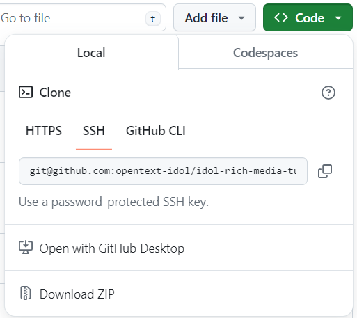

# Knowledge Discovery Rich Media Tutorials

A set of guides to get you doing great things with Knowledge Discovery Media Server!

For details of the latest changes to Knowledge Discovery Media Server in version 25.1, please see the [Release Notes](https://www.microfocus.com/documentation/idol/knowledge-discovery-25.1/IDOLReleaseNotes_25.1_Documentation/idol/Content/Servers/MediaServer.htm).

## Target audience

You! If you have access to Knowledge Discovery software and want to analyze rich media sources, like CCTV, broadcast news, photos, scanned images, *etc*.

## Aims

- Get hands on with Knowledge Discovery Media Server.  Familiarize yourself with key concepts.
- Select from walkthroughs showcasing different analytic capabilities of Knowledge Discovery Media Server, from AN/LPR to Object Recognition and Speech Transcription.
- See how Media Server integrates with other Knowledge Discovery products.

## Obtaining tutorial materials

Get a local copy of this tutorial to give you all the configuration files and sample media you will need.  You can either clone this repository or download the `.zip` from [GitHub](https://github.com/opentext-idol/idol-rich-media-tutorials).

Throughout the tutorial, we will assume these materials are stored under `C:\OpenText`.  File paths and other resources are currently documented for Windows, but other supported platforms (*e.g.* Linux) will work with appropriate modifications.

You can stay on GitHub to follow the steps in this and further linked README files in your browser or, if you prefer to work with the downloaded files, see [these steps](./tutorials/appendix/Markdown_reader.md) for some convenient offline reading options.

## Get started

The tutorials start [here](./tutorials/README.md)!

## License

(c) Copyright 2014-2025 OpenText or one of its affiliates.

Licensed under the MIT License (the "License"); you may not use this project except in compliance with the [License](./LICENSE.md).
