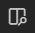

# View markdown files locally

If you prefer to follow this guide with the files downloaded from the repository, you need a good way to view the notes, which are in Markdown format.  My three favorite ways are:

1. Download and install [VS Code](https://code.visualstudio.com/download) and use the handy markdown preview button .

1. Follow these steps to turn your Google Chrome browser into a smart markdown viewer:
    - Open Google Chrome
    - Install [Markdown Preview Plus](https://chromewebstore.google.com/detail/markdown-preview-plus/febilkbfcbhebfnokafefeacimjdckgl?utm_source=chrome-app-launcher-info-dialog)
    - Navigate to [Extensions](chrome://extensions/) and select `Details` for Markdown Preview Plus
    - Enable the option `Allow access to file URLs`.
    - Follow the link to `Extension Options`:
      - Select `Enable HTML content` .
      - (*Optionally*) Choose your favorite theme, *e.g.* `GitHub`.

1. Download and install the cross-platform markdown editor [Typora](https://typora.io/).

You can now re-open this README file in your preferred tool and proceed through the tutorials following links between pages as you would on the GitHub site.
