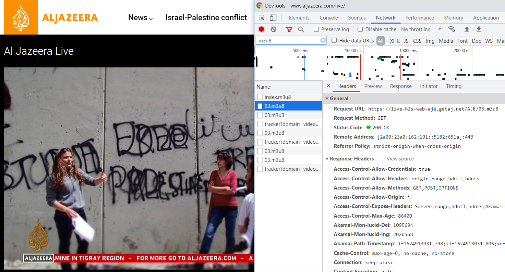

# Rich media tips

A collection of tips and tricks to support your future projects in image, video and audio processing.

---

- [Useful third-party software](#useful-third-party-software)
- [Collecting sample media](#collecting-sample-media)
  - [Video file and streamed sources from the web](#video-file-and-streamed-sources-from-the-web)
    - [Language variants](#language-variants)
    - [Resolution variants](#resolution-variants)
    - [Live YouTube channels](#live-youtube-channels)
  - [CCTV camera streams](#cctv-camera-streams)
  - [Academic datasets](#academic-datasets)
- [Working with video sources](#working-with-video-sources)
  - [Devices](#devices)
  - [Video files](#video-files)
    - [Examine the metadata of a video file](#examine-the-metadata-of-a-video-file)
    - [Extract still images from a video file](#extract-still-images-from-a-video-file)
    - [Split a video into shorter clips](#split-a-video-into-shorter-clips)
    - [Make a video clip of an interesting section](#make-a-video-clip-of-an-interesting-section)
    - [Concatenate video clips into one video file](#concatenate-video-clips-into-one-video-file)
    - [Ingest a sequence of videos as a playlist](#ingest-a-sequence-of-videos-as-a-playlist)
    - [Add tracks to existing media file](#add-tracks-to-existing-media-file)
    - [Strip tracks to existing media file](#strip-tracks-to-existing-media-file)
  - [Video streams](#video-streams)
    - [Test availability of an IP stream](#test-availability-of-an-ip-stream)
    - [Record video/audio from an IP stream](#record-videoaudio-from-an-ip-stream)
    - [Loop a video file to produce a continuous RTSP stream](#loop-a-video-file-to-produce-a-continuous-rtsp-stream)
  - [YouTube](#youtube)
    - [Download a video from YouTube](#download-a-video-from-youtube)
      - [Video format options](#video-format-options)
    - [Play a live YouTube channel](#play-a-live-youtube-channel)
    - [Record video/audio from a live YouTube channel](#record-videoaudio-from-a-live-youtube-channel)
    - [Record only audio from a live YouTube channel](#record-only-audio-from-a-live-youtube-channel)
    - [Restream video/audio from a live YouTube channel](#restream-videoaudio-from-a-live-youtube-channel)
- [Next steps](#next-steps)

---

## Useful third-party software

- A text editor, *e.g.* [VS Code](https://code.visualstudio.com/download), [Notepad++](https://notepad-plus-plus.org/)
- A video player, *e.g.* [VLC](http://www.videolan.org/vlc/), [ffmpeg](https://ffmpeg.org/download.html)
- A video editor, *e.g.* [ffmpeg](https://ffmpeg.org/download.html)
- A screen recorder, *e.g.* with the [Xbox Game Bar](https://support.xbox.com/en-GB/help/friends-social-activity/share-socialize/record-game-clips-game-bar-windows-10) included with Windows 10, or [ffmpeg](https://ffmpeg.org/download.html)
- A scripting language, *e.g.* [node.js](https://nodejs.org/), [python](https://www.python.org/downloads/)
- A better terminal for Windows, *e.g.* [GitBash](https://gitforwindows.org/) (even better with [Cmder](https://cmder.app/) or [Windows Terminal](https://apps.microsoft.com/store/detail/windows-terminal/9N0DX20HK701))

## Collecting sample media

Typically, you will be able to get audio, video or image samples from your customer. If not you have (at least) these choice:

1. Use a webcam - see the setup guide to learn how to [connect](../setup/WEBCAM.md).
1. Make use of open data shared by the academic community, see [below](#academic-datasets).
1. Search for rights-free media on the web, *e.g.* [pexels.com](https://www.pexels.com/).
1. Download video files or stream video from YouTube, *e.g.* as described [below](#download-a-video-from-youtube).
1. Connect to a video file or stream embedded in a website, *e.g.* from a news broadcaster's website, as described [below](#video-file-and-streamed-sources-from-the-web).

### Video file and streamed sources from the web

There exist many free news streams on the web that you can connect to.  Often news websites include a "Live" page where you can view the channel in your browser.  Under the hood, the page is often requesting an HLS stream index `.m3u8` file.  We can identify these files by manually inspecting websites, *i.e.* by pressing `F12` and filtering on files downloaded in the Network tab.



> NOTE: While IDOL Media Server's Video ingest engine does support `https` on Windows, *it does not on Linux*.  Luckily, you can often change the URL protocol to `http` and it will still work, *e.g.* <https://live-hls-web-aje.getaj.net/AJE/03.m3u8> seen in the above screenshot can be safely changed to <http://live-hls-web-aje.getaj.net/AJE/03.m3u8>, as listed in the table below.
>
> If your target stream does not support HTTP, you can use ffmpeg to restream the source for Media Server to ingest, as shown [below](#restream-videoaudio-from-a-live-youtube-channel).

The following streams were working at time of writing.

Language | Broadcaster | Resolution | Link
--- | --- | --- | ---
Arabic | Al Jazeera | 960x540 | <http://live-hls-web-aja.getaj.net/AJA/03.m3u8>
English | CBS News | 640x360 | <http://cbsn-us.cbsnstream.cbsnews.com/out/v1/55a8648e8f134e82a470f83d562deeca/master_11.m3u8>
English | DW | 712x400 | <https://dwamdstream102.akamaized.net/hls/live/2015525/dwstream102/stream02/streamPlaylist.m3u8>
Spanish | RTVE 24h | 1024x576 | <https://rtvelivestream-clnx.rtve.es/rtvesec/24h/24h_main_576.m3u8>

These streams can be directly ingested by IDOL Media Server using the the multi-purpose [Video](https://www.microfocus.com/documentation/idol/IDOL_24_4/MediaServer_24.4_Documentation/Help/index.html#Configuration/Ingest/Libav/_Libav.htm) type ingest engine.  The easiest way to try this is with the [GUI Ingest Test page](http://localhost:14000/a=gui#/ingest):


#### Language variants

For some channels, you can find alternative language streams:

- Al Jazeera:

    Stream | Resolution
    --- | ---
    <http://live-hls-web-aja.getaj.net/AJA/03.m3u8> | Arabic
    <http://live-hls-web-aje.getaj.net/AJE/03.m3u8> | English

#### Resolution variants

Some channels have multiple streams with different quality, which may be easy to switch between if you inspect the URL:

- Al Jazeera English:

    Stream | Resolution
    --- | ---
    <http://live-hls-web-aje.getaj.net/AJE/01.m3u8> | 1920x1080
    <http://live-hls-web-aje.getaj.net/AJE/02.m3u8> | 1280x720
    <http://live-hls-web-aje.getaj.net/AJE/03.m3u8> | 960x540
    <http://live-hls-web-aje.getaj.net/AJE/04.m3u8> | 746x420
    <http://live-hls-web-aje.getaj.net/AJE/05.m3u8> | 640x360

- Deutsche Welle English:

    Stream | Resolution
    --- | ---
    <https://dwamdstream102.akamaized.net/hls/live/2015525/dwstream102/stream01/streamPlaylist.m3u8> | 640x360
    <https://dwamdstream102.akamaized.net/hls/live/2015525/dwstream102/stream02/streamPlaylist.m3u8> | 712x400
    <https://dwamdstream102.akamaized.net/hls/live/2015525/dwstream102/stream03/streamPlaylist.m3u8> | 1024x576
    <https://dwamdstream102.akamaized.net/hls/live/2015525/dwstream102/stream04/streamPlaylist.m3u8> | 1280x720
    <https://dwamdstream102.akamaized.net/hls/live/2015525/dwstream102/stream05/streamPlaylist.m3u8> | 1920x1080

> TIP: There are also good third-party lists of IPTV streams on the web, *e.g.* <https://iptv-org.github.io/>.

#### Live YouTube channels

Increasingly, broadcasters are offering live streaming news via YouTube.  Some examples working at time of writing:

Language | Broadcaster | Link
--- | --- | ---
Chinese | TVBS NEWS | <https://www.youtube.com/watch?v=m_dhMSvUCIc>
French | France 24 | <https://www.youtube.com/watch?v=l8PMl7tUDIE>
Japanese | ANN News | <https://www.youtube.com/watch?v=coYw-eVU0Ks>
Hindi | NDTV | <https://www.youtube.com/watch?v=MN8p-Vrn6G0>
Spanish | Milenio TV | <https://www.youtube.com/watch?v=xIfl74SFiDA>
Turkish | CNN | <https://www.youtube.com/watch?v=Ue9SnIpwNB4>
Ukrainian | 112 Украина | <https://www.youtube.com/watch?v=EITCN6MhNbY>

These urls __*cannot*__ be directly ingested by IDOL Media Server however, YouTube also provides HLS index `.m3u8` files, which __*can*__ be ingested as described [below](#record-videoaudio-from-a-live-youtube-channel).

### CCTV camera streams

IDOL Media Server can connect directly to live streams from most CCTV camera brands.  To find the stream details you will usually need to consult the operating manual for the particular camera.  

Most modern cameras will offer an [RTSP](https://en.wikipedia.org/wiki/Real_Time_Streaming_Protocol) stream, which looks like `rtsp://<user>:<password>@<IP>:<port>/<channel>`, where `IP` is the IP address (or hostname) of the camera.  If the port is not specified, the default is `554` for RTSP.  The channel part of the URL is optional.  The username and password can be added as shown and are required if security has been enabled on the camera.  Some examples from common brands:

Manufacturer | RTSP
--- | ---
Arecont | `rtsp://<IP>/media/video1`
Axis | `rtsp://<IP>/axis-media/media.amp`
Bosch | `rtsp://<IP>/video?inst=1&h26x=4`
D-Link | `rtsp://<IP>/live1.sdp`
Flir | `rtsp://<IP>/avc`
Geovision | `rtsp://<IP>/CH001.sdp`
Hikvision | `rtsp://<IP>/Streaming/Channels/101/`
IndigoVision | `rtsp://<IP>/`
Pelco | `rtsp://<IP>/stream1`

> TIP: If you cannot find a manual for your camera, or your manual does not include RTSP connection details (which is not uncommon), there are a number of websites that aggregate camera connection details.  I have found this one to be useful: <http://community.geniusvision.net/platform/cprndr/manurtsplist>.

As with the Bosch connection example above, some cameras also expose configuration parameters in the URL.Most cameras will need to be configured via an embedded web configuration UI, similar to what you have on your internet router at home.  This UI will be accessible at `http://IP:80/`, where `IP` is again the IP address (or hostname) of the camera.

IDOL Media Server can connect directly to these RTSP streams if you configure the multi-purpose [Video](https://www.microfocus.com/documentation/idol/IDOL_24_4/MediaServer_24.4_Documentation/Help/index.html#Configuration/Ingest/Libav/_Libav.htm) type ingest engine.  IDOL Media Server also includes the following additional ingest engines to support alternative stream types:

- [MJPEG](https://www.microfocus.com/documentation/idol/IDOL_24_4/MediaServer_24.4_Documentation/Help/index.html#Configuration/Ingest/MJPEG/_MJPEG.htm): for cameras supporting motion Jpeg streaming
- [MxPEG](https://www.microfocus.com/documentation/idol/IDOL_24_4/MediaServer_24.4_Documentation/Help/index.html#Configuration/Ingest/MXPEG/_MXPEG.htm): for [Mobotix](https://www.mobotix.com/en/mxpeg) cameras
- [Genetec](https://www.microfocus.com/documentation/idol/IDOL_24_4/MediaServer_24.4_Documentation/Help/index.html#Configuration/Ingest/Genetec/_Genetec.htm): to connect to any camera already integrated into the Genetec Security Center Video Management System (VMS)
- [Milestone](https://www.microfocus.com/documentation/idol/IDOL_24_4/MediaServer_24.4_Documentation/Help/index.html#Configuration/Ingest/Milestone/_Milestone.htm): to connect to any camera already integrated into the Milestone XProtect VMS

The easiest way to try this is with the [GUI Ingest Test page](http://localhost:14000/a=gui#/ingest):


> TIP: If you don't have access to a camera right now, there are also many third-party lists of IPTV streams on the web.  These are hit-and-miss so you may have to try a few, *e.g.* <http://insecam.org/en/bytag/Traffic/>.
> 

### Academic datasets

> NOTE: Please check the license terms for these datasets.

- [COCO](http://cocodataset.org/): The "Common Objects in COntext" dataset is a large-scale object detection, segmentation, and captioning benchmark.
- [Open Images](https://storage.googleapis.com/openimages/web/factsfigures.html): A dataset of 9.2M images with unified annotations for image classification, object detection and visual relationship detection.
- [ImageNet](http://www.image-net.org/): ImageNet is an image dataset organized according to the WordNet hierarchy.
- [LFW](http://vis-www.cs.umass.edu/lfw/): The University of Massachusetts Labeled Faces in the Wild dataset is a public benchmark for face verification.
- [MS-Celeb-1M](https://github.com/EB-Dodo/C-MS-Celeb): The Microsoft Research One Million Celebrities in the Real World dataset is a benchmark for large-scale face recognition.
- [PETS2009](http://cs.binghamton.edu/~mrldata/pets2009): The IEEE International Workshop on Performance Evaluation of Tracking and Surveillance 2009 dataset is a public benchmark for the characterization of different crowd activities.

    > TIP: The PETS2009 dataset is provided as folders of stills.  To concatenate them into videos, use the ffmpeg command:
    >
    > ```sh
    > ffmpeg -r 7 -i S3/Multiple_Flow/Time_12-43/View_008/frame_%04d.jpg -c:v libx264 -vf fps=25 -pix_fmt yuv420p S3_MF_Time_12-43_View_008.mp4
    > ```

- [UA-DETRAC](http://detrac-db.rit.albany.edu/home): The University at Albany DEtection and TRACking dataset is a benchmark for challenging real-world multi-object detection and multi-object tracking.

    > TIP: The UA-DETRAC dataset is provided as folders of stills.  To concatenate them into videos, use the ffmpeg command:
    >
    > ```sh
    > ffmpeg -r 25 -i ./MVI_40864/img%05d.jpg -c:v libx264 -vf fps=25 -pix_fmt yuv420p MVI_40864.mp4
    > ```

## Working with video sources

The two main tools to keep handy are ffmpeg and VLC player.  They have overlapping capabilities, so in the following example tips we will use a mix of both to give you a small flavour of what each is capable of.

The following examples are grouped by source type: video files, video steams and YouTube:

### Devices

Many devices, such as webcams and HDMI-to-USB dongles, can be used as video sources for IDOL Media Server thanks to DirectShow on Windows or Video4Linux on Linux.  For tips on connecting to such devices, see the [webcam setup page](../../tutorials/setup/WEBCAM.md).

### Video files

#### Examine the metadata of a video file

With ffmpeg, you also get an executable called `ffprobe`. From the command line:

```sh
ffprobe -v quiet -print_format json -show_format -show_streams myVideo.mp4
```

#### Extract still images from a video file

Use ffmpeg to extract an image from the third second of your video:

```cmd
ffmpeg -ss 00:00:03 -i path\to\my\video.mp4 -frames:v 1 path\to\interesting\frame.png
```

Use ffmpeg to extract one image every second from a video, starting from the third second:

```cmd
ffmpeg -ss 00:00:03 -i path\to\my\video.mp4 -vf fps=1 out%03d.png
```

For more details, read this [documentation](https://trac.ffmpeg.org/wiki/Create%20a%20thumbnail%20image%20every%20X%20seconds%20of%20the%20video).

#### Split a video into shorter clips

Use ffmpeg to create a sequence of 60-second clips from your video:

```cmd
ffmpeg -i path\to\my\video.mp4 -c copy -map 0 -segment_time 00:01:00 -f segment out%03d.mp4
```

#### Make a video clip of an interesting section

Use ffmpeg to create a 135 second long clip, starting from the 1st hour, 6th minute and 11th second of your video:

```cmd
ffmpeg -ss 01:06:11 -i path\to\my\video.ext -t 135 path\to\interesting\clip.ext
```

or

```cmd
ffmpeg -i path\to\my\video.ext -ss 01:06:11 -t 135 path\to\interesting\clip.ext
```

If the start time `-ss` option is passed before the input `-i`, ffmpeg will jump straight to that time in the video. Although this is a faster option, you might start copying far away from an I-frame and so have some mess at the start of your clip.

If the start time `-ss` option is passed after the input `-i`, ffmpeg will process all frames from the start. This can be a slower option but guarantees that your clip will be created with an full frame at the start.

#### Concatenate video clips into one video file

Create a playlist file, called *e.g.* `playlist.txt`, containing the text:

```ini
# comment
file 'path\to\my\first\video.ext'
file 'path\to\my\second\video.ext'
file 'path\to\my\third\video.ext'
```

Then use ffmpeg to perform the concatenation:

```sh
ffmpeg -f concat -i playlist.txt -c copy output.ext
```

For more details, read this [documentation](https://trac.ffmpeg.org/wiki/Concatenate).

#### Ingest a sequence of videos as a playlist

IDOL Media Server can read a playlist file in order to ingest a sequence of video files in a single process action.  The easiest way to ingest a playlist file, is with the Ingest Test page:


> NOTE: To do this, note the Video-type ingest engine requires the `Format` option to be set to `Concat`.

#### Add tracks to existing media file

To add an empty audio track to a video file:

```sh
ffmpeg -f lavfi -i aevalsrc=0 -i in.mp4 -vcodec copy -acodec aac -map 0:0 -map 1:0 -shortest -strict experimental -y out.mp4
```

To add a video track to an audio file by:

1. looping over an image file:

    ```sh
    ffmpeg -loop 1 -i image.png -i audio.mp3 -shortest out.mp4
    ```

1. generating a test page:

    ```sh
    ffmpeg -f lavfi -i testsrc -i audio.mp3 -shortest out.mp4
    ```

1. generating a blue background:

    ```sh
    ffmpeg -f lavfi -i color=c=blue -i audio.mp3 -shortest out.mp4
    ```

#### Strip tracks to existing media file

To remove the audio track to a video file:

```sh
ffmpeg -i in.mp4 -vcodec copy -an out.mp4
```

### Video streams

> TIP: When working with external streams be aware that they may sometimes drop out.  To help with this, Media Server's *Video* type ingest engine includes a configurable [StreamTimeout](https://www.microfocus.com/documentation/idol/IDOL_24_4/MediaServer_24.4_Documentation/Help/Content/Configuration/Ingest/Libav/StreamTimeout.htm) to control how long you want to wait before giving up the process.  Additionally, the process action itself has a [Persist](https://www.microfocus.com/documentation/idol/IDOL_24_4/MediaServer_24.4_Documentation/Help/Content/Actions/VideoAnalysis/parameters/Persist.htm) option, which instructs Media Server to retry processing a stream automatically if it does time out.

#### Test availability of an IP stream

With ffmpeg, you also get an executable called `ffplay`. From the command line you can ingest, *e.g.* this HLS stream:

```sh
ffplay http://live-hls-web-aje.getaj.net/AJE/03.m3u8
```

This executable uses the same underlying libraries as IDOL Media Server. So, if you can play with this, it is highly likely you can ingest with IDOL Media Server.

#### Record video/audio from an IP stream

From the command line, *e.g.* to record a five minute clip:

```sh
ffmpeg -i http://live-hls-web-aje.getaj.net/AJE/03.m3u8 -t 300 clip-5mins.mp4
```

From the command line, *e.g.* to record from a CCTV camera's RTSP stream in five minute chunks, maintaining the original video encoding:

```sh
ffmpeg -i rtsp://host:port/channel -f segment -segment_time 300 -an -vcodec copy clip%04d.ts
```

From the command line, *e.g.* to record from a CCTV camera's MJPEG stream in five minute chunks, with a workaround to estimate frame timestamps (for which transcoding is required):

```sh
ffmpeg -use_wallclock_as_timestamps 1 -i http://localhost:port/ -f segment -segment_time 300 -an -vcodec h264 clip%04d.mp4
```

#### Loop a video file to produce a continuous RTSP stream

Sometimes I want to to analyze a video file on a loop for testing. This can be achieved by creating a looping stream of the video content. Using VLC player, from the command line:

```sh
vlc C:\video\anpr.mp4 --loop :sout=#duplicate{dst=rtp{sdp=rtsp://127.0.0.1:8554/mystream} } :sout-all :sout-keep
```

To view this stream in VLC player, from the command line:

```sh
vlc rtsp://127.0.0.1:8554/mystream
```

To process this stream with IDOL Media Server, do:

<http://127.0.0.1:14000/action=process&source=rtsp://127.0.0.1:8554/mystream&persist=true&configName=mySessionConfig>

, where setting `persist=true` instructs IDOL Media Server to wait out any short term interruptions in the incoming video stream that can occur due to network latency.

### YouTube

The free tool `yt-dlp` allows you to download video files from YouTube.

Obtain it through your Python package manager:

```sh
pip install yt-dlp
```

#### Download a video from YouTube

Simply pass your video url to `yt-dlp`:

```sh
yt-dlp https://www.youtube.com/watch?v=MDn20owH-uI
```

You now have a local video file: `TFI Friday： Baby Left, Baby Right ｜ Channel 4 [MDn20owH-uI].webm`.

##### Video format options

Using `yt-dlp`, query a YouTube video URL for available formats:

```sh
$ yt-dlp https://www.youtube.com/watch?v=MDn20owH-uI --list-formats
[youtube] Extracting URL: https://www.youtube.com/watch?v=MDn20owH-uI 
[youtube] MDn20owH-uI: Downloading webpage
[youtube] MDn20owH-uI: Downloading ios player API JSON 
[youtube] MDn20owH-uI: Downloading android player API JSON 
WARNING: [youtube] Skipping player responses from android clients (got player responses for video "aQvGIIdgFDM" instead of "MDn20owH-uI") 
[youtube] MDn20owH-uI: Downloading player 74a3a562
[youtube] MDn20owH-uI: Downloading m3u8 information 
[info] Available formats for MDn20owH-uI: 
ID      EXT   RESOLUTION FPS CH │   FILESIZE  TBR PROTO │ VCODEC         VBR ACODEC      ABR ASR MORE INFO
────────────────────────────────────────────────────────────────────────────────────────────────────────────────────────────
sb2     mhtml 48x27        2    │                 mhtml │ images                                 storyboard
sb1     mhtml 80x45        1    │                 mhtml │ images                                 storyboard
sb0     mhtml 160x90       1    │                 mhtml │ images                                 storyboard
233     mp4   audio only        │                 m3u8  │ audio only         unknown             [en] Default
234     mp4   audio only        │                 m3u8  │ audio only         unknown             [en] Default
139-drc m4a   audio only      2 │  240.14KiB  49k https │ audio only         mp4a.40.5   49k 22k [en] low, DRC, m4a_dash
249-drc webm  audio only      2 │  234.41KiB  48k https │ audio only         opus        48k 48k [en] low, DRC, webm_dash
250-drc webm  audio only      2 │  299.96KiB  61k https │ audio only         opus        61k 48k [en] low, DRC, webm_dash
139     m4a   audio only      2 │  234.71KiB  48k https │ audio only         mp4a.40.5   48k 22k [en] low, m4a_dash
249     webm  audio only      2 │  244.63KiB  50k https │ audio only         opus        50k 48k [en] low, webm_dash
250     webm  audio only      2 │  306.16KiB  63k https │ audio only         opus        63k 48k [en] low, webm_dash
140-drc m4a   audio only      2 │  634.11KiB 130k https │ audio only         mp4a.40.2  130k 44k [en] medium, DRC, m4a_dash
251-drc webm  audio only      2 │  569.02KiB 116k https │ audio only         opus       116k 48k [en] medium, DRC, webm_dash
140     m4a   audio only      2 │  621.95KiB 127k https │ audio only         mp4a.40.2  127k 44k [en] medium, m4a_dash
251     webm  audio only      2 │  576.86KiB 118k https │ audio only         opus       118k 48k [en] medium, webm_dash
269     mp4   256x144     13    │ ~817.18KiB 167k m3u8  │ avc1.42C00C   167k video only
160     mp4   256x144     13    │  532.95KiB 109k https │ avc1.42C00C   109k video only          144p, mp4_dash
603     mp4   256x144     13    │ ~768.15KiB 157k m3u8  │ vp09.00.11.08 157k video only
278     webm  256x144     13    │  404.22KiB  83k https │ vp09.00.11.08  83k video only          144p, webm_dash
229     mp4   426x240     25    │ ~  1.49MiB 311k m3u8  │ avc1.4D4015   311k video only
133     mp4   426x240     25    │    1.17MiB 245k https │ avc1.4D4015   245k video only          240p, mp4_dash
604     mp4   426x240     25    │ ~995.46KiB 204k m3u8  │ vp09.00.20.08 204k video only
242     webm  426x240     25    │  608.08KiB 125k https │ vp09.00.20.08 125k video only          240p, webm_dash
230     mp4   640x360     25    │ ~  2.12MiB 444k m3u8  │ avc1.4D401E   444k video only
134     mp4   640x360     25    │    1.36MiB 284k https │ avc1.4D401E   284k video only          360p, mp4_dash
18      mp4   640x360     25  2 │ ≈  1.96MiB 411k https │ avc1.42001E        mp4a.40.2       44k [en] 360p
605     mp4   640x360     25    │ ~  1.96MiB 411k m3u8  │ vp09.00.21.08 411k video only
243     webm  640x360     25    │    1.01MiB 212k https │ vp09.00.21.08 212k video only          360p, webm_dash
231     mp4   854x480     25    │ ~  3.90MiB 818k m3u8  │ avc1.4D401E   818k video only
135     mp4   854x480     25    │    2.98MiB 625k https │ avc1.4D401E   625k video only          480p, mp4_dash
606     mp4   854x480     25    │ ~  2.70MiB 566k m3u8  │ vp09.00.30.08 566k video only
244     webm  854x480     25    │    1.58MiB 332k https │ vp09.00.30.08 332k video only          480p, webm_dash
```

I want an MP4 file including both video and audio, which is format code 18.  I can then download that video as follows:

```sh
yt-dlp -f 18 https://www.youtube.com/watch?v=MDn20owH-uI
```

#### Play a live YouTube channel

Live YouTube channels wrap standard HLS streams in their own API.

Using `yt-dlp`, query a channel for available HLS streams:

```sh
$ yt-dlp https://www.youtube.com/watch?v=l8PMl7tUDIE --list-formats
[youtube] Extracting URL: https://www.youtube.com/watch?v=l8PMl7tUDIE 
[youtube] l8PMl7tUDIE: Downloading webpage
[youtube] l8PMl7tUDIE: Downloading ios player API JSON 
[youtube] l8PMl7tUDIE: Downloading android player API JSON 
WARNING: [youtube] Skipping player responses from android clients (got player responses for video "aQvGIIdgFDM" instead of "l8PMl7tUDIE") 
[youtube] l8PMl7tUDIE: Downloading m3u8 information
[youtube] l8PMl7tUDIE: Downloading m3u8 information 
[info] Available formats for l8PMl7tUDIE: 
ID  EXT RESOLUTION FPS │   TBR PROTO │ VCODEC        VBR ACODEC     MORE INFO
─────────────────────────────────────────────────────────────────────────────
233 mp4 audio only     │       m3u8  │ audio only        unknown    Default
234 mp4 audio only     │       m3u8  │ audio only        unknown    Default
269 mp4 256x144     30 │  269k m3u8  │ avc1.4D400C  269k video only
91  mp4 256x144     30 │  269k m3u8  │ avc1.4d400c       mp4a.40.5
229 mp4 426x240     30 │  507k m3u8  │ avc1.4D4015  507k video only
92  mp4 426x240     30 │  507k m3u8  │ avc1.4d4015       mp4a.40.5
230 mp4 640x360     30 │  962k m3u8  │ avc1.4D401E  962k video only
93  mp4 640x360     30 │  962k m3u8  │ avc1.4d401e       mp4a.40.2
231 mp4 854x480     30 │ 1283k m3u8  │ avc1.4D401F 1283k video only
94  mp4 854x480     30 │ 1283k m3u8  │ avc1.4d401f       mp4a.40.2
232 mp4 1280x720    30 │ 2448k m3u8  │ avc1.4D401F 2448k video only
95  mp4 1280x720    30 │ 2448k m3u8  │ avc1.4d401f       mp4a.40.2
270 mp4 1920x1080   30 │ 4561k m3u8  │ avc1.4D4028 4561k video only
96  mp4 1920x1080   30 │ 4561k m3u8  │ avc1.4d4028       mp4a.40.2
```

I want a medium quality video with best available audio, *e.g.* format code 94.

I can obtain the HLS playlist file URL for that channel as follows:

```sh
$ yt-dlp -f 93 --get-url https://www.youtube.com/watch?v=l8PMl7tUDIE
https://manifest.googlevideo.com/api/manifest/hls_playlist/expire/1715880975/ei/.../playlist/index.m3u8
```

This is typically a long URL.  I can use a shortcut to play the stream in `ffplay` as follows:

```sh
ffplay $(yt-dlp -f 93 --get-url https://www.youtube.com/watch?v=l8PMl7tUDIE)
```

Press `Ctrl`+`C` to stop the stream.

I need to copy the full URL string to play it in Media Server.  The easiest way to try this is with the [GUI Ingest Test page](http://localhost:14000/a=gui#/ingest):


#### Record video/audio from a live YouTube channel

Following from the above example, I can next record that stream continuously with `ffmpeg` in one-minute segments as follows:

```sh
ffmpeg -i $(yt-dlp -f 93 --get-url https://www.youtube.com/watch?v=l8PMl7tUDIE) -f segment -segment_time 60 -c copy recording%04d.mp4
```

#### Record only audio from a live YouTube channel

To record the audio only, I could modify the above command to:

1. instruct ffmpeg to drop the video:

    ```sh
    ffmpeg -i $(yt-dlp -f 93 --get-url https://www.youtube.com/watch?v=l8PMl7tUDIE) -f segment -segment_time 60 -vn -acodec copy recording%04d.aac
    ```

1. or, since it is available for this channel, select an audio-only stream:

    ```sh
    ffmpeg -i $(yt-dlp -f 233 --get-url https://www.youtube.com/watch?v=l8PMl7tUDIE) -f segment -segment_time 60 -c copy recording%04d.aac
    ```

#### Restream video/audio from a live YouTube channel

YouTube stream URLs use the `https:` protocol.  If I'm running IDOL Media Server on Linux, I cannot connect directly to an `https:` stream due to licensing restrictions of some underlying libraries; therefore, I want to convert this stream, *e.g.* to multicast `udp:`.

This can be achieved, following from the above example, with `ffmpeg` as follows:

```sh
ffmpeg -i $(yt-dlp -f 93 --get-url https://www.youtube.com/watch?v=l8PMl7tUDIE) -f mpegts udp://239.255.1.4:1234
```

To view this stream in `ffmpeg`, from the command line:

```sh
ffplay udp://239.255.1.4:1234
```

These streams can be directly ingested by IDOL Media Server using the the multi-purpose [Video](https://www.microfocus.com/documentation/idol/IDOL_24_4/MediaServer_24.4_Documentation/Help/index.html#Configuration/Ingest/Libav/_Libav.htm) type ingest engine.  The easiest way to try this is with the [GUI Ingest Test page](http://localhost:14000/a=gui#/ingest):


## Next steps

Why not try some tutorials to explore some of the analytics available in IDOL Media Server, linked from the [main page](../../README.md).
