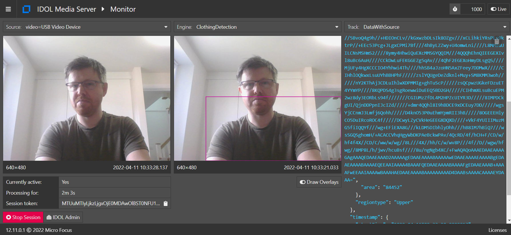

# PART II - More face analytics

In this tutorial we will:

1. chain analytics, *i.e.* use the output of face detection as input to other analytics
1. filter analysis output tracks using event processing to control the input rate to other analytics
1. use the encoding engines to extract images and record video of faces

---

- [Analysis chaining](#analysis-chaining)
  - [Controlling event rates](#controlling-event-rates)
  - [Event processing](#event-processing)
  - [Run face and clothing analysis](#run-face-and-clothing-analysis)
- [Transformation and encoding](#transformation-and-encoding)
  - [Run face image encoding](#run-face-image-encoding)
  - [Producing video](#producing-video)
  - [Run blurred faces video encoding](#run-blurred-faces-video-encoding)
- [Alternatives for video encoding](#alternatives-for-video-encoding)
  - [Run MJPEG streaming](#run-mjpeg-streaming)
- [PART III - Face recognition](#part-iii---face-recognition)

---

## Analysis chaining

Once a face has been detected, Knowledge Discovery Media Server can perform further analytics, including gender estimation and clothing color detection.

For example, to enable face demographics analysis on tracked faces, we could include the following configuration lines:

```ini
[Session]
...
Engine1 = FaceDetection
Engine2 = FaceDemographics

...

[FaceDetection]
Type = FaceDetect

[FaceDemographics]
Type = Demographics
Input = FaceDetection.ResultWithSource
```

You can see that the output from one analysis engine is fed to another by setting the `Input` property of the downstream engine to one of the output tracks of the upstream engine.

This is only *allowed* if the data output from the upstream engine contains the information required by the downstream engine, *i.e.* contains the same data types.  To list the input and output track data types, use the [`listEngines`](http://localhost:14000/a=ListEngines) action, which returns, *e.g.* for `FaceDetect` and `Demographics`, the following information:

```xml
<engine>
  <type>FaceDetect</type>
  <input name="Input" type="ImageData"/>
  <output name="Data" type="CustomData,FaceData,RegionData,UUIDData" isOutput="false"/>
  <output name="DataWithSource" type="CustomData,ImageData,FaceData,RegionData,UUIDData" isOutput="false"/>
  <output name="Result" type="CustomData,FaceData,RegionData,UUIDData" isOutput="true"/>
  <output name="ResultWithSource" type="CustomData,ImageData,FaceData,RegionData,UUIDData" isOutput="false"/>
  <output name="Start" type="CustomData,FaceData,RegionData,UUIDData" isOutput="false"/>
  <output name="End" type="CustomData,FaceData,RegionData,UUIDData" isOutput="false"/>
  <output name="SegmentedResult" type="CustomData,FaceData,RegionData,UUIDData" isOutput="true"/>
  <output name="SegmentedResultWithSource" type="CustomData,ImageData,FaceData,RegionData,UUIDData" isOutput="false"/>
  <output name="Event" type="CustomData,UUIDData,TrackingEventData" isOutput="true"/>
</engine>
<engine>
  <type>Demographics</type>
  <input name="Input" type="ImageData,FaceData,RegionData,UUIDData"/>
  <output name="Data" type="CustomData,FaceData,RegionData,UUIDData" isOutput="false"/>
  <output name="DataWithSource" type="CustomData,ImageData,FaceData,RegionData,UUIDData" isOutput="false"/>
  <output name="Result" type="CustomData,FaceData,RegionData,UUIDData" isOutput="true"/>
  <output name="ResultWithSource" type="CustomData,ImageData,FaceData,RegionData,UUIDData" isOutput="false"/>
  <output name="SegmentedResult" type="CustomData,FaceData,RegionData,UUIDData" isOutput="true"/>
  <output name="SegmentedResultWithSource" type="CustomData,ImageData,FaceData,RegionData,UUIDData" isOutput="false"/>
</engine>
```

You can see that `Demographics` requires `ImageData`, `FaceData`, `RegionData` and `UUIDData` as inputs.  Hence, in our process configuration we are allowed to pass the `ResultWithSource` output from face detection as input to demographics because it includes all of the required data types (as well as `CustomData`, which is a catch-all term for any analysis-specific properties).

In our next test we will chain the following analytics together:

- Face detection &rarr; Face demographics
- Face detection &rarr; Face state
- Face detection &rarr; Clothing detection &rarr; Color Analysis

### Controlling event rates

So, back to running some analytics. We don't want to keep covering the webcam to trigger results.  To get more frequent output automatically we will tap into the `SegmentedResultWithSource` track to get updates from any ongoing tracks at intervals of `SegmentDuration`.

To enable this, *e.g.* to set the rate of data for demographics analysis to five seconds, we could include the following:

```ini
[Session]
...
Engine1 = FaceDetection
Engine2 = FaceDemographics

[FaceDetection]
Type = FaceDetect
SegmentDuration = 5s

[FaceDemographics]
Type = Demographics
Input = FaceDetection.SegmentedResultWithSource
```

### Event processing

As well as limiting the rate of events to deal with, we can also can make additional filters by taking advantage of event processing engines. In this case we will restrict our face analysis only to faces that we detect are looking forwards. This can improve the accuracy of those downstream analytics.

To enable this, *e.g.* for demographics analysis, we could include the following:

```ini
[Session]
...
Engine1 = FaceDetection
Engine2 = FaceForward
Engine3 = FaceDemographics

...

[FaceForward]
Type = Filter
Input = FaceDetection.SegmentedResultWithSource
LuaScript = frontalFace.lua

[FaceDemographics]
Type = Demographics
Input = FaceForward.Output
```

> NOTE: The name of the event processing output track variant is always `Output`, *e.g.* `FaceForward.Output`.

Many logical operators are available in addition to `Filter`, which include the capability to compare or combine records from multiple tracks. See the [reference guide](https://www.microfocus.com/documentation/idol/knowledge-discovery-25.3/MediaServer_25.3_Documentation/Help/index.html#Configuration/ESP/ESP.htm) for more details.

Most of these operators provide additional flexibility through Lua scripts that allow you to create more complex logic.  Knowledge Discovery Media Server ships with a number of example scripts that can be found in the `configurations/lua` directory.  Here was have used the out-of-the-box `frontalFace.lua` script, which contains the following code

```lua
-- return if face is forward-facing (i.e. non-profile) and mostly within image
function pred(record)
  local oopangle = record.FaceData.outOfPlaneAngleX
  return oopangle ~= 90 and oopangle ~= -90 and record.FaceData.percentageInImage > 95
end
```

, and therefore applies the following additional filters:

1. the angle of the face to the camera must be less than 90 degrees, *i.e.* the face must not be in profile,
1. almost all of the face must be visible in the view of the frame.

If the function `pred()` returns `true`, then this record will be kept, otherwise it will be discarded.

See [tips on Lua scripting](../appendix/Lua_tips.md) for more information.

### Run face and clothing analysis

Paste the following parameters into [`test-action`](http://localhost:14000/a=admin#page/console/test-action) (again remembering to update the webcam name from `Integrated Webcam` to match yours):

```url
action=process&source=video%3DIntegrated%20Webcam&configName=tutorials/faceAnalysis2a
```

Click `Test Action` to start processing.



Review the results with [`/action=GUI`](http://localhost:14000/a=gui#/monitor(tool:options)), then stop processing with [`stop`](http://localhost:14000/a=queueInfo&queueAction=stop&queueName=process).

## Transformation and encoding

Knowledge Discovery Media Server can encode video, images and audio.  We will now create a configuration to save cropped images of faces detected in your webcam.

To enable cropping and to draw overlays, we could include the following:

```ini
[Session]
...
Engine1 = FaceDetection
Engine2 = FaceDemographics
Engine3 = FaceCrop
Engine4 = FaceDraw

...

[FaceCrop]
Type = Crop
Input = FaceDetection.ResultWithSource
Border = 15%

[FaceDraw]
Type = Draw
Input = FaceDemographics.ResultWithSource
LuaScript = draw_demo.lua
```

Again, Lua scripts can be used to provide flexibility.  Copy the included `draw_demo.lua` script from this tutorial into your `configuraitons/lua` directory.  This script does a number of things; for example it sets the overlay color based on the detected gender of the face:

```lua
ResultsProcessor = {
    ...
    colours = { -- colours for each analysis type
        ...
        demographic = {
            male = rgb(255, 128, 0), -- orange
            female = rgb(64, 0, 128), -- purple
            unknown = rgb(128, 128, 128) }, -- grey
        },
        ...
    },
    ...
}
```

To encode these cropped images:

```ini
[Session]
...
Engine2 = FaceCrop
Engine3 = FaceDraw
Engine4 = FaceCropEncoder
Engine5 = FaceDrawEncoder

...

[FaceCropEncoder]
Type = ImageEncoder
ImageInput = FaceCrop.Output
OutputPath = output/faces2b/%record.startTime.timestamp%_crop.png

[FaceDrawEncoder]
Type = ImageEncoder
ImageInput = FaceDraw.Output
OutputPath = output/faces2b/%record.startTime.timestamp%_overlay.png
```

We can access parameter values from the alert record such as `startTime` using *macros* to generate the image `OutputPath`.  See the [reference guide](https://www.microfocus.com/documentation/idol/knowledge-discovery-25.3/MediaServer_25.3_Documentation/Help/index.html#Configuration/Macros.htm) for details.

### Run face image encoding

Paste the following parameters into [`test-action`](http://localhost:14000/a=admin#page/console/test-action) (again remembering to update the webcam name from `Integrated Webcam` to match yours):

```url
action=process&source=video%3DIntegrated%20Webcam&configName=tutorials/faceAnalysis2b
```

Click `Test Action` to start processing.

Review the results with [`/action=GUI`](http://localhost:14000/a=gui#/monitor(tool:options)), then open the folder `output/faces2b` to see the encoded images. These images will be used in the face recognition module. Images will accumulate, so don't run for too long without stopping.

Stop processing with [`stop`](http://localhost:14000/a=queueInfo&queueAction=stop&queueName=process).

### Producing video

We will now create a process configuration to save video from your webcam, in which we will blur out any detected faces.

Just as we drew the overlays on images of faces, we will use a transform engine to blur faces in the video frames.  Encoding video introduces the following complications:

1. we must analyze every frame that we want to encode, otherwise we risk missing faces on not-analyzed video frames
1. we must combine face detection records for each frame, whether there are zero, one or many faces detected in that frame

Face detection should be run at a sensible frame rate for most laptops.  This analysis rate will restrict the maximum output rate of the encoded video such that all frames can be analyzed and combined.

We should therefore restrict the ingest rate of the input stream with an event processing filter:

```ini
[Session]
Engine0 = VideoIngest
Engine1 = RateLimitedIngest

...

[RateLimitedIngest]
Type = Deduplicate
Input = Default_Image
MinTimeInterval = 200ms
PredicateType = Always
```

As a result, the `FaceDetect` analysis can be configured with unlimited sampling rate by including the following changes:

```ini
[FaceDetection]
Type = FaceDetect
Input = RateLimitedIngest.Output
SampleInterval = 0
```

The `FaceDetect` analysis produces output only when a face is detected.  In order to produce a smooth output video showing all frames - whether a face was detected or not - we therefore cannot rely on this output alone.

We need to combine the rate-limited source video frames, *i.e.* "every" frame, with face detection data where available.

To do this, use an event processing `Combine` engine as follows:

```ini
[CombineFaces]
Type = Combine
Input0 = RateLimitedIngest.Output
Input1 = FaceDetection.Data
```

Then to enable blurring for video frames with detected faces, we will include the following:

```ini
[FaceImageBlur]
Type = Blur
Input = CombineFaces.Output
```

Finally, to encode the video to disk (in one minute segments), we will include the following:

```ini
[BlurredFacesVideo]
Type = Mpeg
ImageInput = FaceImageBlur.Output
OutputPath = output/faces2c/%currentTime.timestamp%_blur.mp4
UseTempFolder = True
Segment = True
SegmentDuration = 1m
```

### Run blurred faces video encoding

Paste the following parameters into [`test-action`](http://localhost:14000/a=admin#page/console/test-action) (again remembering to update the webcam name from `Integrated Webcam` to match yours):

```url
action=process&source=video%3DIntegrated%20Webcam&configName=tutorials/faceAnalysis2c
```

Click `Test Action` to start processing.

Review the results with [`/action=GUI`](http://localhost:14000/a=gui#/monitor(tool:options)), then open the folder `output/faces2c` to see the encoded videos.  Let this process run for long enough to allow a few `.mp4` files to be generated.


Stop processing with [`stop`](http://localhost:14000/a=queueInfo&queueAction=stop&queueName=process).

## Alternatives for video encoding

Knowledge Discovery Media Server offers more options that just encoding video to files:

- (Evidential) Rolling Buffer
- UDP streaming with the MPEG encoder
- MJPEG streaming

The easiest to set up and connect to here is the MJPEG option.  To enable that method, you can add the following configuration:

```ini
[DrawnFacesStream]
Type = Mjpeg
ImageInput = FaceImageDraw.Output
Port = 3000
```

### Run MJPEG streaming

Paste the following parameters into [`test-action`](http://localhost:14000/a=admin#page/console/test-action) (again remembering to update the webcam name from `Integrated Webcam` to match yours):

```url
action=process&source=video%3DIntegrated%20Webcam&configName=tutorials/faceAnalysis2d
```

Click `Test Action` to start processing.

Review the results with [`/action=GUI`](http://localhost:14000/a=gui#/monitor(tool:options)), then open your web browser to <http://localhost:3000/> to watch the stream.


Stop processing with [`stop`](http://localhost:14000/a=queueInfo&queueAction=stop&queueName=process).

> NOTE: This is exactly the same process that was used *under the hood* in [this guide](../setup/WEBCAM.md) when testing your webcam connectivity using the Knowledge Discovery Media Server user interface [`gui`](http://localhost:14000/a=gui#/ingest).

## PART III - Face recognition

Start [here](./PART_III.md).
