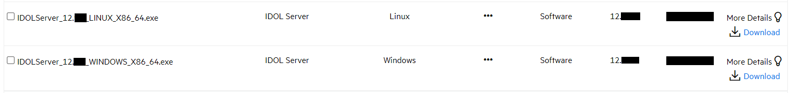
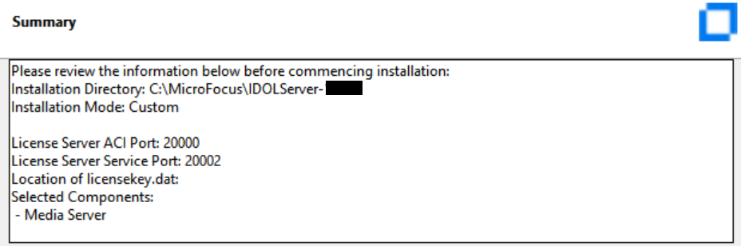

# Install IDOL Media Server

Use the IDOL installer wizard to get IDOL Media Server.

---
<!-- TOC -->

- [Download the IDOL installer](#download-the-idol-installer)
- [Install](#install)

<!-- /TOC -->
---

## Download the IDOL installer

Download software from the [Software Licensing and Downloads](https://sld.microfocus.com/mysoftware/index) portal.

1. Under the *Downloads* tab, select your product, product name and version from the dropdowns:

    

1. From the list of available files, select and download `IDOLServer_12.13.0_WINDOWS_X86_64.exe` or `IDOLServer_12.13.0_LINUX_X86_64.exe` depending on your operating system.

    

## Install

On Windows, right click the installer and __run as Administrator__.

On Linux, run from the command line:

```sh
chmod +x IDOLServer_12.13.0_LINUX_X86_64.exe
./IDOLServer_12.13.0_LINUX_X86_64.exe
```

Follow the install wizard to get the required components.

Keep the default options except in the following cases:

1. Accept the license agreement.
2. Keep the default installation directory.
3. Select `Custom` under *Installation Mode*.
4. Do not choose an OEM installation
5. Confirm that `No`, you do not have an existing License Server.
6. (On Windows keep the default service name.)
7. Leave the default port settings and set location of your license `.dat` file.
8. Component Selection:
   - To cover these tutorials you need to select only the *Media Server* component.
   - (On Windows also create a service with the default name).

      

9. Click Next to proceed with the installation.
