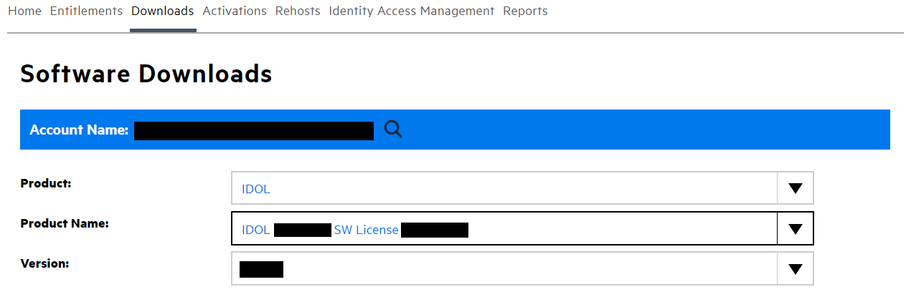
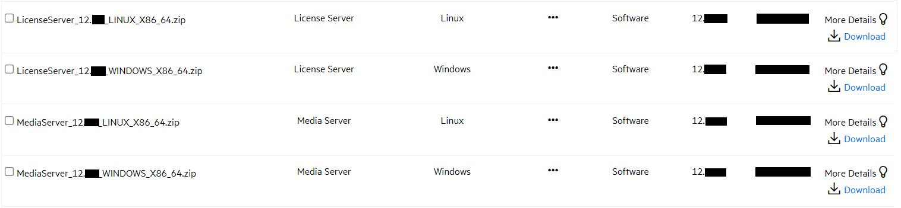
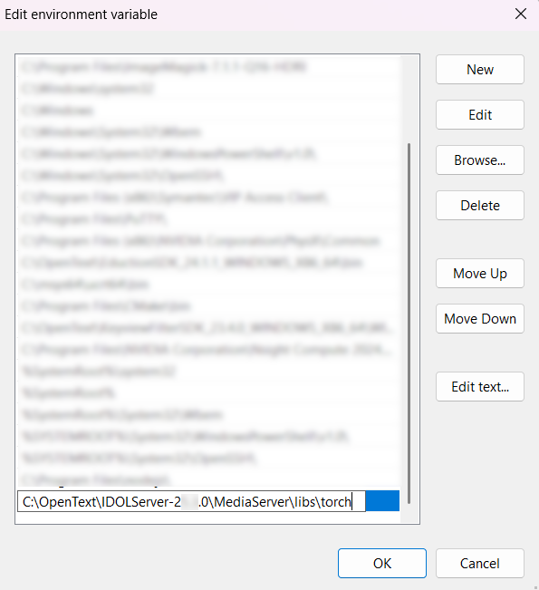

# Install Knowledge Discovery Media Server

Use a script to install Knowledge Discovery Media Server from the component `.zip` files.

---

- [Download Knowledge Discovery components](#download-knowledge-discovery-components)
- [Install](#install)
  - [Windows](#windows)
  - [Ubuntu](#ubuntu)

---

## Download Knowledge Discovery components

Download software from the [Software Licensing and Downloads](https://sld.microfocus.com/mysoftware/index) portal.

1. Under the *Downloads* tab, select your product, product name and version from the dropdowns:

    

1. From the list of available files, select and download the following (depending on your operating system):

   - `LicenseServer_26.2.0_WINDOWS_X86_64.zip` or `LicenseServer_26.2.0_LINUX_X86_64.zip`, and
   - `MediaServer_26.2.0_WINDOWS_X86_64.zip` or `MediaServer_26.2.0_LINUX_X86_64.zip`.

    

## Install

Installation scripts are included in this tutorial for Windows (`install.bat`) and Linux (`install.sh`).

Before running the appropriate script, open it and check the following:

1. the `SOURCE_DIR` variable should be pointing at the directory where you have placed your `.zip` files and license key file, *e.g.* in `install.dat` for Windows this is assumed to be:

    ```sh
    set SOURCE_DIR=%HOMEPATH%\Downloads
    ```

1. the `LICENSE_KEY` variable should be using the correct name for your license `.dat` file, which is also expected to be found in your `SOURCE_DIR`:

    ```sh
    set LICENSE_KEY=licensekey.dat
    ```

### Windows

You must edit a system environment variable in order to run Media Server as a Windows Service.

Add the target installation directory (`C:\OpenText\IDOLServer-26.2.0\MediaServer\libs\torch`) to your `Path` environment variable as follows:



> NOTE: Please refer to the [admin guide](https://www.microfocus.com/documentation/idol/knowledge-discovery-26.2/MediaServer_26.2_Documentation/Help/Content/Getting_Started/StartMediaServer.htm) for more details.

Run `install.bat` with administrator privileges:

- right click
- select 'Run as administrator'

### Ubuntu

Run the following command to execute the installation script:

```sh
sudo ./install.sh
```
