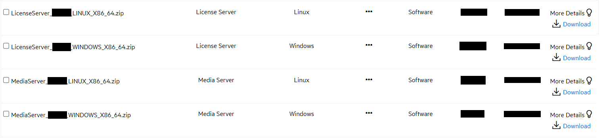

# Install IDOL Media Server

Use a script to install IDOL Media Server from the component `.zip` files.

---
<!-- TOC -->

- [Download IDOL components](#download-idol-components)
- [Install](#install)
  - [Windows](#windows)
  - [Ubuntu](#ubuntu)

<!-- /TOC -->
---

## Download IDOL components

Download software from the [Software Licensing and Downloads](https://sld.microfocus.com/mysoftware/index) portal.

1. Under the *Downloads* tab, select your product, product name and version from the dropdowns:

    

1. From the list of available files, select and download the following (depending on your operating system):
   -  `LicenseServer_12.13.0_WINDOWS_X86_64.zip` or `LicenseServer_12.13.0_LINUX_X86_64.zip`, and
   -  `MediaServer_12.13.0_WINDOWS_X86_64.zip` or `MediaServer_12.13.0_LINUX_X86_64.zip`.

    

## Install

Installation scripts are included in this tutorial for Windows (`install.bat`) and Linux (`install.sh`).

Before running the appropriate script, open it and check the following:

1. the `SOURCE_DIR` variable is pointed correctly at the directory where you have placed your `.zip` files and license key file, *e.g.* in `install.sh` for Linux this is assumed to be:

    ```sh
    SOURCE_DIR="~/Downloads"
    ```

1. the `LICENSE_KEY` variable gives the correct name for your license `.dat` file.

### Windows

Run `install.bat` with administrator privileges:

- right click
- select 'Run as administrator'

### Ubuntu

Run the following command to execute the installation script:

```sh
sudo ./install.sh
```
