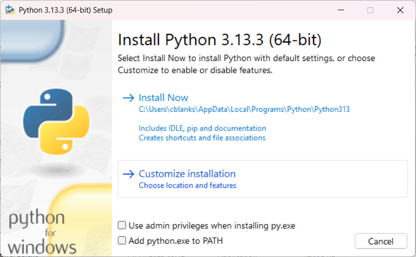
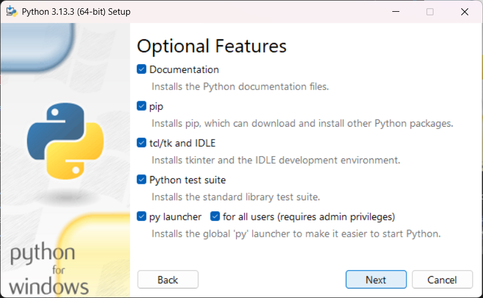
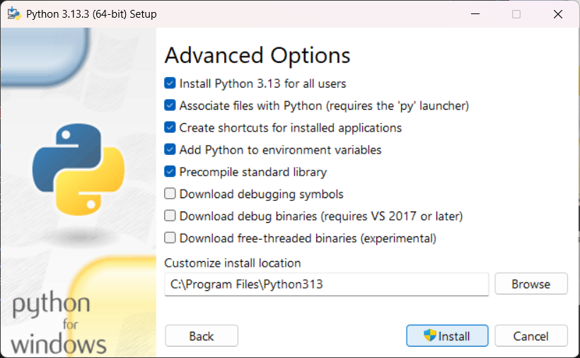

# Install Python

This is a setup guide for the popular scripting language `Python 3`, which is required for the [face recognition](../showcase/face-recognition/README.md) and [speech transcription](../showcase/speech-transcription/PART_I.md) tutorials.

---

- [On Windows](#on-windows)
- [On Ubuntu](#on-ubuntu)
- [Install packages](#install-packages)

---

## On Windows

Download Python from <https://www.python.org/downloads/> and run the installation wizard:

- Customize installation:

  

- For all users:

  

- Confirm for all users and add to environment variables:

  

- On success, close.

To verify the installation, open a PowerShell terminal and run:

```ps
> python -V
Python 3.13.3
```

## On Ubuntu

Python 3 will already be installed.  Verify the installed version by executing the following command:

```sh
$ python3 -V
Python 3.10.12
```

To manage software packages for Python, you need to install `pip`. Use the following command:

```sh
apt install -y python3-pip
```

## Install packages

We will make use of the `requests` package to run HTTP requests for communication with Media Server. To install this package, from the command line, run:

```sh
pip install requests
```

> TIP: For advanced users, consider implementing a [virtual environment](https://docs.python.org/3/library/venv.html) to manage an independent set of package dependencies for this project.

---

For other setup guides, follow [this link](./SETUP.md).
