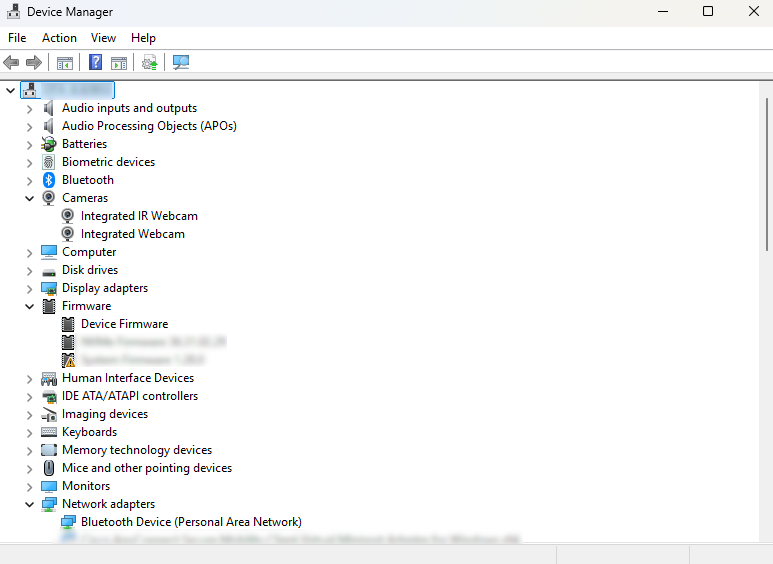
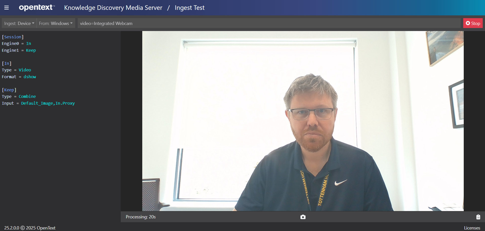

# Setup connection to your webcam

This is a setup guide for ingestion of webcam video into Knowledge Discovery Media Server.  If you do not have a webcam, go to [Plan B](#plan-b).

---

- [Find your device name](#find-your-device-name)
  - [On Windows](#on-windows)
  - [On Ubuntu](#on-ubuntu)
- [Connect to your webcam](#connect-to-your-webcam)
  - [Configuration change for Linux](#configuration-change-for-linux)
  - [Device options](#device-options)
  - [Connectivity problems](#connectivity-problems)
    - [Plan B](#plan-b)

---

## Find your device name

To find your webcam connection name please follow these steps:

### On Windows

If you have [`ffmpeg`](https://ffmpeg.org/download.html) installed already, then:

1. from the command line, list the available devices:

    ```cmd
    > ffmpeg -list_devices true -f dshow -i dummy
      ...
      [dshow @ 0000029405f18880] DirectShow video devices (some may be both video and audio devices)
      [dshow @ 0000029405f18880]  "Integrated Webcam"
      [dshow @ 0000029405f18880]     Alternative name "@device_pnp_\\?\usb#vid_0bda&pid_554c&i_00#6&34a67fa&0&0000#    >       {65e8773d-8f56-11d0-a3b9-00a0c9223196}\global"
      [dshow @ 0000029405f18880]  "Microphone Array (Realtek(R) Audio)"
      [dshow @ 0000029405f18880]     Alternative name "@device_cm_33D9A762-90C8-11D0-BD43-00A0C911CE86}\wave_    >       {EB047B5C-FE38-40BB-A89F-6A1993C710EF}"
      dummy: Immediate exit requested
    ```

1. Based on this, note down the connection string `video=Integrated Webcam`.

If you do not yet have ffmpeg installed, go to the Device Manager to see the same "Integrated Webcam" device name:



### On Ubuntu

1. Install `v4l-utils`, then use the control tool to list available devices:

    ```sh
    $ apt-get install v4l-utils
    $ v4l2-ctl --list-devices

    Integrated Webcam (usb-0000:00:1d.0-1.4):
            /dev/video0
    ```

1. Based on this, note down the connection string: `video=/dev/video0`.

## Connect to your webcam

Open the Knowledge Discovery Media Server user interface [`\a=gui`](http://localhost:14000/a=gui#/ingest) then follow these steps to connect to your webcam:

1. Set Ingest type to "Device".
1. Set operating system family to "Linux" or "Windows" as appropriate.
1. Enter the device connection string, *e.g.* "video=Integrated Webcam" as found above.
1. Click the blue `Process` button.  After a short time, your webcam stream should begin to play in your browser.

    

To stop testing, click the red `Stop` button.

### Configuration change for Linux

There is one configuration difference between ingesting webcam video on Linux compared to on Windows that you will need to keep in mind when following webcam-based tutorial examples later on.  Look at the ingest engine section in the screenshot above as an example.  To switch this from Windows to Linux, you would need to make the following edit:

```diff
  [VideoIngest]
  Type = Video
- Format = dshow
+ Format = v4l2
```

This change is marked in all webcam-targeted configuration examples, so you will only need to toggle comments on the relevant lines.

### Device options

Some webcams and many DirectShow compatible devices, *e.g.* HDMI dongles, offer a range of video options, such as frame rate, resolution and aspect ratio.

To find these options, *e.g.* on Windows, use `ffmpeg` as follows:

```sh
$ ffmpeg -f dshow -list_options true -i video="Integrated Webcam"
  ...
[dshow @ 000001e26a818840] DirectShow video device options (from video devices)
[dshow @ 000001e26a818840]  Pin "Capture" (alternative pin name "Capture")
[dshow @ 000001e26a818840]   vcodec=mjpeg  min s=1920x1080 fps=30 max s=1920x1080 fps=30
[dshow @ 000001e26a818840]   vcodec=mjpeg  min s=1280x960 fps=30 max s=1280x960 fps=30
[dshow @ 000001e26a818840]   vcodec=mjpeg  min s=1280x720 fps=30 max s=1280x720 fps=30
[dshow @ 000001e26a818840]   vcodec=mjpeg  min s=640x480 fps=30 max s=640x480 fps=30
[dshow @ 000001e26a818840]   vcodec=mjpeg  min s=640x360 fps=30 max s=640x360 fps=30
[dshow @ 000001e26a818840]   pixel_format=yuyv422  min s=640x480 fps=30 max s=640x480 fps=30
[dshow @ 000001e26a818840]   pixel_format=yuyv422  min s=640x360 fps=30 max s=640x360 fps=30
[dshow @ 000001e26a818840]   pixel_format=yuyv422  min s=320x240 fps=30 max s=320x240 fps=30
[dshow @ 000001e26a818840]   pixel_format=yuyv422  min s=320x180 fps=30 max s=320x180 fps=30
[dshow @ 000001e26a818840]   pixel_format=yuyv422  min s=160x120 fps=30 max s=160x120 fps=30
[dshow @ 000001e26a818840]   pixel_format=yuyv422  min s=1280x720 fps=10 max s=1280x720 fps=10
[dshow @ 000001e26a818840]   pixel_format=yuyv422  min s=1920x1080 fps=5 max s=1920x1080 fps=5
```

We see that my webcam can provide a maximum resolution of 1080P (`s=1920x1080`) at 30 frames per second.

Try requesting video with some variations on these settings using `ffplay`, *e.g.* try the following commands:

```sh
ffplay -f dshow -framerate 10 -video_size 1280x720 -i video="Integrated Webcam"
ffplay -f dshow -framerate 30 -video_size 640x480 -i video="Integrated Webcam"
```

> NOTE: For more details on options for DirectShow device control with `ffmpeg`, read this [documentation](https://trac.ffmpeg.org/wiki/DirectShow).

To apply these device settings in Knowledge Discovery Media Server, add the following config options to the *Video*-type ingest engine:

```diff
  [VideoIngest]
  Type = Video
  Format = dshow
+ FrameRate = 30
+ VideoSize = 1280x720
```

> NOTE: More options are available for the `Video`-type ingest engine.  Please read the [reference guide](https://www.microfocus.com/documentation/idol/knowledge-discovery-25.3/MediaServer_25.3_Documentation/Help/index.html#Configuration/Ingest/Libav/_Libav.htm).

### Connectivity problems

If the video is not displayed, or you receive an error message, double check that you have set the correct camera name in the test page.  Test with `ffmpeg` using the above commands.

In the unlikely event that this is still not working, try reinstalling your webcam drivers or, if all that fails, go to Plan B.

#### Plan B

If do not have a webcam or cannot connect to your webcam, you can simply process a video file instead.

There are some configuration differences between ingesting video from webcam and a file that you will need to keep in mind when following webcam-based tutorial examples later on.  Let's look at a snippet from `introduction/faceAnalysis1.cfg` as an example:

```diff
  [Session]
  Engine0 = VideoIngest
+ IngestRate = 0
  ...

  [VideoIngest]
  Type = Video
- Format = dshow
```

These changes are marked in all webcam-targeted configuration examples, so you will only need to toggle comments on the relevant lines.
