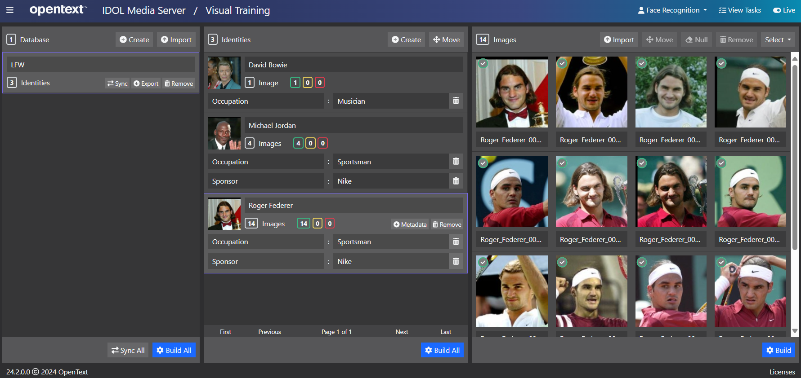
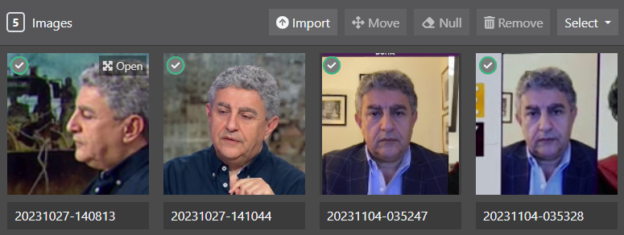
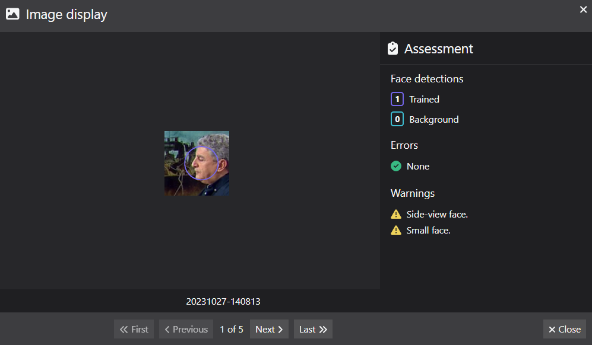
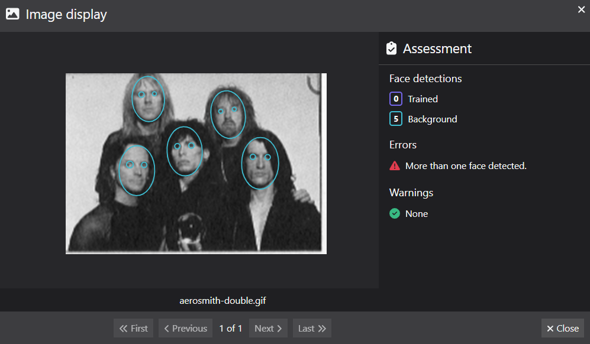
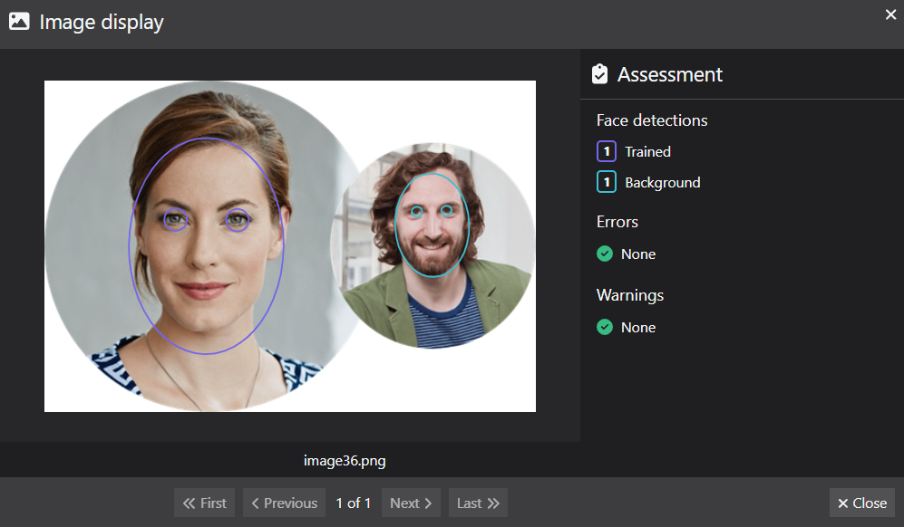

# Face recognition

In this tutorial we will:

1. use the IDOL Media Server GUI to upload and train faces
1. use the `FaceRecognize` analysis engine to match them
1. match your identity from your webcam
1. optimize analysis configuration for good performance

---

- [Face training](#face-training)
  - [Train stock faces](#train-stock-faces)
  - [Train your own face](#train-your-own-face)
  - [Assessing faces for training](#assessing-faces-for-training)
- [Face matching](#face-matching)
  - [Auto-enrolling faces](#auto-enrolling-faces)
- [Considerations when deploying a face recognition system](#considerations-when-deploying-a-face-recognition-system)
  - [Speed optimization](#speed-optimization)
    - [Processing images](#processing-images)
    - [Processing video](#processing-video)
  - [Accuracy optimization](#accuracy-optimization)
    - [Quantifying performance](#quantifying-performance)
    - [Key variables to optimize performance](#key-variables-to-optimize-performance)
    - [Tips](#tips)
      - [Missing faces](#missing-faces)
      - [False face detections](#false-face-detections)
      - [False matches](#false-matches)
    - [Working with streaming video](#working-with-streaming-video)
  - [Hardware requirements](#hardware-requirements)
- [Next steps](#next-steps)

---

## Face training

IDOL Media Server can be trained to recognize faces, as well as specific objects, classes of object, vehicles and more.  We will now train our faces into the system and run the `FaceRecognize` analysis engine to identify ourselves from the webcam video stream.

IDOL Media Server training can be performed through its web API, detailed in the [reference guide](https://www.microfocus.com/documentation/idol/IDOL_24_2/MediaServer_24.2_Documentation/Help/index.html#Actions/Training/_TrainingActions.htm).  For smaller projects, demos and testing, you may find it easier to use the [`gui`](http://localhost:14000/a=gui) web interface.

### Train stock faces

A commonly used set of stock faces is available from [Labeled Faces in the Wild: A Database for Studying Face Recognition in Unconstrained Environment](http://vis-www.cs.umass.edu/lfw/lfw.pdf).

The images of three people from this database are included in these tutorial materials: David Bowie, Michael Jordan and Roger Federer.

Use the included [Python](https://www.python.org/downloads/) script to add them to IDOL Media Server:

```sh
python train-faces.py
```



### Train your own face

Open the IDOL Media Server [`gui`](http://localhost:14000/a=gui) (tested in Google Chrome) then follow these steps to train your identity:

1. select the "Visual Training" page
1. at the top right, note that *Face Recognition* is the selected analytic by default
1. in the left column, click `Create` to add a new *database* (a collection of identities)
    - rename the database to `Workshop`
1. in the center column, click `Create` to add a new *identity*
    - give your identity a name
    - (*optionally*) add key-value metadata
1. in the right column, click `Import` to import images
    - Navigate to `output/faces2b` to select some of cropped images we just created
1. click `Build` to train your identity

The training status for each image is indicated at its bottom left: green for trained, yellow untrained and red for failed.

> NOTE: If you are running a laptop with an AMD processor, IDOL Media Server may become unresponsive when you attempt to train a face.  In this event, to configure IDOL Media Server correctly for your system, follow [these steps](../setup/PATCH_AMD.md).

### Assessing faces for training

When selecting images of faces for training, we should follow the guidance given in the [admin guide](https://www.microfocus.com/documentation/idol/IDOL_24_2/MediaServer_24.2_Documentation/Help/Content/Training/Face_ImageGuide.htm).

IDOL Media Server can also assess training images to warn you of any potential errors.  In the `gui`, follow these steps:

1. select one or more imported images

1. hover over the on thumbnail image and click on the "Open" button

    

1. assessment results are automatically generated and any error and warning messages are reported on the side-pane
    
    

Warnings indicate that training would succeed but that matching performance may be sub-optimal.  

Errors indicate that the image would not be trained successfully.

Where Media Server detects more than one face, there is an attempt to identify a primary face for training, *e.g.* compare the two assessment reports below:

1. All detected faces have similar prominence and none would be trained:
    
    

1. Once face is significantly larger and would be selected for training:
    
    

## Face matching

Once we have trained some faces, we are ready to run the `FaceRecognize` analysis engine.  To do this, we can define the following process configuration:

```ini
[Session]
Engine0 = VideoIngest
Engine1 = FaceDetection
Engine2 = FaceRecognition

...

[FaceRecognition]
Type = FaceRecognize
Input = FaceDetection.ResultWithSource
```

More options are available for the `FaceRecognize` analysis engine, including GPU acceleration, restriction to a particular matching database, setting the matching threshold and allowing multiple matches to be returned.  Please read the [reference guide](https://www.microfocus.com/documentation/idol/IDOL_24_2/MediaServer_24.2_Documentation/Help/index.html#Configuration/Analysis/FaceRecognize/_FaceRecognize.htm) for details.

Paste the following parameters into [`test-action`](http://localhost:14000/a=admin#page/console/test-action) (again remembering to update the webcam name from `USB Video Device` to match yours):

```url
action=process&source=video%3DHP%20HD%20Camera&configPath=C:/OpenText/idol-rich-media-tutorials/tutorials/showcase/face-recognition/faceRecognition1.cfg
```

Click `Test Action` to start processing.

Review the results with [`/action=GUI`](http://localhost:14000/a=gui#/monitor(tool:options)).  As before, we can use `FaceDetection.SegmentedResultWithSource` to tap into the on-going tracking and give alerts at regular intervals.

Stop processing with [`stop`](http://localhost:14000/a=queueInfo&queueAction=stop&queueName=process).

### Auto-enrolling faces

IDOL Media Server can be configured to automatically enroll face images to a chosen database and identity, for example if they are not matched to an identity already trained in that database.

> NOTE: To enable auto enrollment, we must ensure that IDOL Media Server has at least one channel of type `Visual`.

Configure the process session as follows:

- add a transform engine to crop the faces ready for enrollment:

    ```ini
    [FaceImageCrop]
    Type = Crop
    Input = FaceRecognition.ResultWithSource
    Border = 15
    BorderUnit = Percent
    ```

- add event processing to filter known and unknown faces using out-of-the-box Lua functions:

    ```ini
    [KnownFace]
    Type = Filter
    Input = FaceImageCrop.Output
    LuaScript = lua/knownIdentity.lua

    [UnknownFace]
    Type = Filter
    Input = FaceImageCrop.Output
    LuaScript = lua/unknownIdentity.lua
    ```

- add the enroll engine actions themselves:

    ```ini
    [AutoEnrollKnown]
    Type = Enroll
    Module = Face
    Input = KnownFace.Output
    Database = %record.FaceRecognitionResultAndImage.identity.database%
    Identifier = %record.FaceRecognitionResultAndImage.identity.identifier%

    [AutoEnrollUnknown]
    Type = Enroll
    Module = Face
    Input = UnknownFace.Output
    Database = Workshop
    ```

Paste the following parameters into [`test-action`](http://localhost:14000/a=admin#page/console/test-action) (again remembering to update the webcam name from `USB Video Device` to match yours):

```url
action=process&source=video%3DHP%20HD%20Camera&configPath=C:/OpenText/idol-rich-media-tutorials/tutorials/showcase/face-recognition/faceRecognition2.cfg
```

Click `Test Action` to start processing.

Review the results with [`/action=GUI`](http://localhost:14000/a=gui#/monitor(tool:options)).  Remember we can interrupt the tracking by covering your webcam to trigger new entries in the `Result` track.

> TIP: To add an unknown face, ask your neighbor to look in your webcam, or hold your phone showing a photo of someone else up in front of your webcam.

View the enrolled faces with the [`gui`](http://localhost:14000/a=graphicaluserinterface) web app.

Stop processing with [`stop`](http://localhost:14000/a=queueInfo&queueAction=stop&queueName=process).

## Considerations when deploying a face recognition system

We have important external factors to be aware of, as well as the configuration of the software itself.  Here are some key ideas to consider.

### Speed optimization

#### Processing images

Detecting faces in an image takes time.  How much processing do you really need to do with the image?

- [`MinSize`](https://www.microfocus.com/documentation/idol/IDOL_24_2/MediaServer_24.2_Documentation/Help/index.html#Configuration/Analysis/Face/MinSize.htm): Setting a minimum expected face size can reduce processing time.  Find out the minimum size you expect a face can be, *e.g.* by using the IDOL Media Server [`gui`](http://localhost:14000/a=gui#/ingest) to ingest your source and draw rectangles around a few faces.
- [`Region`](https://www.microfocus.com/documentation/idol/IDOL_24_2/MediaServer_24.2_Documentation/Help/index.html#Configuration/Analysis/Face/Region.htm): Setting a region to restrict detection to will also speed this up.  Can faces appear anywhere in an image, or always in a known region that you can restrict detection to?  Again, you can easily use the IDOL Media Server [`gui`](http://localhost:14000/a=gui#/ingest) to define a region.
- [`Orientation`](https://www.microfocus.com/documentation/idol/IDOL_24_2/MediaServer_24.2_Documentation/Help/index.html#Configuration/Analysis/Face/Orientation.htm): Will faces sometimes be seen upside down, or rotated? If not, restrict the orientation to save time.

Recognizing faces also takes time. Do you always need to match against the full list?

- [`Identifier`](https://www.microfocus.com/documentation/idol/IDOL_24_2/MediaServer_24.2_Documentation/Help/index.html#Configuration/Analysis/FaceRecognize/Identifier.htm): By selecting only one or some trained identities, the recognition step can be faster.
- [`Database`](https://www.microfocus.com/documentation/idol/IDOL_24_2/MediaServer_24.2_Documentation/Help/index.html#Configuration/Analysis/FaceRecognize/Database.htm): Trained identities may be grouped into "Databases".  By selecting only one or some databases, the recognition step can be faster.

#### Processing video

The same as for images plus:

- [`SampleInterval`](https://www.microfocus.com/documentation/idol/IDOL_24_2/MediaServer_24.2_Documentation/Help/index.html#Configuration/Analysis/Face/SampleInterval.htm): How many frames per second do you really need to track faces in with Face Detection?  5 or 10 fps is typically good enough to track faces at walking speed.  Don't waste time processing more frames than you need.
- [`NumParallel`](https://www.microfocus.com/documentation/idol/IDOL_24_2/MediaServer_24.2_Documentation/Help/index.html#Configuration/Analysis/Face/NumParallel.htm): If you have additional processing capacity, you can use this parameter to process video frames in parallel for Face Detection.
    > A similar parameter exists for Face Recognition but Face Detection is typically the bottleneck.
- [`Input`](https://www.microfocus.com/documentation/idol/IDOL_24_2/MediaServer_24.2_Documentation/Help/index.html#Configuration/Analysis/FaceRecognize/Input.htm): How many frames from a tracked face do you really need to pass on to Face Recognition for good results? If you use `ResultWithSource` as input for Face Recognition only one frame will be used for that recognition analysis. This is typically sufficient for good performance as this frame will be automatically selected from the face track as the one containing a face that is "best" for recognition, *i.e.* one that is turned most towards the camera.  Adding more recognition attempts for the tracked face by instead using `DataWithSource` or `SegmentedResultWithSource` may provide improved recognition results but will significantly take longer.
- [`GPUNumParallel`](https://www.microfocus.com/documentation/idol/IDOL_24_2/MediaServer_24.2_Documentation/Help/index.html#Configuration/Analysis/FaceRecognize/GPUNumParallel.htm): Configure GPU acceleration.  Although Face Detection does not benefit from this, Face Recognition will.  Using a GPU might allow you to run recognition on many frames with a detected face, *i.e.* you could use `DataWithSource` or `SegmentedResultWithSource` as input.

### Accuracy optimization

#### Quantifying performance

When configuring a face recognition system, it is important to quantify the quality of performance in order to optimize your configuration options and, often more importantly, your real-world setup like camera position and frame rate.

As with any performance checking, this procedure involves human validation.  We need to process a sample of footage, count and write down the following quantities:

- (TP) true positive *or* hit
- (TN) true negative *or* correct rejection
- (FP) false positive *or* false alarm
- (FN) false negative *or* miss

With these quantities you can calculate a single accuracy metric with the following [formula](https://en.wikipedia.org/wiki/Precision_and_recall):


#### Key variables to optimize performance

When recording statistics to calculate our performance metric, we should also take note of the main characteristics of the matched face results:

- Face width in pixels
- Percentage of face in scene
- Face recognition confidence
- Face match rank

> To get more data, you can allow for multiple matches using the `MaxRecognitionResults` parameter and setting a relatively low `RecognitionThreshold`.

With these values to hand, you can straightforwardly check how, *e.g.* changing the `RecognitionThreshold` or `MinSize` parameters would have affected your accuracy metric, without the need to reprocess your sample video.

> You will find that performance will drop off sharply as faces get smaller.  We recommend a minimum face size of 150 pixels but you can work with smaller faces if you are willing to live with reduced performance.

#### Tips

##### Missing faces

If you are missing detections, try reprocessing the same sample at higher frame rate, *i.e.* by reducing the `SampleInterval` parameter of the `FaceDetect` engine. Additionally, are your region and min face size settings correct?

##### False face detections

If background features are misidentified as faces.  This potential source of false alerts may be reduced by enabling the `ColorAnalysis` option in `FaceDetect`. Additionally, is there a problematic area in the view,*i.e.* from a CCTV camera, that you can ignore by setting a region or repositioning the camera?

##### False matches

The recognition score by itself may not always be the best guide to identify true matches.  We know that recognition scores drop with face size for example, so a system seeing smaller faces will tend to produce lower scores.

Often we see that comparing scores can be a useful guide to filtering out false matches.  If the top-ranked match is false, often the second-ranked match will have a similar score.  Conversely, if the top-ranked match is true the second-ranked match tends to be significantly lower.

This relative score can be used as an Event Processing filter to reduce false positives using the out-of-the-box `ambiguousFaceIdentity.lua`.  See `configurations/examples/Face/Recognize_Filtered.cfg` for example usage.

#### Working with streaming video

If working with streaming video, don't forget that it takes up a lot of bandwidth. We want to find the minimal data rate required for good performance.  The best way to reduce data traffic is by dropping frame rate. Don't be aggressive with cutting the encoding quality since we want to keep relatively precise images for accurate face recognition.

### Hardware requirements

Processing requirements vary greatly, depending strongly on video resolution, frame rate, face size and number of faces.  The basic rule of thumb is that IDOL Media Server will require one CPU core to run each of the following tasks in near real-time:

- video ingest
- face detection
- face recognition
- video encoding (*if required*)

> NOTE: Please refer to the [admin guide](https://www.microfocus.com/documentation/idol/IDOL_24_2/MediaServer_24.2_Documentation/Help/Content/Getting_Started/Install_Run/System_Requirements.htm) for more details.

When adding large numbers of faces to the database, you will need to start considering storage and memory requirements.  Each face descriptor must be loaded into memory for matching, so you need to have enough memory on each of the machines where IDOL Media Server is running.  Each descriptor is roughly 5KB in size, so each GB of RAM can hold approximately 200,000 faces.

In this tutorial, we have used a local `mediaserver.db` to store our trained faces.  In production, you should configure an external database such as PostgreSQL, as described in the [admin guide](https://www.microfocus.com/documentation/idol/IDOL_24_2/MediaServer_24.2_Documentation/Help/Content/Getting_Started/_SetupTrainingDatabase.htm).

## Next steps

Why not try more tutorials to explore some of the other analytics available in IDOL Media Server, linked from the [showcase page](../README.md).
