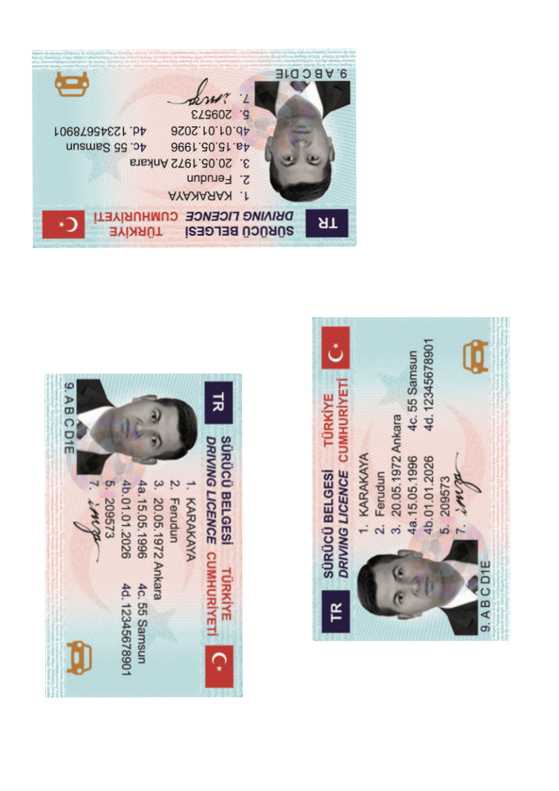

# ID Card Processing

Media Server includes an Optical Character Recognition (OCR) analysis engine, which can be configured to read specific scripts in images and video, such as Japanese characters or Arabic numerals.

For a detailed introduction to Optical Character Recognition, see the [admin guide](https://www.microfocus.com/documentation/idol/knowledge-discovery-25.2/MediaServer_25.2_Documentation/Help/Content/Operations/Analyze/OCR_overview.htm).

In this tutorial we will:

1. use the OCR analysis engine to read the text from an image of an ID card

    

1. use Object Recognition to recognize a specific document type
1. define a document type template in order to maintain document structure after OCR
1. encode a redacted version of the ID card image to hide sensitive data

This guide assumes you have already familiarized yourself with Knowledge Discovery Media Server by completing the [introductory tutorial](../../introduction/README.md).

If you want to start here, you must at least follow these [installation steps](../../setup/SETUP.md) before continuing.

---

- [Setup](#setup)
  - [Configure the required analytics](#configure-the-required-analytics)
    - [Enabled modules](#enabled-modules)
    - [Licensed channels](#licensed-channels)
- [Process configuration to read text](#process-configuration-to-read-text)
  - [Image file ingest](#image-file-ingest)
  - [Analysis](#analysis)
  - [Output](#output)
  - [Running our analysis](#running-our-analysis)
- [Recognize a specific document](#recognize-a-specific-document)
  - [Train Object Recognition](#train-object-recognition)
  - [Detect and extract an ID Card](#detect-and-extract-an-id-card)
    - [Analysis with Object Recognition](#analysis-with-object-recognition)
    - [Rotate and crop](#rotate-and-crop)
    - [Run](#run)
  - [Templated cropping](#templated-cropping)
    - [Train a template](#train-a-template)
    - [Use our template](#use-our-template)
    - [Run card cropping](#run-card-cropping)
  - [Templated OCR](#templated-ocr)
    - [Define the OCR regions](#define-the-ocr-regions)
    - [Add the OCR regions to the template](#add-the-ocr-regions-to-the-template)
    - [Use the OCR regions](#use-the-ocr-regions)
    - [Run templated OCR](#run-templated-ocr)
- [Redact personal information](#redact-personal-information)
  - [Text data](#text-data)
  - [Other sensitive information](#other-sensitive-information)
  - [Face Detection](#face-detection)
  - [Run with redaction](#run-with-redaction)
- [Next steps](#next-steps)

---

## Setup

### Configure the required analytics

Media Server must be licensed for visual analytics, as described in the [introductory tutorial](../../introduction/PART_I.md#enabling-analytics).  To reconfigure Media Server you must edit your `mediaserver.cfg` file.

#### Enabled modules

The `Modules` section is where we list the engines that will be available to Media Server on startup.  Ensure that this list contains the module `objectrecognition`:

```ini
[Modules]
Enable=...,facedetect,objectrecognition,ocr,...
```

#### Licensed channels

*Reminder*: The `Channels` section is where we instruct Media Server to request license seats from License Server.  Media Server has four license *flavours*:

1. Audio
1. Surveillance
1. Visual
1. Video Management

To enable *Face Detect* and *Object Recognition* for this tutorial, you need to enable at least one channel of type *Visual*:

```ini
[Channels]
...
VisualChannels=1
```

> NOTE: For any changes you make in `mediaserver.cfg` to take effect you must restart Media Server.

## Process configuration to read text

In the first step, we will use the Optical Character Recognition (OCR) analysis engine to read the text from an image of an ID card.

### Image file ingest

To ingest an image file couldn't be simpler.  We will include the following in our process configuration:

```ini
[Session]
Engine0 = Source

[Source]
Type = image
```

For full details on the options available for ingesting image sources, please read the [reference guide](https://www.microfocus.com/documentation/idol/knowledge-discovery-25.2/MediaServer_25.2_Documentation/Help/index.html#Configuration/Ingest/Image/_Image.htm).

### Analysis

To read text, we need to include the following configuration:

```ini
[OCR]
Type = ocr
OCRMode = document
Languages = en,tr
```

We have specified parameters that affect how the analytic runs, namely the running mode and which languages to search for.  For full details on these and other available options, please read the [reference guide](https://www.microfocus.com/documentation/idol/knowledge-discovery-25.2/MediaServer_25.2_Documentation/Help/index.html#Configuration/Analysis/OCR/_OCR.htm).

### Output

For this first step we will simply output all the words we have read in a single plain-text file:

```ini
[WriteText]
Type = xml
Input = OCR.Result
OutputPath = output/idCard1/%source.filename%.txt
XSLTemplate = toText.xsl
```

As in the introductory tutorials, we are using an XSL transform to extract the words from the standard XML output.  In this case, using an out-of-the-box transform included with Media Server.  See [tips on XSL transforms](../../appendix/XSL_tips.md) for more information.

### Running our analysis

Media Server looks for process configuration files in its `configurations` folder.  You have already created a sub folder there called `tutorials`.  Copy over all the `idCard*.cfg` files from this lesson, so that we can use them.

Paste the following parameters into [`test-action`](http://localhost:14000/a=admin#page/console/test-action), which assume you have downloaded a local copy of these tutorial materials as described [here](../../setup/SETUP.md#obtaining-tutorial-materials):

```url
action=process&source=C:/OpenText/idol-rich-media-tutorials/tutorials/showcase/id-card-ocr/samples/Turkey1.png&configName=tutorials/idCard1
```

> NOTE: Ensure that you have configured Media Server to read files from this source directory, as described in the [introduction](../../introduction/PART_I.md#enabling-file-access).

Click `Test Action` to start processing.

Go to Media Server's `output/idCard1` directory to see the results:

```txt
TR
sürücü BELGES TÜRKİYE '
DRIVING LICENCE CUMHURİYET
1. KARAKAYA
2. Ferudun
3. 20.05.1972 Ankara
4a.15.05.1996 4c. 5 Samsun
4b.01 01 2026 4d. 12345678901
5. 209573
&
9.ABCD1E
```

We have correctly read almost all the text and, for many use cases, this may be a good place to stop.  In the remainder of this tutorial however, we will attempt additional analysis steps that will help us extract more information.

## Recognize a specific document

Being able to recognize particular documents provides the following advantages:

1. If there is more than one ID Card on the same page, we can separate individual documents.
1. We can define regions for OCR where we can read specific information, such as Surname or Birth Date and preserve that information structure in our output.

### Train Object Recognition

We can train Object Recognition to recognize a document by providing an "anchor image", *i.e.* a part of the document that will look the same for any instance of that document, such as a title bar or logo mark.

> NOTE: See the [admin guide](https://www.microfocus.com/documentation/idol/knowledge-discovery-25.2/MediaServer_25.2_Documentation/Help/Content/Training/Object_ImageGuide.htm) for advice on selecting good images for training.

To create one, open your favorite image editing software and crop out a section and save it as a new image file, *e.g*:


We can now train this image via the API or by using the Media Server [GUI](http://localhost:14000/a=gui), with the following steps:

1. Go to the *Visual Training* page.
1. Select *Object Recognition* from the top right dropdown menu.
1. Create a new Database and name it `IDCardTemplates`.
1. Create a new Identity and name it `TurkishDriversLicense`.
1. Import the image `TurkishDriversLicenseHeader.png` from this tutorial then press the `Build` button.

    

For full details on training options for Object Recognition, please read the [reference guide](https://www.microfocus.com/documentation/idol/knowledge-discovery-25.2/MediaServer_25.2_Documentation/Help/index.html#Actions/Training/TrainObject.htm).

### Detect and extract an ID Card

Imagine this document was scanned and the person who did it put the card in upside down or rotated to one side.  We want to be able to automatically correct that rotation and crop out each card to a separate them.



#### Analysis with Object Recognition

To identify the trained document anchor, we need to run Object Recognition using the following configuration:

```ini
[DetectAnchor]
Type = ObjectRecognition
Database = IDCardTemplates
Geometry = SIM2
```

Here we use the Geometry option `SIM2` to only consider 2-dimensional rotations, since we assume these ID cards are scanned.  For full details on options for Object Recognition, please read the [reference guide](https://www.microfocus.com/documentation/idol/knowledge-discovery-25.2/MediaServer_25.2_Documentation/Help/index.html#Configuration/Analysis/Object/_Object.htm).

#### Rotate and crop

To rotate the image based on the orientation of the detected anchor, we need to include the following transform configuration:

```ini
[RotateIdCard]
Type = Rotate
Input = DetectAnchor.ResultWithSource
LuaLine = function getAngle(x) return -x.ObjectRecognitionResultAndImage.inPlaneRotation end
```

Where we are using a Lua line to capture the angle of rotation of the detected anchor.  See [tips on working with Lua](../../appendix/Lua_tips.md) for more information.

To set a region around the anchor to define the entire card, we need to include the following transform configuration:

```ini
[IdCardRegion]
Type = SetRectangle
Input = DrawOnIdCard.Output
LuaLine = function rectangle(x) return { left = x.RegionData.left - 0.5 * x.RegionData.height, top = x.RegionData.top - 0.5 * x.RegionData.height, width = 1.1 * x.RegionData.width, height = 6 * x.RegionData.height } end

```

For full details on these and other available transformations, please read the [reference guide](https://www.microfocus.com/documentation/idol/knowledge-discovery-25.2/MediaServer_25.2_Documentation/Help/index.html#Configuration/Transform/_Transform.htm).

Finally we can crop to that region and encode an image for each card.  See the included file `idCard2.cfg` for full details.

#### Run

Paste the following parameters into [`test-action`](http://localhost:14000/a=admin#page/console/test-action), which assume you have downloaded a local copy of these tutorial materials as described [here](../../setup/SETUP.md#obtaining-tutorial-materials):

```url
action=process&source=C:/OpenText/idol-rich-media-tutorials/tutorials/showcase/id-card-ocr/samples/Turkey2.png&configName=tutorials/idCard2
```

Click `Test Action` to start processing.

Go to Media Server's `output/idCard2` directory to see the three cropped ID cards successfully produced, each with its detected anchor region highlighted by a yellow box.

### Templated cropping

Above, we manually defined a rough transformation from the anchor region to the full card boundary.  In practice, each type of card will need a different transformation.  We can manage this requirement by building a template for each type of ID card.

This template will need to store the position of the anchor point on the ID card, as well as the size of the ID card itself.

#### Train a template

We can make use of the Media Server [GUI](http://localhost:14000/a=gui) to define these values:

1. Go to the *Ingest Test* page.
1. Import the image file `Turkey1.png`, then click the `Ingest` button.
1. Click the `draw regions` button:

    

1. With your mouse over the image of the ID card, click and drag then release to define a region to match your anchor image.

    

    If you don't draw the region right first time, click and drag the corners to edit the shape.

    Take a note of your region coordinates in pixels: `6, 8, 448, 52`.

1. Click the show details button to read of the full ID card dimensions:

    

    Take a note of your image width and height in pixels: `460` and `281`.

    

With that information to hand, we can now define our template by making use of the facility to add metadata fields to our Object Recognition trained anchor image.  

1. Back in the Media Server [GUI](http://localhost:14000/a=gui), navigate to the *Visual Training* page.
1. With your anchor identity selected, click to add the following metadata fields:

    

#### Use our template

To set our ID Card region using this template, we will modify the existing *SetRectangle* engine to use a custom Lua script `getIdCardBoundary.lua`:

```ini
[IdCardRegion]
Type = SetRectangle
Input = DrawOnIdCard.Output
LuaScript = getIdCardBoundary.lua
```

This script reads the metadata fields from the Object Recognition result and uses them to calculate the ID card boundary rectangle.

#### Run card cropping

First, copy the included file `getIdCardBoundary.lua` into Media Server's `configurations\lua` folder.

Now, paste the following parameters into [`test-action`](http://localhost:14000/a=admin#page/console/test-action), which assume you have downloaded a local copy of these tutorial materials as described [here](../../setup/SETUP.md#obtaining-tutorial-materials):

```url
action=process&source=C:/OpenText/idol-rich-media-tutorials/tutorials/showcase/id-card-ocr/samples/Turkey2.png&configName=tutorials/idCard2a
```

Click `Test Action` to start processing.

Go to Media Server's `output/idCard2a` directory to see the same three cropped ID cards again successfully produced, this time using the template method and resulting in more precise boundaries.

In the next step we can process these individually cropped ID cards to extract all the available information.

### Templated OCR

ID cards present structured data, *e.g.* showing names, dates *etc.*  In reading the whole scanned image, as we did earlier, we lost this structure.  In order to preserve it we can extend our new template approach to define regions for OCR.  

Each region needs to be mapped to a particular parameter, *e.g.* Surname, so it can be processed appropriately.

#### Define the OCR regions

We will again make use of the Media Server [GUI](http://localhost:14000/a=gui) to define these template regions:

1. Go to the *Ingest Test* page.
1. Import the image file `Turkey1.png`, then click the `Ingest` button.
1. Click the `draw regions` button:

    

1. With your mouse over the image of the ID card, click and drag then release to define your regions.

1. Define a region for each field to be read by OCR, *e.g.*

    

#### Add the OCR regions to the template

<!-- TODO: add a script to support this - it can generate the lua scripts at the same time. -->

Next we will again add these regions to the trained Object Recognition anchor as metadata fields.

1. Keeping the *Ingest Test* page open in one browser tab, open another tab with the *Visual Training* page.
1. For each region, copy the text on screen, being sure to set the units as percent, *e.g.*

    

1. Then, switching to the *Visual Training* page, click to add Metadata to the ID card identity.
1. Enter a label for this region, *e.g.* `OCR_Surname`.
1. Paste your copied region as the value or this metadata field.

    > NOTE: As before, you must replace the commas between numbers with spaces.

1. Repeat this process for each field and you will start to build a list of metadata like this:

    
  
> TIP: As a short cut, you can add each OCR region for this particular ID Card by clicking each of the following links in turn to call the API:
>
> - [`1. OCR_Surname`](http://localhost:14000/action=AddObjectMetadata&database=IDCardTemplates&identifier=TurkishDriversLicense&key=OCR_Surname&value=38%2022%2035%209)
> - [`2. OCR_Forename`](http://localhost:14000/action=AddObjectMetadata&database=IDCardTemplates&identifier=TurkishDriversLicense&key=OCR_Forename&value=38%2030%2035%209)
> - [`3. OCR_DateAndPlaceOfBirth`](http://localhost:14000/action=AddObjectMetadata&database=IDCardTemplates&identifier=TurkishDriversLicense&key=OCR_DateAndPlaceOfBirth&value=38%2038%2035%209)
> - [`4a. OCR_IssueDate`](http://localhost:14000/action=AddObjectMetadata&database=IDCardTemplates&identifier=TurkishDriversLicense&key=OCR_IssueDate&value=38%2046%2022%209)
> - [`4b. OCR_ExpiryDate`](http://localhost:14000/action=AddObjectMetadata&database=IDCardTemplates&identifier=TurkishDriversLicense&key=OCR_ExpiryDate&value=38%2054%2022%209)
> - [`4c. OCR_Address`](http://localhost:14000/action=AddObjectMetadata&database=IDCardTemplates&identifier=TurkishDriversLicense&key=OCR_Address&value=69%2045%2024%209)
> - [`4d. OCR_Code4d`](http://localhost:14000/action=AddObjectMetadata&database=IDCardTemplates&identifier=TurkishDriversLicense&key=OCR_Code4d&value=69%2054%2025%209)
> - [`5. OCR_Code5`](http://localhost:14000/action=AddObjectMetadata&database=IDCardTemplates&identifier=TurkishDriversLicense&key=OCR_Code5&value=38%2062%2022%209)
> - [`9. OCR_VehicleTypes`](http://localhost:14000/action=AddObjectMetadata&database=IDCardTemplates&identifier=TurkishDriversLicense&key=OCR_VehicleTypes&value=6%2083%2022%209)
>
> NOTE: You may need to refresh the GUI to display these new metadata fields.

For full details on the metadata API for Object Recognition, please read the [reference guide](https://www.microfocus.com/documentation/idol/knowledge-discovery-25.2/MediaServer_25.2_Documentation/Help/index.html#Actions/Training/AddObjectMetadata.htm).

#### Use the OCR regions

In order to preserve the labels of each region through the analysis of an ID Card image, we will create one pair of *SetRectangle* and *OCR* engines for each field on the card, *e.g.* for Surname:

```ini
[TextRegion_Surname]
Type = SetRectangle
Input = RotateIdCard.Output
LuaScript = getIdCardOCR_Surname.lua

[OCR_Surname]
Type = ocr
OCRMode = document
Input = TextRegion_Surname.Output
Region = Input
Languages = tr
CharacterTypes = uppercase
```

Where we need to invoke a custom Lua script to extract the required templated region for each field.

An added benefit of this approach is that individual OCR engines can be customized for each field, *e.g.* if surnames are always uppercase, we can restrict the character types and potentially boost accuracy.

> NOTE: When you train multiple ID Card templates, you will need to additional pairs to cover any new fields those templates might specify.

As an example format for the output data, let's use a custom XSL transform `IdCard_toJSON.xsl` to convert the results into JSON.

#### Run templated OCR

First, copy the included set of Lua scripts `getIdCardOCR_*.lua` into Media Server's `configurations\lua` folder.

Next, copy the included XSL transform `IdCard_toJSON.xsl` into Media Server's `configurations\xml` folder.

Now, paste the following parameters into [`test-action`](http://localhost:14000/a=admin#page/console/test-action), which assume you have downloaded a local copy of these tutorial materials as described [here](../../setup/SETUP.md#obtaining-tutorial-materials):

```url
action=process&source=C:/OpenText/idol-rich-media-tutorials/tutorials/showcase/id-card-ocr/samples/Turkey1.png&configName=tutorials/idCard3
```

Click `Test Action` to start processing.

Go to Media Server's `output/idCard3` directory to see the results.

## Redact personal information

This document contains personal information.  You might want to create a redacted version of the original image in order to share it in a report.  We can make use of the Blur and/or Draw transform engines to do this automatically for us.

### Text data

In the previous exercise, we already draw boxes around the detected words to show our working.  Now we can easily modify this step to hide, rather than highlight, that text using a custom `redactIdCard.lua` script:

```ini
[DrawOCRRegions]
Type = Draw
Input = CombineReads.Output
LuaScript = redactIdCard.lua
```

### Other sensitive information

We can also define non-OCR readable elements in our template for later redaction, such as signatures.  Add a box for the signature with this action: [`7. Redact_Signature`](http://localhost:14000/action=AddObjectMetadata&database=IDCardTemplates&identifier=TurkishDriversLicense&key=Redact_Signature&value=37%2071%2030%2017)

### Face Detection

This and many ID cards contain faces.  We could define a redaction region in our template for this face but for fun, let's use Media Server to find and then blur it automatically:

```ini
[FaceDetect]
Type = FaceDetect

[CombineFaces]
Type = Combine
Input0 = FaceDetect.ResultWithSource
Input1 = FaceDetect.Result

[BlurFaces]
Type = Blur
Input = CombineFaces.Output
```

### Run with redaction

First, copy the additional Lua scripts `redactIdCard.lua` and `getIdCardRegion_VehicleType.lua` into Media Server's `configurations\lua` folder.

Now, paste the following parameters into [`test-action`](http://localhost:14000/a=admin#page/console/test-action), which assume you have downloaded a local copy of these tutorial materials as described [here](../../setup/SETUP.md#obtaining-tutorial-materials):

```url
action=process&source=C:/OpenText/idol-rich-media-tutorials/tutorials/showcase/id-card-ocr/samples/Turkey1.png&configName=tutorials/idCard4
```

Click `Test Action` to start processing.

Go to Media Server's `output/idCard4` directory to see the results.


## Next steps

Why not try more tutorials to explore some of the other analytics available in Media Server, linked from the [showcase page](../README.md).
