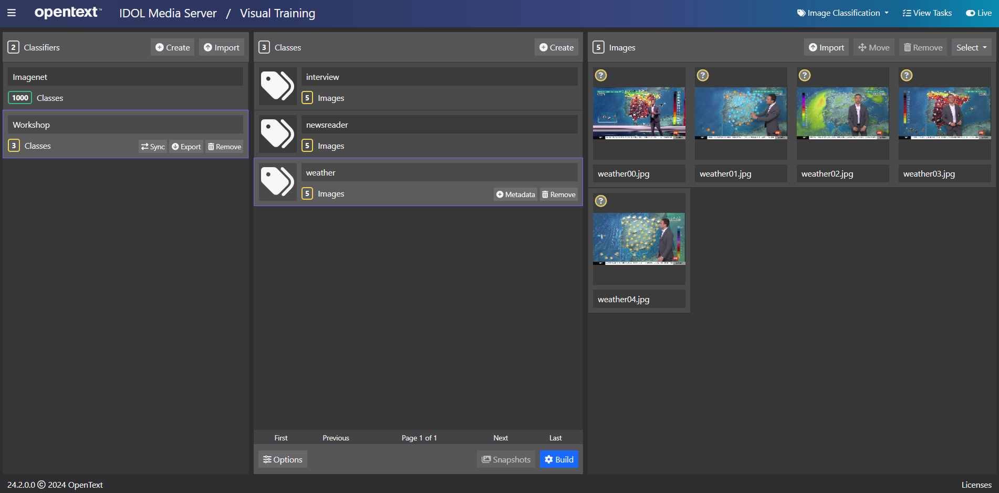
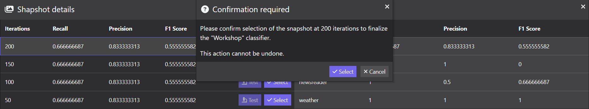

# PART II - Build a custom classifier

The pre-trained Image Classifiers that ship with IDOL Media Server cover a broad range of image content types; however, there may be occasions when you wish to work with additional types of content.  IDOL Media Server enables us to build custom classifiers by uploading and organizing your own sample images.

1. use the IDOL Media Server GUI to upload sample images to train a classifier to distinguish between new classes
1. understand key issues when selecting training images to build new classifiers
1. process test images to label them with these new classes
1. use "snapshots" to optimize your own models

---

- [Image class training](#image-class-training)
  - [Collect sample training images](#collect-sample-training-images)
  - [Class and image selection best practice](#class-and-image-selection-best-practice)
  - [Add training images](#add-training-images)
  - [Build your classifier](#build-your-classifier)
- [Running image classification](#running-image-classification)
- [Results](#results)
  - [Accuracy optimization](#accuracy-optimization)
    - [Retrain with snapshots](#retrain-with-snapshots)
    - [Compare snapshots](#compare-snapshots)
    - [Fixing a snapshot](#fixing-a-snapshot)
    - [Re-using validation data](#re-using-validation-data)
- [Next steps](#next-steps)

---

## Image class training

IDOL Media Server can be trained to distinguish between classes of image content.  

Image Classification works by saying how alike a test image (or video frame) is to each of the trained classes in a given classifier.  In the previous lesson you used the ImageNet pre-trained classifier to label a test image of a kitten.  The ImageNet classifier contains many other classes and is usually a sufficient and capable tool for any image labelling use case out of the box.

Custom classifiers on the other hand, are most often used not to label but to pick a winner, *i.e.*: 

- Is a railway platform crowded or quiet?
- Is a bank teller's window open or closed?
- Is a scanned document a copy of an ID Card, a Birth Certificate or a University diploma?
- Is a sports broadcast showing a football match, a crowd of fans or a studio shot?
- Is a dash-cam video showing a city scene, a country lane or a desert road?

> NOTE: This short list gives a flavor of the real-world problems have been successfully addressed with Media Server's Image Classification in recent years.

IDOL Media Server training can be performed through its web API, detailed in the [reference guide](https://www.microfocus.com/documentation/idol/IDOL_24_2/MediaServer_24.2_Documentation/Help/index.html#Actions/Training/_TrainingActions.htm).  For smaller projects, demos and testing, you may find it easier to use the [`gui`](http://localhost:14000/a=gui) web interface.

### Collect sample training images

In this tutorial, we will train a new classifier to distinguish between video frames from a news broadcast showing a weather report, an interview or the main newsreader, using a small number of prepared sample images.

> TIP: Usually around 100 training images per class is sufficient to obtain good real-world performance.

These images are included in the folder `tutorials/showcase/image-classification/train`.  

> NOTE: For reference, these were obtained with the following steps:
> 
> 1. Recording five-minute video clips from the RTVE News channel [live stream](../../appendix/Media_tips.md#video-file-and-streamed-sources-from-the-web), using the method described in the [appendix](../../appendix/Media_tips.md#record-videoaudio-from-an-ip-stream):
>     ```sh
>     ffmpeg -i http://rtvelivestream-clnx.rtve.es/rtvesec/24h/24h_main_576.m3u8 -f segment -segment_time 300 -an -vcodec copy clip%04d.mp4
>     ```
> 1. Extracting stills from the clips at 2-second intervals, using the method described in the [appendix](../../appendix/Media_tips.md#extract-still-images-from-a-video-file), *e.g.*:
>     ```sh
>     mkdir clip0001
>     ffmpeg -i clip0001.mp4 -vf fps=0.5 clip0001/out%03d.jpg
>     ```
> 1. Manually reviewing the stills to select a variety of weather report, interview and newsreader (newscaster) shots.  For each class, six shots were selected: five for training and one reserved for testing.

### Class and image selection best practice

An image classifier is trained to differentiate between different types of scene.  Therefore a classifier must contain at least two classes and the classes you choose to define should be well differentiated, *i.e.* any image from one class should look different by eye to an image from any other class.

When selecting images to exemplify a class, make sure they are:
- self-similar, *i.e.* any two images from the class look similar by eye, and
- representative of real-world variation.

> NOTE: In the sample data provided for news readers, we include backgrounds and different people.

> INFO: Read the cautionary tale of the time-of-day-detecting [tank recognition AI](https://gwern.net/tank).

### Add training images

Open the IDOL Media Server [`gui`](http://localhost:14000/a=gui#/train/imageClass(tool:select)) (tested in Google Chrome), then follow these steps to upload your class training images:

1. at the top right, check that the analytic *Image Classification* is selected
1. in the left column, click `Create` to add a new *classifier* (a collection of *classes*)
    - rename the classifier to `Workshop`
1. in the center column, click `Create` to add a new *class*
    - give your class a name, *e.g.* "newsreader"
    - (*optionally*) add key-value metadata
1. in the right column, click `Import` to import images
    - Navigate to the tutorial folder `tutorials/showcase/image-classification/train` and select the five `newsreader`- images included
1. repeat the previous steps to create and add images for "interview" and "weather" classes.



### Build your classifier

Image classification uses Convolutional Neural Network (CNN) classifiers. A CNN classifier usually produces more accurate results than other types of classifier, but can require a significant amount of time to train.

> NOTE: For this lesson we have only a small number of images, so training with CPU can be done in a manageable time; however, in general it is *strongly recommended* to utilize GPU acceleration for training.  For details on GPU support and setup, please refer to the [admin guide](https://www.microfocus.com/documentation/idol/IDOL_24_2/MediaServer_24.2_Documentation/Help/Content/Advanced/GPU.htm).

The time required to train a classifier is proportional to the number of training iterations.  Increasing the number of iterations can result in better accuracy, but running too many iterations may result in over-fitting.

> TIP: For classifiers that have four or five dissimilar classes with around 100 training images per class, approximately 500 iterations produces reasonable results.

Back in the GUI, on the bottom right of the list of classes, click the "Options" button to open the training options menu and reduce the training iteration count to `50`.


> NOTE: For details on available training options, please read the [admin guide](https://www.microfocus.com/documentation/idol/IDOL_24_2/MediaServer_24.2_Documentation/Help/Content/Actions/Training/SetClassifierTrainingOption.htm).

Click "Confirm" to apply your change.  Now we're ready to click `Build`.

> NOTE: With these configuration options on the author's laptop, this build took about 20 minutes in CPU mode or 40 seconds with GPU.

## Running image classification

Once we have trained some sample images for our class(es), we are ready to run the *Image Classification* analysis.  To do this, we can define the following process engine configuration:

```ini
[ImageClassificationEngine]
Type = ImageClassification
Classifier = Workshop
```

> NOTE: More options are available for the *Image Classification* analysis engine, including setting the matching threshold and allowing multiple matches to be returned.  Please read the [reference guide](https://www.microfocus.com/documentation/idol/IDOL_24_2/MediaServer_24.2_Documentation/Help/Content/Configuration/Analysis/ImageClass/_ImageClassification.htm) for details.

Paste the following parameters into [`test-action`](http://127.0.0.1:14000/a=admin#page/console/test-action), which assume you have downloaded a local copy of these tutorial materials as described [here](../../setup/SETUP.md#obtaining-tutorial-materials):

```url
action=process&source=C:/OpenText/idol-rich-media-tutorials/tutorials/showcase/image-classification/test/interview.jpg&configPath=C:/OpenText/idol-rich-media-tutorials/tutorials/showcase/image-classification/imageClassification.cfg&[ImageClassificationEngine]Classifier=Workshop
```

> TIP: Select the blue arrow button to expand the process parameters and make any changes to file paths as needed on your system.

Click `Test Action` to start processing.

> NOTE: We are using a sample process configuration, similar to the one you built in PART I, but using a handy feature of the ACI API to override the `Classifier` parameter to reference our newly built model.

## Results

To review the resulting detection image, go to Media Server's `output` folder and find `interview.xml`:

```xml
<ImageClassificationResult>
  <id>af8ee1a4-8eea-4c52-9668-a81d7e1e74a4</id>
  <classification>
    <identifier>interview</identifier>
    <confidence>99.91</confidence>
  </classification>
  <classifier>Workshop</classifier>
</ImageClassificationResult>
```

Success!  Our small classifier gives us the correct label "interview", with a high 99.9% confidence score.

Modify the above command to do the same for the test images `newsreader.jpg` and `weather.jpg`.  Check the resulting XML.  Where the others as successful?

### Accuracy optimization

We can optionally configure Media Server to take "snapshots" of our new model at regular intervals during the training process.  

By setting aside some of your training images for evaluation purposes, you can then compare the accuracy (precision and recall) of your model at each snapshot. 

You can then select the best performing snapshot to "publish" and therefore avoid over-fitting.

> NOTE: For full details, please refer to the [reference guide](https://www.microfocus.com/documentation/idol/IDOL_24_2/MediaServer_24.2_Documentation/Help/Content/Training/ImageClass_CreateClassifier.htm).

#### Retrain with snapshots

Back in the GUI, on the bottom right of the list of classes, click the "Options" button to open the training options menu and reduce the training iteration count to `50`.


Click "Confirm" and note that your classifier reverts to an untrained state.

Click "Build" to re-run your training.

When the build is complete, note that your classifier has entered a new "snapshotted" state and the "Snapshots" button is enabled.

#### Compare snapshots

Click the "Snapshots" button to open a dedicated window.  When you first do this, you will automatically trigger a task to test the last snapshot of your build:


Once the test task is completed, you can view the calculated accuracy (recall, precision and F1) for the combined classifier as well as for each individual class.

Optionally, click the "Test" button on the other snapshots to run test tasks for them:


In this case, we see "perfect" accuracy for our first and last snapshots, so we have no reason to choose anything other than the last one. 

#### Fixing a snapshot

In the current state, our model is already usable and will operate using the final build state, *i.e.* the last snapshot.


To "fix" or "publish" the model at your preferred snapshot, back to the snapshots window, hit "Select" button on your preferred snapshot.



The unwanted snapshots will be removed and your model will now be in the "trained" (green) state.

#### Re-using validation data

This model is not exactly the same as the first model you created, since it did not use the reserved validation data.  Having decided on your optimal snapshot (*i.e.* number of steps), you may now wish to retrain you model with a `Snapshot Frequency` of `0` to include all the available training images.

## Next steps

Why not try more tutorials to explore some of the other analytics available in IDOL Media Server, linked from the [showcase page](../README.md).
