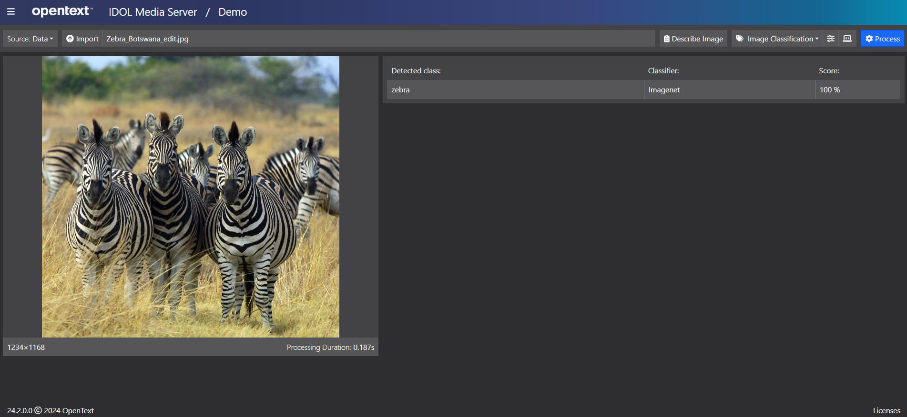

# Image Classification

IDOL Media Server includes an *Image Classification* analysis engine, which can be trained to classify images or video frames.  Common use cases include answering the questions:

- Does this scanned document show an ID card, an Invoice or a Letter, *etc.*?
- Was this photo taken in a city or in the desert?
- Does this CCTV camera show a crowded or an empty train platform?

For more details on *Image Classification*, see the [admin guide](https://www.microfocus.com/documentation/idol/IDOL_24_2/MediaServer_24.2_Documentation/Help/Content/Operations/Analyze/ImageClass.htm).

> NOTE: *Image Classification* results tell you about the contents of the whole image (or a defined region of the image) and is not to be confused with *Object Class Recognition*, which is covered separately [here](../object-class-recognition/README.md) and is used to detect and track the location of objects of a particular class, *e.g.* individual people or buses.

## Demo

Before rolling up our sleeves, let's run a quick demo, using the Media Server GUI, to see the results of Image Classification on a sample image.

First, follow [these steps](PART_I#import-pre-defined-classifiers) to load the latest "ImageNet" pre-trained classifier, then return here.

Process a test image:
- Open the Media Server GUI's [demo page](http://localhost:14000/a=gui#/demo).
- With "Source" set to "Data", click "Open" and navigate to this tutorial folder to load the included image `zebras.jpg`.
- Select the pre-configured analysis option "Image Classification"
- Hit the blue "Process" button.

    

> TIP: If you added more than one classifier, you can use the settings pop-up to select which one to apply. 

## PART I - Use an out-of-the-box classifier

Use the IDOL Media Server GUI to import pre-trained classes to enable classification (labelling) of common types of content in test images.

Start [here](PART_I.md).

## PART II - Build a custom classifier

Use the IDOL Media Server GUI to load training images and build a custom classifier to allow you to differentiate between images with your own types of content.

Start [here](PART_II.md).

## Next steps

Try our [document analytics](../optical-character-recognition/PART_II.md) lesson, which combines another pre-built *Image Classification* model with *OCR* and more to label scanned documents.

Why not try more tutorials to explore some of the other analytics available in IDOL Media Server, linked from the [showcase page](../README.md).
