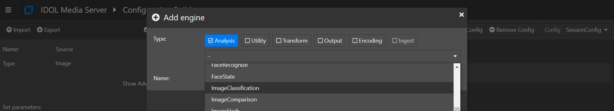
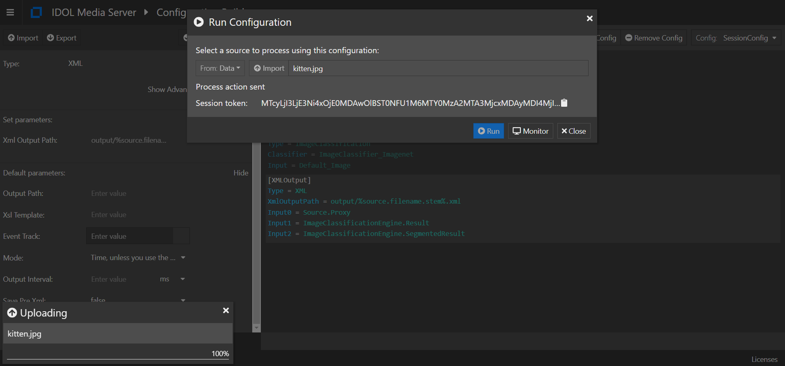

# Image Classification

Media Server includes an *Image Classification* analysis engine, which can be trained to classify images or video frames.  Common use cases include answering the questions:

- Does this scanned document show an ID card, an Invoice or a Letter, *etc.*?
- Was this photo taken in a city or in the desert?
- Does this CCTV camera show a crowded or an empty train platform?

For more details on *Image Classification*, see the [admin guide](https://www.microfocus.com/documentation/idol/IDOL_12_13/MediaServer_12.13_Documentation/Help/Content/Operations/Analyze/ImageClass.htm).

> NOTE: *Image Classification* results tell you about the contents of the whole image (or a defined region of the image) and is not to be confused with *Object Class Recognition*, which is covered in our [surveillance analytics](../surveillance/README.md) lesson and is used to detect and follow the location of objects of a particular class, *e.g.* individual people or buses.

In this tutorial we will use the Media Server GUI to:

1. import pre-trained classes to enable classification of common types,
1. build and run a process configuration to label a random image from Flickr.

This guide assumes you have already completed the [introductory tutorial](../../README.md#introduction).

---
<!-- TOC -->

- [Setup](#setup)
  - [Configure Media Server](#configure-media-server)
    - [Enabled modules](#enabled-modules)
    - [Licensed channels](#licensed-channels)
- [Training Image Classifiers](#training-image-classifiers)
  - [Import pre-defined classifiers](#import-pre-defined-classifiers)
- [Process configuration](#process-configuration)
  - [Obtaining a random test image](#obtaining-a-random-test-image)
  - [Config file](#config-file)
- [Running our analysis](#running-our-analysis)
- [Next steps](#next-steps)

<!-- /TOC -->
---

## Setup

### Configure Media Server

Media Server must be licensed for visual analytics, as described in the [introductory tutorial](../../introduction/PART_I.md#enabling-analytics).  To reconfigure Media Server you must edit your `mediaserver.cfg` file.

#### Enabled modules

The `Modules` section is where we list the engines that will be available to Media Server on startup.  Ensure that this list contains the module `imageclassification`:

```ini
[Modules]
Enable=...,imageclassification,...
```

#### Licensed channels

The `Channels` section is where we instruct Media Server to request license seats from License Server.  To enable *Image Classification* for this tutorial, you need to enable at least one channel of type *Visual*:

```ini
[Channels]
...
VisualChannels=1
```

> For any changes you make in `mediaserver.cfg` to take effect you must restart Media Server.

## Training Image Classifiers

Micro Focus provides a set of pre-defined training packs for Media Server, including image classifiers. Media Server also allows you to train your own classifiers by uploading and labelling your own images.

That training can be performed through Media Server's web API, detailed in the [reference guide](https://www.microfocus.com/documentation/idol/IDOL_12_13/MediaServer_12.13_Documentation/Help/index.html#Actions/Training/_ImageClassification.htm).  For smaller projects, demos and testing, you may find it easier to use the [`gui`](http://localhost:14000/a=gui) web interface.

### Import pre-defined classifiers

Pre-trained *Image Classification* packages are distributed separately from the main Media Server installer.  To obtain the training pack, return to the [Software Licensing and Downloads](https://sld.microfocus.com/mysoftware/index) portal, then:

1. Under the *Downloads* tab, select your product, product name and version from the dropdowns:

    

1. From the list of available files, select and download `MediaServerPretrainedModels_12.13.0_COMMON.zip`.

    

Extract the training pack `.zip` then, to load one of the classifiers, open the Media Server GUI at [`/action=gui`](http://127.0.0.1:14000/a=gui#/train/imageClass(tool:select)) and follow these steps:

1. in the left column, click `Import`
1. navigate to your extracted training pack and select `ImageClassifier_Imagenet.dat`

    

1. wait a few minutes for the import to complete.  You are now ready to classify media.

This classifier contains 1000 classes (from abucus to zucchini) and was built from the [ImageNet](https://www.image-net.org/index.php) set of labelled images:


## Process configuration

### Obtaining a random test image

A fun source of random photographs is the [Lorem Flickr](https://loremflickr.com/) project.  To obtain a random kitten photo for example, try <https://loremflickr.com/320/240/kitten>.  Here's one obtained earlier:


### Config file 

Let's build a process configuration using the interactive [config builder](http://localhost:14000/a=gui#/process).

To analyze an image file, include the following engines:

1. Click the `Add Engine` button, then select the *Image*-type ingest engine:

    

1. Next, to classify the image, add the *Image Classification*-type analysis engine:

    

1. You will now be prompted to specify the classifier to use.  Select the imported `ImageClassifier_ImageNet` from the dropdown menu:

    

    > For full details on this and other available options for *Image Classification*, please read the [reference guide](https://www.microfocus.com/documentation/idol/IDOL_12_13/MediaServer_12.13_Documentation/Help/index.html#Configuration/Analysis/ImageClass/_ImageClassification.htm).

1. Let's output the results to disk.  Add the "XML"-type output engine to do that:

    

1. Finally, you need to now set the output path.  With the `[XMLOutput]` section selected, click `Show` to reveal the available configuration parameters.  Set the "Xml Output Path" parameter to `output/%source.filename.stem%.xml`:

    

## Running our analysis

Still in the *Configuration Builder* page, click the `Run` button to open the source selection dialog.

Locate an image file to process, *e.g.* the example image from LoremFlickr included in this tutorial.


Click "Run" to launch the process:



To review the results, go to Media Server's `output` directory to find `kitten.xml`.

Open this file to see the classification results.  Within this XML, note the `<ImageClassificationResult>` tags, which contain the class matches.  In this case, three cat-like classes from ImageNet have been matched:

```xml
<record>
  <pageNumber>1</pageNumber>
  <trackname>ImageClassificationEngine.Result</trackname>
  <ImageClassificationResult>
    <id>374727aa-d90c-4b19-aa78-dd80c07afa04</id>
    <classification>
      <identifier>tabby, tabby cat</identifier>
      <confidence>49.63</confidence>
    </classification>
    <classifier>ImageClassifier_Imagenet</classifier>
  </ImageClassificationResult>
</record>
<record>
  <pageNumber>1</pageNumber>
  <trackname>ImageClassificationEngine.Result</trackname>
  <ImageClassificationResult>
    <id>374727aa-d90c-4b19-aa78-dd80c07afa04</id>
    <classification>
      <identifier>tiger cat</identifier>
      <confidence>22.66</confidence>
    </classification>
    <classifier>ImageClassifier_Imagenet</classifier>
  </ImageClassificationResult>
</record>
<record>
  <pageNumber>1</pageNumber>
  <trackname>ImageClassificationEngine.Result</trackname>
  <ImageClassificationResult>
    <id>374727aa-d90c-4b19-aa78-dd80c07afa04</id>
    <classification>
      <identifier>Egyptian cat</identifier>
      <confidence>15.07</confidence>
    </classification>
    <classifier>ImageClassifier_Imagenet</classifier>
  </ImageClassificationResult>
</record>
```

> NOTE: This image labelling can be used to facilitate image search, where:
> - the image can be retrieved from the search term "Egyptian cat". and
> - the image can be used to generate a query looking for documents (and other images) about Egyptian cats.

## Next steps

Take a look at Media Server's sample configurations folder, which includes an example using *Image Classification* to process a video file.

Why not try more tutorials to explore some of the other analytics available in Media Server, linked from the [main page](../../README.md).
