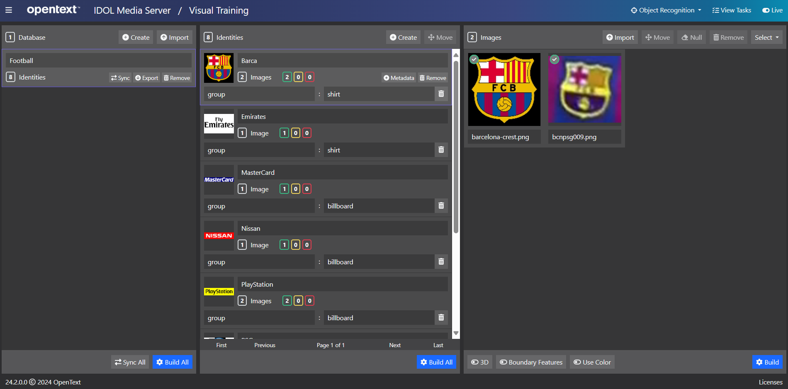

# Logo Recognition

IDOL Media Server includes an Object Recognition analysis engine, which can be trained to recognize specific 2-D and 3-D objects in images and video, such as a logo or painting.

For a more detailed introduction to Object Recognition, see the [admin guide](https://www.microfocus.com/documentation/idol/IDOL_24_4/MediaServer_24.4_Documentation/Help/Content/Operations/Analyze/ObjectRecognition_Introduction.htm).

In this tutorial we will:

1. use the Object Recognition analysis engine to train Objects and identify them in a video from a football match
1. use transform and image encoding engines to save cropped images of the Objects we find

This guide assumes you have already familiarized yourself with IDOL Media Server by completing the [introductory tutorial](../../README.md#introduction).

If you want to start here, you must at least follow these [installation steps](../../setup/SETUP.md) before continuing.

---

- [Setup](#setup)
  - [Third-party software](#third-party-software)
  - [Configure object recognition](#configure-object-recognition)
    - [Enabled modules](#enabled-modules)
    - [Licensed channels](#licensed-channels)
- [Training objects](#training-objects)
- [Process configuration](#process-configuration)
  - [Video file ingest](#video-file-ingest)
  - [Analysis](#analysis)
  - [Event processing](#event-processing)
  - [Encoding images as output](#encoding-images-as-output)
  - [In-use tracks](#in-use-tracks)
- [Running our analysis](#running-our-analysis)
- [Next steps](#next-steps)

---

## Setup

### Third-party software

This guide makes use of `node.js`.  Please follow these [instructions](../../setup/NODE_JS.md) if you do not already have it on your system.

### Configure object recognition

IDOL Media Server must be licensed for visual analytics, as described in the [introductory tutorial](../../introduction/PART_I.md#enabling-analytics).  To reconfigure IDOL Media Server you must edit your `mediaserver.cfg` file.

#### Enabled modules

The `Modules` section is where we list the engines that will be available to IDOL Media Server on startup.  Ensure that this list contains the module `objectrecognition`:

```ini
[Modules]
Enable=...,objectrecognition,...
```

#### Licensed channels

The `Channels` section is where we instruct IDOL Media Server to request license seats from IDOL License Server.  To enable *Object Recognition* for this tutorial, you need to enable at least one channel of type *Visual*:

```ini
[Channels]
...
VisualChannels=1
```

> NOTE: For any changes you make in `mediaserver.cfg` to take effect you must restart IDOL Media Server.

## Training objects

We previously trained faces by manually importing them into the training web app at [`/action=gui`](http://127.0.0.1:14000/a=graphicaluserinterface).  It is sometimes preferable to make use of the training actions programmatically, *i.e.* if we have many identities to train, or we just wish to automate the process.

Let's use the included `trainObjects.js` script to create identities for the Objects saved in our `billboard` and `shirt` directories by running the command in your terminal:

```sh
node trainObjects.js
```

We can then view the trained Objects in the training web app [`/action=gui`](http://127.0.0.1:14000/a=gui#/train/objectRec(tool:select)).



Alternatively you can list the trained models by pointing your browser to [`/action=listObjects`](http://127.0.0.1:14000/a=listObjects&Database=Football).

Name | Type | Object images
:---: | :---: | :---:
MasterCard | Billboard | 
Nissan | Billboard | 
PlayStation | Billboard | 
Unicredit | Billboard | 
PSG | Shirt | 
Emirates | Shirt | 
Barcelona | Shirt | 
Qatar Airways | Shirt | 

These objects are all 2D, *i.e.* flat images that might be seen from different angles but will always be flat when seen.  These objects can be trained with one or more images.  

> Training additional images for 2D objects is advisable.  A match to the object results from a match to any of its trained images.

3D objects can also be trained; however, because a 3D object can look significantly different from different angles, multiple images from multiple angles are always required to train such an object.

## Process configuration

### Video file ingest

To ingest a video file, we will include the following in our process configuration:

```ini
[Session]
Engine0 = VideoIngest
# Process every frame in the video irrespective of time taken
IngestRate = 0

[VideoIngest]
Type = Video
# Use video time rather than clock time
IngestDateTime = 0
```

For full details on the options available for ingesting video (and other) sources, please read the [reference guide](https://www.microfocus.com/documentation/idol/IDOL_24_4/MediaServer_24.4_Documentation/Help/index.html#Configuration/Ingest/_Ingest.htm).

### Analysis

To detect objects, we need to include the following:

```ini
[ObjectRecognition]
Type = ObjectRecognition
NumParallel = 2
Database = Football
ColorAnalysis = True
ObjectEnvironment = Cluttered
```

Here we have specified our newly created database with the `Database` parameter.  Without doing this, the analysis engine would attempt to match against all available object recognition databases.  Additional restrictions can be placed by providing:

- an identifier (or list of identifiers), *e.g.* for one-to-one validation (or matching a sub-set)
- a metadata key-value pair, *e.g.* if you want to match only shirt sponsors in our example, set `Metadata = group:shirt`

We have also specified some parameters that affect how the analytic runs.  For full details on these and other available options, please read the [reference guide](https://www.microfocus.com/documentation/idol/IDOL_24_4/MediaServer_24.4_Documentation/Help/index.html#Configuration/Analysis/Object/_Object.htm).

### Event processing

We will use an event processing filter to select high quality matches of a reasonable minimum size.  We will use a Lua function to filter on both the confidence of the match and the dimensions of the recognized object.

```ini
[HighQualityObjects]
Type = Filter
Input = ObjectRecognition.ResultWithSource
LuaLine = function pred(x) return x.IdentityData.confidence > 50 and x.RegionData.width > 20 and x.RegionData.height > 20 end
```

> NOTE: In production it is recommended to reference a script file, *e.g.* using the logo filter:

```ini
LuaScript = mmap/logoConfidenceFilter.lua
```

For more information on working with Lua scripts, see this short [guide](../../appendix/Lua_tips.md).

### Encoding images as output

Next we will draw overlays and then crop images around the detected objects before encoding them to files on disk:

```ini
# Transform
[DrawPolygon]
Type = Draw
Input = HighQualityObjects.Output
Color = Aqua
Thickness = 3

[CropObjects]
Type = Crop
Input = HighQualityObjects.Output
Border = 15%

# Encoding
[SaveFullImage]
Type = ImageEncoder
ImageInput = DrawPolygon.Output
OutputPath = output/football/%record.IdentityData.identifier%_%record.IdentityData.confidence%_%record.peakTime.timestamp%.png

[SaveCroppedImage]
Type = ImageEncoder
ImageInput = CropObjects.Output
OutputPath = output/football/%record.IdentityData.identifier%_%record.IdentityData.confidence%_%record.peakTime.timestamp%_crop.png
```

> NOTE: Unlike in the [introductory tutorial](../../introduction/PART_II.md#transformation-and-encoding), where used `draw.lua` to define out bound box color and line thickness, here were are specifying them directly.

### In-use tracks

Remember that only connected tracks are populated as a IDOL Media Server process runs.  If you want to monitor additional tracks, *e.g.* in IDOL Media Server's GUI, you can force them to be "in use" by adding them as inputs to a "dummy" engine, for example in this *Combine*-type event processing engine:

```ini
[Keep]
Type = Combine
Input0 = ObjectRecognition.DataWithSource
Input1 = ObjectRecognition.Start
Input2 = ObjectRecognition.End
```

## Running our analysis

While testing, or if you simply wish to keep your config files in a project-specific directory outside of `configurations`, you can reference a config file path in the process action by setting the `configPath` parameter (assuming of course that IDOL Media Server can access the location where your process configuration file is stored).

Let's try it. Paste the following parameters into [`test-action`](http://127.0.0.1:14000/a=admin#page/console/test-action), which assume you have downloaded a local copy of these tutorial materials as described [here](../../setup/SETUP.md#obtaining-tutorial-materials):

```url
action=process&source=C:/OpenText/idol-rich-media-tutorials/tutorials/showcase/logo-recognition/bcnpsg.mp4&configPath=C:/OpenText/idol-rich-media-tutorials/tutorials/showcase/logo-recognition/objectRecognition.cfg
```

Click `Test Action` to start processing.

To review the resulting detection images, go to `output/football`, *e.g.*


Stop processing with [`stop`](http://127.0.0.1:14000/a=queueInfo&queueAction=stop&queueName=process) or just let the process stop itself when it reaches the end of the video file.

## Next steps

Why not try more tutorials to explore some of the other analytics available in IDOL Media Server, linked from the [showcase page](../README.md).
