# Milestone integration

Media Server offers integration with popular third party Video Management System (VMS) products from Milestone and Genetec. Media Server includes dedicated ingest engines to process live streaming video from Milestone's "XProtect" and Genetec's "Security Center". Both of these products offer methods to receive events from external systems, so Media Server also includes dedicated Milestone and Genetec output engines to send events back to these products.  In this way, IDOL Media Server can be positioned as an analytics plug-in for existing Milestone and Genetec customers.

> For customers who do not already have a VMS, it should be noted that Media Server's own [Rolling Buffer](https://www.microfocus.com/documentation/idol/IDOL_12_13/MediaServer_12.13_Documentation/Help/Content/Operations/Encode/RollingBuffer_Introduction.htm) capability allows it to function as a VMS: recording live video from direct camera connection and facilitating playback, via HLS streaming, of that recorded video.

In this tutorial we will focus on Milestone XProtect Corporate as an example external VMS.  We will:

1. introduce Milestone documentation to install and configure a trial version of XProtect Corporate on Windows,
1. ingest a video file into Milestone as a substitute for a real CCTV camera stream,
1. run a Media Server process action to analyze video streamed from Milestone to create events that we will send back to Milestone, and
1. show how these events are visualized in Milestone XProtect Smart Client.

This guide assumes you have already completed the [Introductory](../../README.md#introduction) tutorial.

---
<!-- TOC -->

- [Milestone setup](#milestone-setup)
  - [Install DirectShow driver](#install-directshow-driver)
- [Configure video recording in Milestone](#configure-video-recording-in-milestone)
  - [DirectShow driver setup](#directshow-driver-setup)
  - [Video file ingest](#video-file-ingest)
  - [(*Optional*) Webcam ingest](#optional-webcam-ingest)
- [Test Media Server ingest](#test-media-server-ingest)
  - [Optional use of Milestone SDK](#optional-use-of-milestone-sdk)
- [Configure Media Server for processing](#configure-media-server-for-processing)
  - [Enabled modules](#enabled-modules)
  - [Licensed channels](#licensed-channels)
  - [Analysis Configuration](#analysis-configuration)
    - [Ingest](#ingest)
    - [Analysis](#analysis)
    - [Output](#output)
- [Configure Milestone to receive analytics events](#configure-milestone-to-receive-analytics-events)
- [Run the Media Server process](#run-the-media-server-process)
- [View alerts in the Milestone Smart Client](#view-alerts-in-the-milestone-smart-client)
- [Next steps](#next-steps)

<!-- /TOC -->
---

## Milestone setup

Milestone offers a 30-day trial license for their XProtect Corporate application.  You can request a license [here](https://www.milestonesys.com/solutions/platform/try-our-software/xprotect-trial-download/).  After completing the form, you will receive an email including your `.lic` license key file.  Save that file somewhere.

Next, download a copy of the installer from [here](https://www.milestonesys.com/support/resources/download-software/?prod=3&type=11&lang=27).  Look for the version that matches your trial key.  The latest version at the time of writing is "XProtect Corporate 2021 R1 (21.1b)".

Once the download is complete, run the install wizard as your current Windows user, *i.e.* not with Administrator privileges.

- Enter the location of your license key file:

    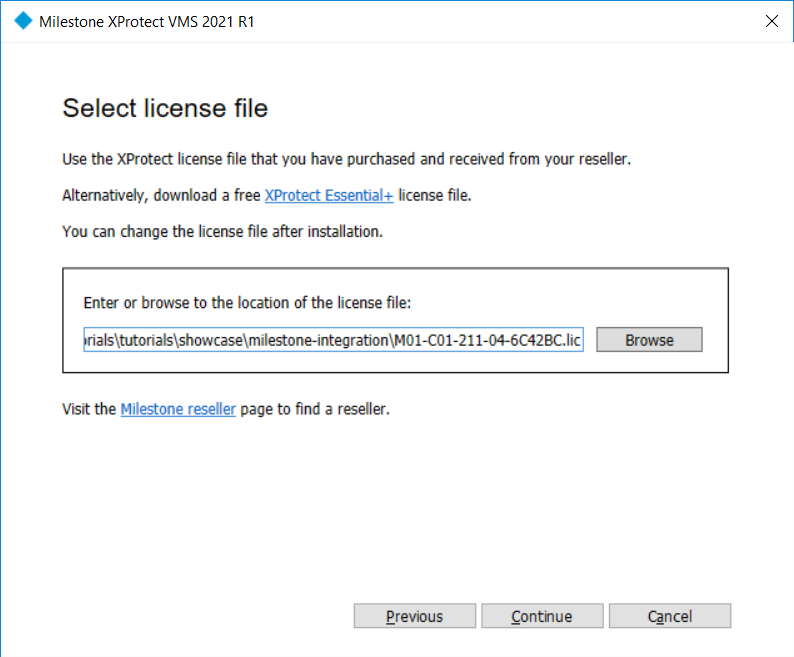

- Select "Single computer" install, then keep defaults.
- (*Optionally*) Create a system password and mobile server password.
- Specify the recording server settings, *i.e.* the details of the machine where you are running this installer:

    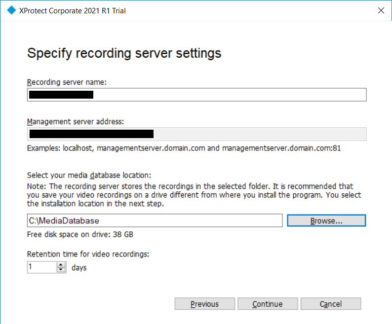

- (*Optionally*) Configure certificates for secure communications.
- Finalize installation steps with default options.

> The install process may take quite a while.  Now would be a very good time to grab a coffee...

Once complete, the Milestone XProtect Smart Client application will open.  Log in with "Windows authentication (current user)".

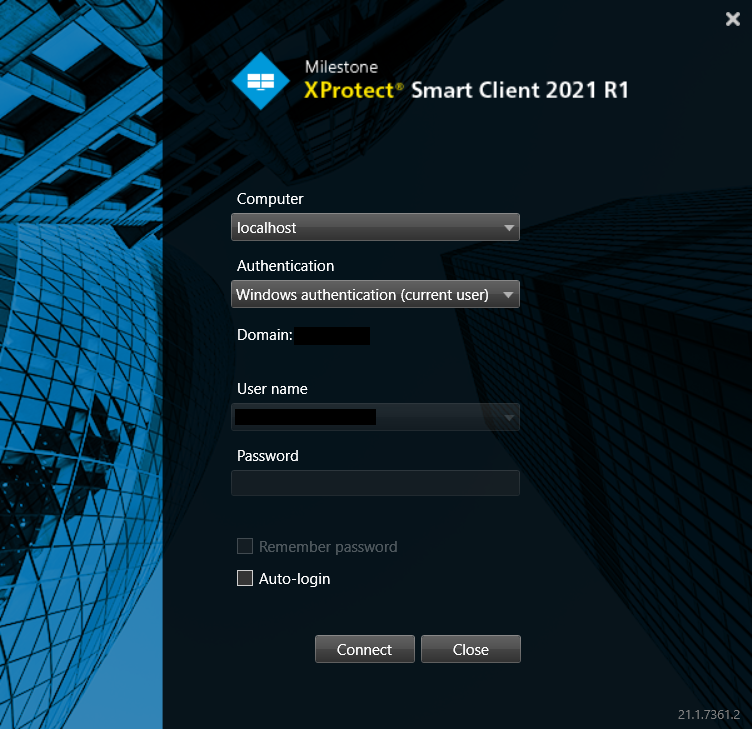

> Keep this client open, you will need it later on.

### Install DirectShow driver

In order to ingest video files into Milestone for testing, we need to install the DirectShow driver as part of the "Legacy Device Pack".

Download a copy of the installer from [here](https://www.milestonesys.com/support/resources/download-software/?type=17&lang=27).  Look for the version that matches your version of XProtect.  The latest version at the time of writing is "2.1b".

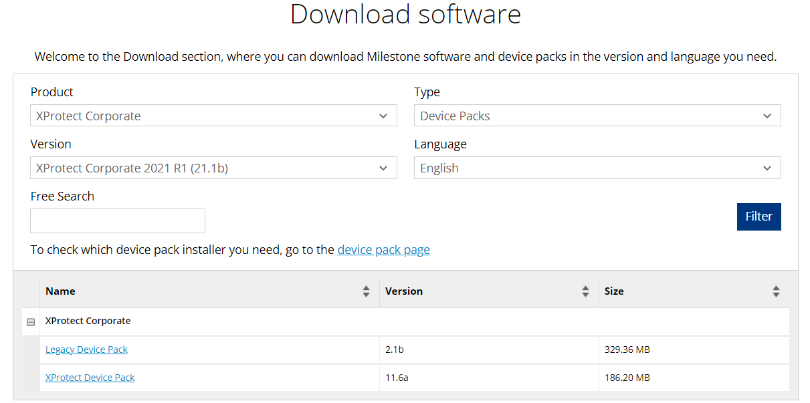

Once the download is complete, run the install wizard with default options then restart XProtect.

## Configure video recording in Milestone

Milestone XProtect can attempt to automatically detect any IP cameras on your network. If you do not have a camera to hand, you can use Milestone's DirectShow driver to ingest a video file (on loop forever) or your webcam.  This [document](https://download.milestonesys.com/MTSKB/KB000001020/DirectShow-guide.pdf) explains the process in detail.

For this tutorial, we will use the video file `vehicles.avi`, which is included in the same folder as this guide.

> To try your own video, note that Milestone requires you to encode your video to `.avi` format.  You can do this using `ffmpeg`, with the command:
> ```
> ffmpeg -i vehicles.mp4 vehicles.avi
> ```

### DirectShow driver setup

To set up the DirectShow driver, first open "Milestone XProtect Management Client", then take the following steps:

- In the left-hand "Site Navigation" pane, select "Recording Server":
- Right click on your hostname and select "Add Hardware..." from the context menu.

    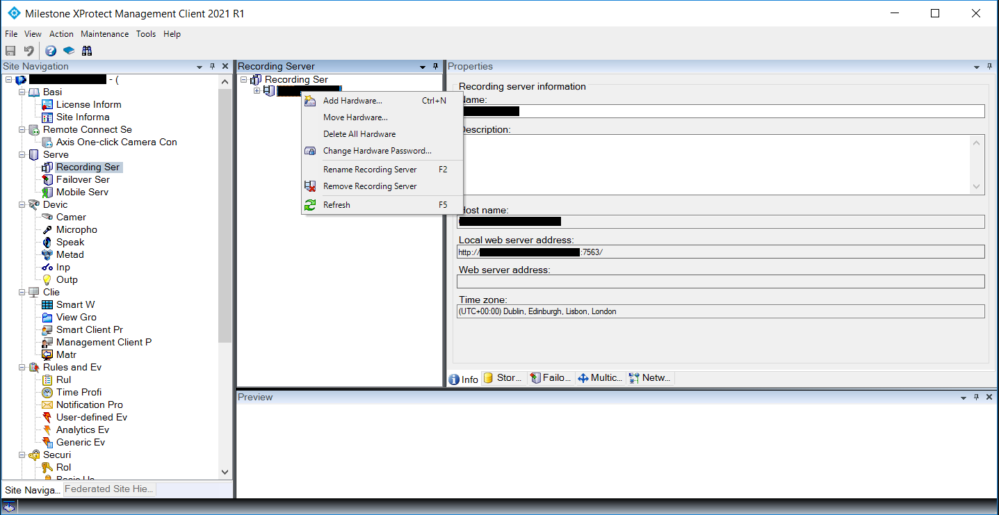

- Choose "Manual" mode, then click "Next" until you reach the screen that shows "Enter the network address and port for hardware you want to add" and configure as shown in this screenshot:

    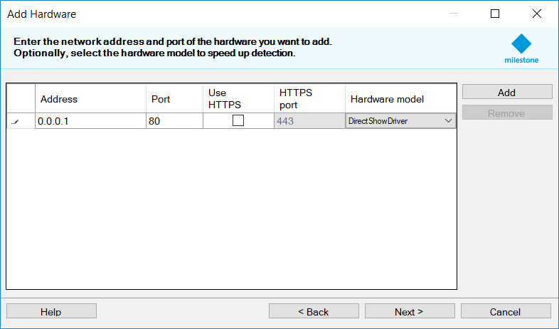

- You should now see that DirectShow has been successfully detected on your system:

    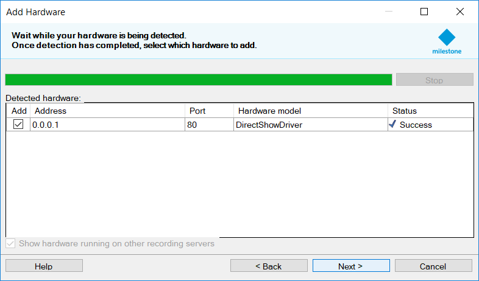

- Next, you have the option to activate up to eight video and audio inputs. I have selected two video and zero audio:

    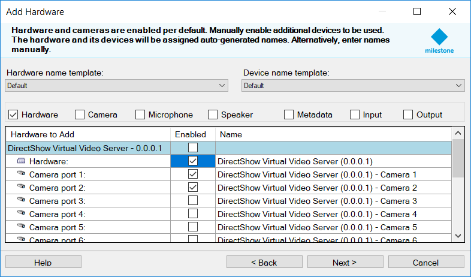

- Finally, you are prompted to add this new device to a camera group. If you don't already have one, create a new "Default camera group".  I've called mine "SafeCity":

    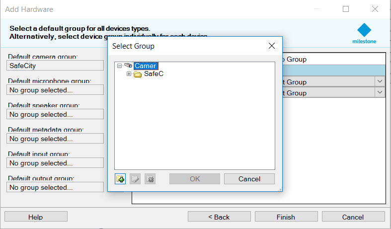

### Video file ingest

To ingest our video file, select the first activated video input, then on the "Settings" tab enter the path to the `vehicles.avi` file.  After you save changes (click the save icon at the top left of the window), wait a few seconds, then you will see video frames appear in the preview pane below:

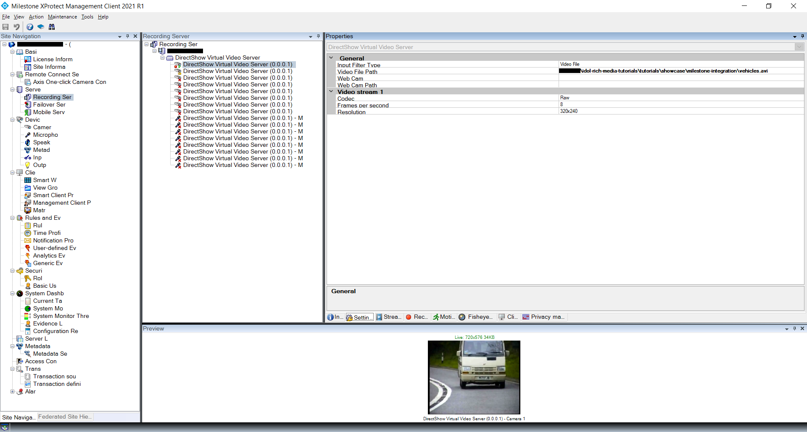

### (*Optional*) Webcam ingest

We will not use a webcam later in this tutorial but let's try to ingest video from your webcam now for your future reference.  

Select the second activated video input, then on the "Settings" tab, change "Input Filter Type" to "Webcam" and enter your webcam's video device name, which you have discovered before [here](../../setup/WEBCAM.md).  After you save changes, wait a few seconds, then you will see video frames appear in the preview pane below:

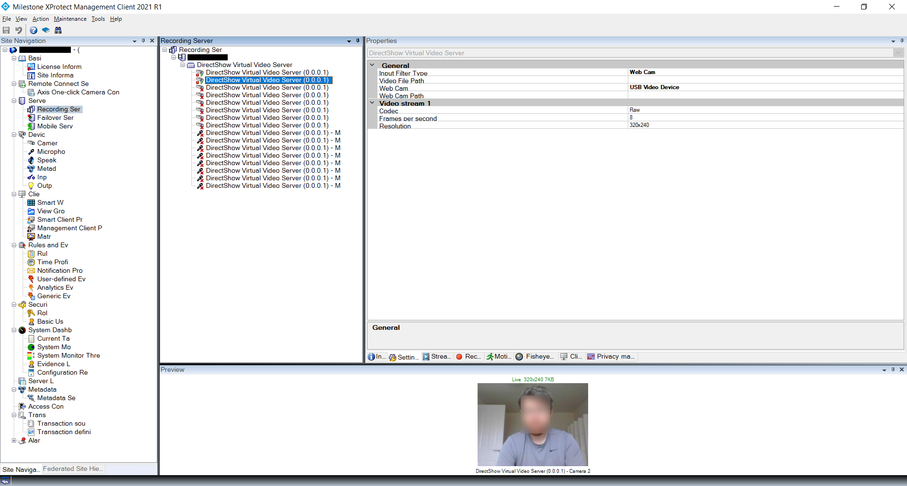

To stop processing your webcam, right click on the second activated input and deselect "Enabled" from the context menu.

## Test Media Server ingest

We can make use of the Media Server user interface [/a=gui](http://localhost:14000/a=gui) to quickly test ingestion of our new video source from Milestone:

1. Go to the *Ingest Test* page.
1. Select from the option dropdowns to ingest a "Stream" using "Milestone" and "NTLM" authentication:
        
    > Media Server's Milestone ingest engine, described in full [here](https://www.microfocus.com/documentation/idol/IDOL_12_13/MediaServer_12.13_Documentation/Help/index.html#Configuration/Ingest/Milestone/_Milestone.htm), offers multiple authentication options to support different versions of Milestone XProtect.  The "Corporate" version requires "NTLM" authentication.

1. The process action source for Milestone streams is the stream id, or `guid`.  Find it by running the following `curl` command:
    ```sh
    curl --ntlm --user <DOMAIN>/<USER>:<PASSWORD> http://localhost/rcserver/systeminfo.xml > systeminfo.xml
    ```

    In that returned XML, look for the camera with `cameraid` property matching the first activated video input of your DirectShow device, *e.g.*:

    ```xml
    <camera cameraid="DirectShow Virtual Video Server (0.0.0.1) - Camera 1">
      <guid>3d53dbca-dad6-4f89-ae97-2e073f5493e2</guid>
      <hostname>localhost</hostname>
      <port>7563</port>
      ...
    </camera>
    ```

1. The Milestone Ingest engine must also be configured with the hostname and port or your recording server, so note those down too from the above XML response.  When you fill these in on the Ingest Test page, note the config on the left pane shows the updated parameters:

    ```diff
      [In]
      Type = MilestoneIngest
      SOAPAuthentication = True
    + RecorderHost = localhost
    + RecorderPort = 7563
    ```

1. Next, add your Windows user login and password to authenticate, as well as the hostname and port 80 where Milestone authentication is handled using IIS. Note the following updated parameters:

    ```diff
      [In]
      Type = MilestoneIngest
      SOAPAuthentication = True
      RecorderHost = localhost
      RecorderPort = 7563
    + AuthenticationHost = localhost
    + AuthenticationPort = 80
    + NTLMUserName = <domain>\<user>
    + NTLMPassword = <encrypted password>
    ```

    > It is not recommended to enter your password in plain text.  Media Server includes a lightweight AES encryption tool `autpassword.exe`, which you can use to encrypt your password as follows:
    > ```sh
    > $ ./autpassword.exe -x -tAES -oKeyFile=./MyKeyFile.ky
    > ./MyKeyFile.ky=9b7aff82f1fa766985152790402a48f0ade3a20f196629b18e2eeb0c1735ff5f
    > $ ./autpassword -e -tAES -oKeyFile=./MyKeyFile.ky MyPassword
    > W1BBU1NXT1JEXQpUeXBlPUFFUwpLZXlGaWxlPUM6L01pY3JvRm9jdXMvTWVkaWFTZXJ2ZXJfMTIuOC4yX1dJTkRPV1NfWDg2XzY0L015S2V5RmlsZS5reQpQYXNzd29yZD05UmwyUzlrNXdyODNGWnR5dUhZU1VaVjNMRkQrUGV1L2dzWHZnWFVGVWRBPQ==
    > ```

1. Finally, click "Ingest" and watch the video successfully ingested into Media Server.

    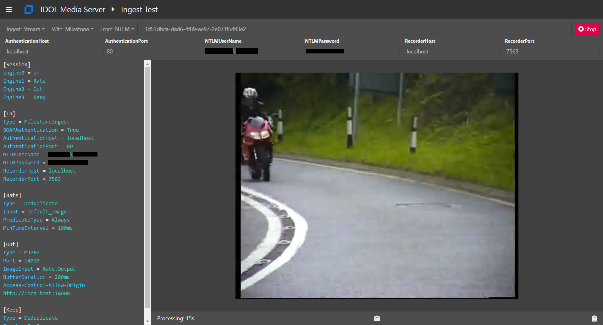

Click "Stop" now we're satisfied.

### Optional use of Milestone SDK

Media Server now offers two ingest options for Milestone.  The new  **Windows-only** option makes use of the Milestone SDK decoding libraries to allow encoded video to be streamed to Media Server, reducing network traffic in comparison to the existing cross-platform option, which received MJPEG video from Milestone.  To take advantage of this, you must include the following parameter in your `mediaserver.cfg` file:

```ini
[Paths]
MilestoneDirectory=libs/Milestone
```

This `MilestoneDirectory` path must point to a folder containing the decoder libraries from Milestone's SDK.

To obtain the Milestone SDK, 
1.	Go to https://www.milestonesys.com/community/developer-tools/sdk/download-sdk/ and register (it's free).
1.	Install the MIPSDK (tested against 2021 R1), *e.g.* under `C:/Program Files/Milestone/MIPSDK`.
1.	The MIPDSDK includes a handy batch script to copy the library files you need over to Media Server:

    ```
    cd "C:/Program Files/Milestone/MIPSDK/Bin"
    CopyMediaCpp.bat "C:/MicroFocus/MediaServer_12.13.0_WINDOWS_X86_64/libs/Milestone"
    ```
    > NOTE: 25 files should be copied.

No additional session config parameters are required to enable this option.  On Windows, Media Server will simply check for the existence of these Milestone libraries and quietly fall back to the cross-platform option if they do not exist.

The Milestone libraries offer some tuning options, which are exposed in Media Server's [Milestone Ingest Engine](https://www.microfocus.com/documentation/idol/IDOL_12_13/MediaServer_12.13_Documentation/Help/index.html#Configuration/Ingest/Milestone/_Milestone.htm).  These are:

Parameter | Default | Function
--- | --- | ---
DecoderThreads | 1 | Number of CPU threads available for Milestone decoder libraries.
FrameDropping | False | If set to "True", enables the Milestone decoder's ["Skip to catch up mode"](https://doc.developer.milestonesys.com/html/MMTKhelp/mmp_source_toolkit.html).


## Configure Media Server for processing

Let's process our video with *Numberplate Recognition* to generate alerts to send back to Milestone.

Before getting started, check that you have the required analytics modules and licensing configured.

### Enabled modules

The `Modules` section is where we list the engines that will be available to Media Server on startup.  Ensure that this list contains the following item:

```ini
[Modules]
Enable=...,numberplate,...
```

### Licensed channels

*Reminder*: The `Channels` section is where we instruct Media Server to request license seats from License Server.  Media Server has four license *flavours*:

1. Audio
1. Surveillance
1. Visual
1. Video Management

To enable *Numberplate Recognition* for this tutorial, you need to enable at least one channel of either *Surveillance* or *Visual*:

```ini
[Channels]
...
VisualChannels=1
```

> For any changes you make in `mediaserver.cfg` to take effect you must restart Media Server.

### Analysis Configuration

Let's create a simple process configuration to perform *Numberplate Recognition* (aka ANPR or ALPR) on our Milestone video.

#### Ingest

First, let's re-use the ingest configuration from our earlier test.  For our single-server Milestone installation, we can fall back to default values for some of these options:

```ini
[XProtectIngest]
Type = MilestoneIngest
# Specify the details to access the XProtect recorder here.
SOAPAuthentication = True
# RecorderHost = # Only needed if changed from the default of localhost.
# RecorderPort = # Only needed if changed from the default of 7563 (SOAPAuthentication True) or 80 (False).
NTLMUserName = <DOMAIN>\<USERNAME>
NTLMPassword = <PASSWORD>
# AuthenticationHost = # Only needed if changed from the default of localhost.
# AuthenticationPort = # Only needed if changed from the default of 80.
```

#### Analysis

The ANPR analysis is very simple:

```ini
[ANPR]
Type = numberplate
Location = GB
```

> For more on numberplate and vehicle analysis, try this [tutorial](../../README.md#vehicle-analysis).

#### Output

Finally, the output engine section:

```ini
[XProtectOutput]
Type = MilestoneOutput
Input = ANPR.Result,XProtectIngest.Proxy
ProxyTrack = XProtectIngest.Proxy
XSLTemplate = toMilestone.xsl
# Specify the details to access the XProtect recorder here.
Host = localhost
# Port = # Only needed if changed from the default of 9090.
Location = Cambridge
SavePreXML = true
SavePostXML = true
XMLOutputPath = output/milestone/%session.token%/%segment.type%_%%segment.sequence%.xml
```

> See the [reference guide](https://www.microfocus.com/documentation/idol/IDOL_12_13/MediaServer_12.13_Documentation/Help/index.html#Configuration/OutputEngines/Milestone/_Milestone.htm) for full details the Milestone output engine. 

The complete configuration is included here as `MilestoneANPR.cfg`.

## Configure Milestone to receive analytics events

Before running this process, we must configure Milestone to accept events from an external service.

- In the Milestone XProtect Management Client, select "Options", under the Tools menu, the select the check box to enable analytics events:
  
  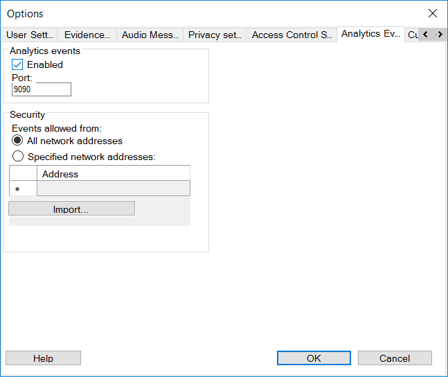

  > Verify that the port `9090` matches the value in the Media Server process configuration above.

- On the side menu, under "Rules and Events", select "Analytics Events".
- Right-click the top-level item, then select "Add New ..." from the context menu.

  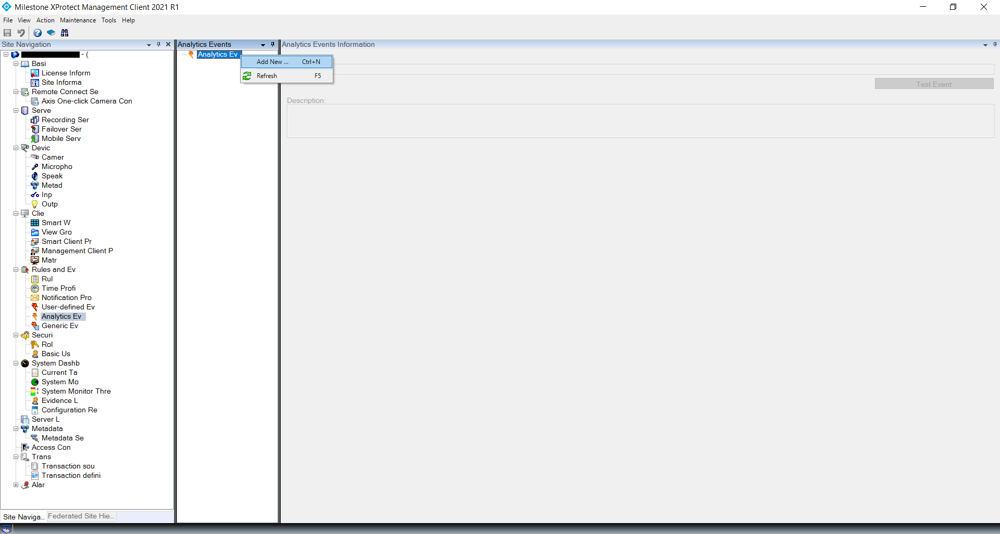

- Rename the event to "ANPR" and save changes.

  > If you wished to change the alert name from "ANPR", *e.g.* to "MyCustomEventName", you would have to change the default message in Media Server's `configurations/xsl/toMilestone.xsl` to match, *e.g.*:
  > ```diff
  > <xsl:template match="NumberPlateResult|NumberPlateResultAndImage">
  >   <xsl:variable name="score" select="numberplate/score"/>
  >   <xsl:variable name="confidence" select='format-number($score div 100, "0.00")'/>
  >   <AnalyticsEvent xmlns="urn:milestone-systems">
  >     <xsl:call-template name="formeventheader">
  >       <xsl:with-param name="type" select="'ANPR'" />
  >       <xsl:with-param name="location" select="../engineDetails/config/location" />
  >       <xsl:with-param name="isotime" select="../timestamp/peakTime/@iso8601" />
  >       <xsl:with-param name="guid" select="../engineDetails/config/guid" />
  > -     <xsl:with-param name="message" select="'ANPR'" />
  > +     <xsl:with-param name="message" select="'MyCustomEventName'" />
  >       ...
  > ```

- The "Test Event" button will become enabled.  Click it, then select your active camera to run the test.

  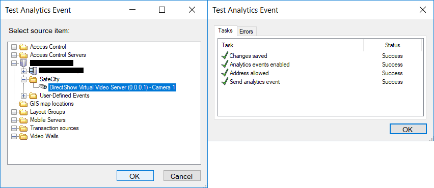

Next, we must define an alarm, which will be triggered by our incoming ANPR event.

- On the side menu, under "Alarms", select "Alarm Definitions".
- Right-click the top-level item, then select "Add New ..." from the context menu.

  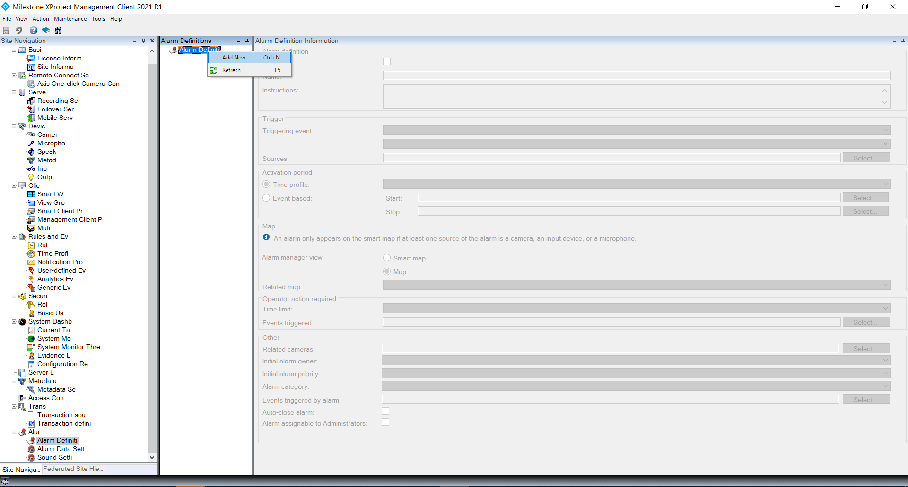

- Rename the alarm to "ANPR Alarm Definition".
- Under "Trigger", 
    - select "Analytics Events" from the first dropdown menu, 
    - select your event called "ANPR",
    - select your camera source, then 
    - save changes.

  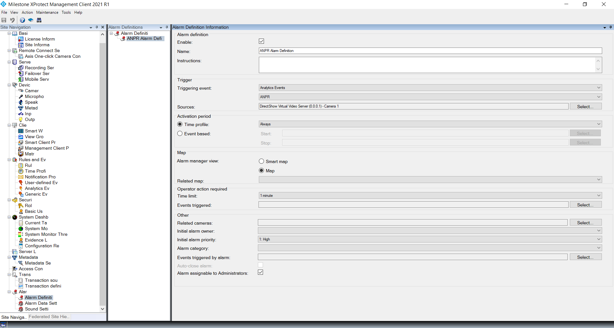

Finally, to ensure that all of the metadata provided by IDOL Media Server will be visible to users in Milestone, we must make one last configuration change:

- On the side menu, under "Alarms", select "Alarm Data Settings".
- Under the "Alarm List Configuration" tab, select all of the available columns:

  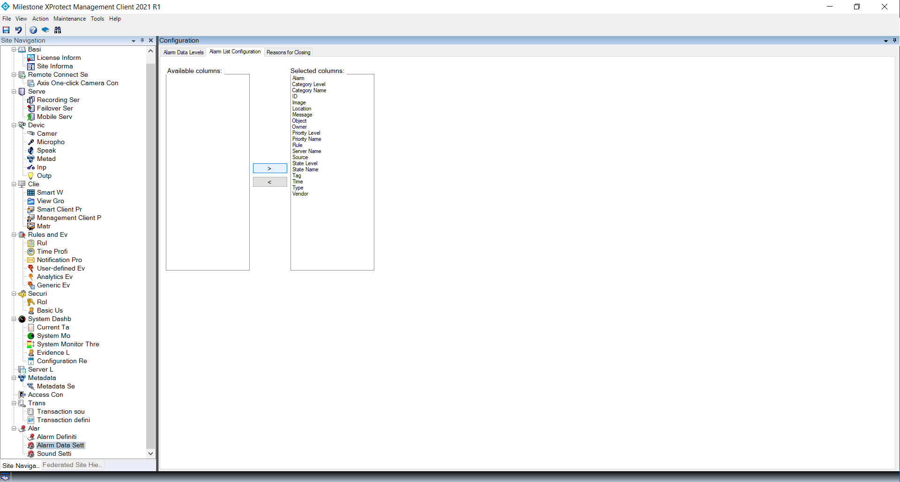

That's all!  We're ready to go.

> For more information about alert configuration in Milestone XProtect, please refer to the [XProtect VMS Administrator Manual](https://doc.milestonesys.com/2021R1/en-US/portal/htm/chapter-page-mc-administrator-manual.htm).

## Run the Media Server process

Paste the following parameters into [`test-action`](http://localhost:14000/a=admin#page/console/test-action), which assume you have downloaded a local copy of these tutorial materials as described [here](../../setup/SETUP.md#obtaining-tutorial-materials), entering your camera's GUID as the source:

```url
action=process&source=<CAMERA_GUID>&configPath=C:/MicroFocus/idol-rich-media-tutorials/tutorials/showcase/milestone-integration/MilestoneANPR.cfg
```

On that page, click `Test Action` to start processing.

## View alerts in the Milestone Smart Client

Open the Smart Client and log in as described [above](#milestone-setup).

You should already see a notification that `9+` alarms have been received.  Open the "Alarm Manager" tab to view details:

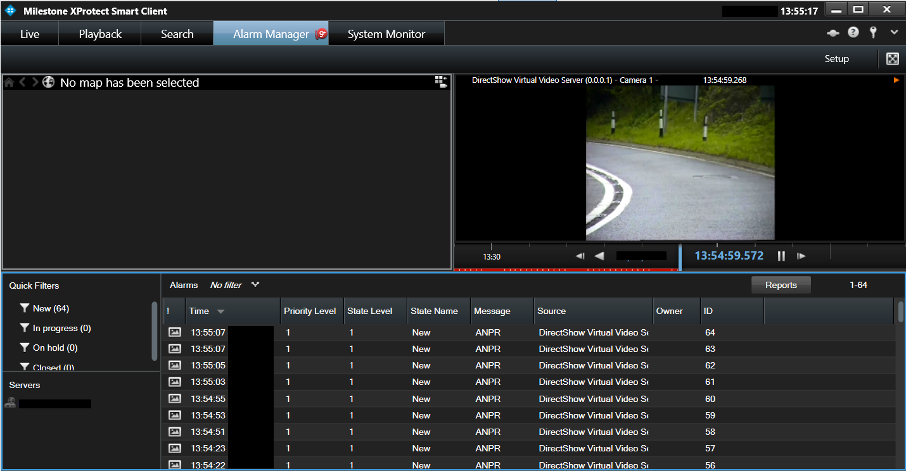

This view shows you a list of alarms under a live view of the camera stream.  Click on any of those alarms to open a new window showing your Media Server-produced ANPR event:

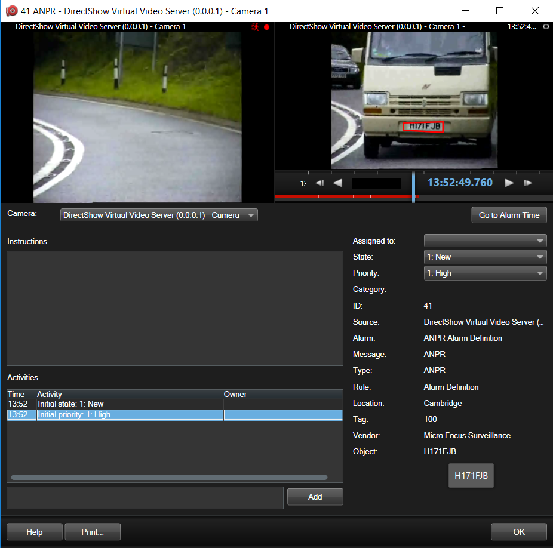

## Next steps

Why not try more tutorials to explore some of the other analytics available in Media Server, linked from the [main page](../../README.md).
