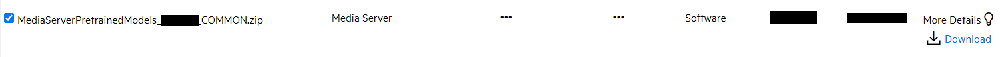
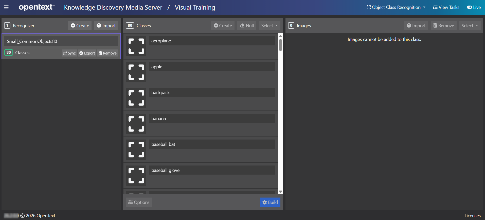

# Import a pre-defined recognizer

Pre-trained *Object Class Recognition* packages are distributed separately from the main Knowledge Discovery Media Server package.  To obtain the training pack, return to the [Software Licensing and Downloads](https://sld.microfocus.com/mysoftware/index) portal, then:

1. Under the *Downloads* tab, select your product, product name and version from the dropdowns:

    

1. From the list of available files, select and download `MediaServerPretrainedModels_26.2.0_COMMON.zip`.

    

Extract the training pack `.zip` then, to load one of the recognizers, open the Knowledge Discovery Media Server GUI at [`/action=gui`](http://127.0.0.1:14000/a=gui#/visual/objectClassRec(tool:select)) and follow these steps:

1. go to the Object Class Recognition visual training page
1. in the left column, click `Import`
1. navigate to your extracted training pack and select `ObjectClassRecognizer_Small_CommonObjects80.dat`

    

1. wait a few minutes for the import to complete.  You are now ready to locate objects in your media.

This recognizer contains 80 classes (from aeroplanes to zebras) and was built from the [Common Objects in Context](https://cocodataset.org) set of labelled images:

---

End
