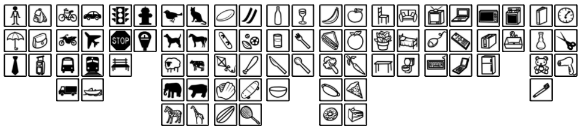
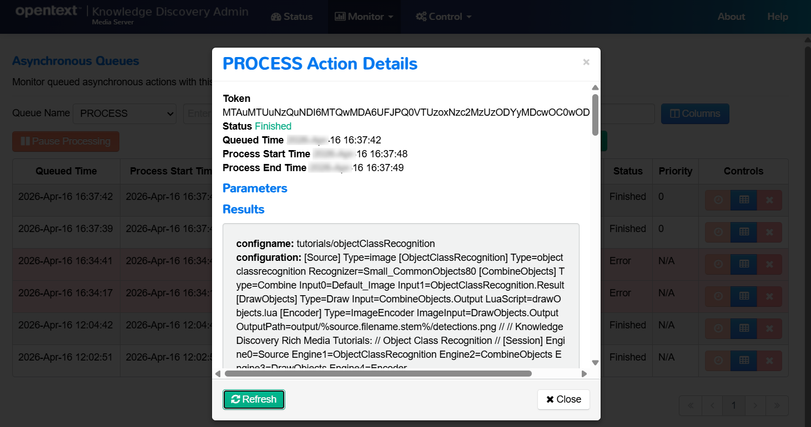
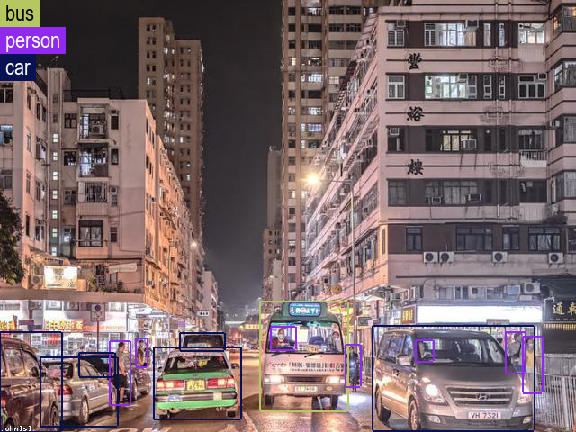

# PART I - Process images for recognition

In this tutorial we will:

1. verify the import of pre-trained classes to enable detection of common class types,
1. build and run a process configuration to detected objects in a random image from Flickr.

---

- [Setup](#setup)
  - [Configure Knowledge Discovery Media Server](#configure-knowledge-discovery-media-server)
    - [Enabled modules](#enabled-modules)
    - [Licensed channels](#licensed-channels)
    - [File access](#file-access)
- [Object Class Recognizers](#object-class-recognizers)
- [Process configuration](#process-configuration)
  - [Obtaining a random test image](#obtaining-a-random-test-image)
  - [Config file](#config-file)
- [Running our analysis](#running-our-analysis)
- [Results](#results)
- [PART II - Build a custom recognizer](#part-ii---build-a-custom-recognizer)

---

## Setup

### Configure Knowledge Discovery Media Server

Knowledge Discovery Media Server must be licensed for visual analytics, as described in the [introductory tutorial](../../introduction/PART_I.md#enablement-notes).  

Remember, to reconfigure Knowledge Discovery Media Server you must edit your `mediaserver.cfg` file then restart Knowledge Discovery Media Server.

#### Enabled modules

As a reminder, the `Modules` section list contains all modules by default.

In production, it is recommended to specify what modules are required, *e.g.* for this tutorial, we will depend on the following item:

```ini
[Modules]
Enable=...,objectclassrecognition,...
```

#### Licensed channels

The `Channels` section is where we instruct Knowledge Discovery Media Server to request license seats from Knowledge Discovery License Server.  To enable *Object Class Recognition* for this tutorial, you need to enable at least one channel of type *Visual*:

```ini
[Channels]
...
VisualChannels=1
```

#### File access

In this tutorial we will process an image file from the tutorials folder.  Modify the `mediaserver.cfg` file to add to include the folder containing these tutorial files, `e.g.` "C:\OpenText":

```diff
[Paths]
AllowedEngineOutputDirectories=output
-AllowedInputDirectories=
+AllowedInputDirectories=.,C:\OpenText
```

Restart Knowledge Discovery Media Server.

## Object Class Recognizers

OpenText provides a set of pre-trained packs for Knowledge Discovery Media Server, including object class recognizers. Knowledge Discovery Media Server also allows you to train your own recognizers by uploading and labelling your own images.

> NOTE: That training can be performed through Knowledge Discovery Media Server's API, detailed in the [reference guide](https://www.microfocus.com/documentation/idol/knowledge-discovery-26.2/MediaServer_26.2_Documentation/Help/index.html#Actions/Training/_ObjectClassRecognition.htm).  For smaller projects, demos and testing, you may find it easier to use the [`GUI`](http://localhost:14000/a=gui) web interface.

As you kow from the above demo, pre-trained *Object Class Recognition* packages are distributed separately from the main Knowledge Discovery Media Server package.  You have already obtained the training pack as described in [these steps](./IMPORT_RECOGNIZER.md).

This package includes multiple models for Object Class Recognition, which are described in the [documentation](https://www.microfocus.com/documentation/idol/knowledge-discovery-26.2/MediaServer_26.2_Documentation/Help/Content/Appendixes/PreTrained_Recognizers.htm) and can all be optionally loaded.

Following the demo steps, you loaded the `ObjectClassRecognizer_Small_CommonObjects80.dat` model. This recognizer contains 80 classes (from aeroplanes to zebras) and was built from the [Common Objects in Context](https://cocodataset.org) set of labelled images:



Let's use the same model again here.  

## Process configuration

### Obtaining a random test image

A fun source of random photographs is the [Lorem Flickr](https://loremflickr.com/) project.  To obtain a random photo of Hong Kong for example, try <https://loremflickr.com/640/480/hongkong>.  Here's one obtained earlier:


### Config file

An image-processing config file is included with this tutorial, called `objectClassRecognition.cfg`.

The image ingest engine is simple and should be familiar to you:

```ini
[Session]
Engine0 = Source

[Source]
Type = image
```

The analysis itself also does not require much configuration here.  We just reference the pre-loaded recognizer by name:

```ini
[ObjectClassRecognition]
Type = ObjectClassRecognition
Recognizer = Small_CommonObjects80
```

> NOTE: For full details on this and other available options for *Object Class Recognition*, please read the [reference guide](https://www.microfocus.com/documentation/idol/knowledge-discovery-26.2/MediaServer_26.2_Documentation/Help/index.html#Configuration/Analysis/ObjectClass/_ObjectClass.htm).

To show the object detection results, we are going to draw color-coded boxes around each one as overlays on the source image.  This requires two engines, a *Combine*-type Utility engine and a *Draw*-type Transform engine:

```ini
[CombineObjects]
Type = Combine
Input0 = Default_Image
Input1 = ObjectClassRecognition.Result

[DrawObjects]
Type = Draw
Input = CombineObjects.Output
LuaScript = drawObjects.lua
```

> NOTE: The `LuaScript` parameter is set to refer to a custom drawing logic file, included with this tutorial.

The final engine we need is an image encoder:

```ini
[Encoder]
Type = ImageEncoder
ImageInput = DrawObjects.Output
OutputPath = output/%source.filename.stem%/detections.png
```

## Running our analysis

Before processing, we must first copy the included `drawObjects.lua` file into Knowledge Discovery Media Server's `configurations/lua` directory.

With that copied, we're ready to go.

Media Server looks for process configuration files in its `configurations` folder.  You have already created a sub folder there called `tutorials`.  Copy over the `objectClassRecognition.cfg` from this lesson.

Paste the following parameters into [`test-action`](http://127.0.0.1:14000/a=admin#page/console/test-action), which assume you have downloaded a local copy of these tutorial materials as described [here](../../README.md#obtaining-tutorial-materials):

```url
action=process&source=C:/OpenText/idol-rich-media-tutorials/tutorials/showcase/object-class-recognition/hong_kong.jpg&configName=tutorials/objectClassRecognition
```

> NOTE: Ensure that you have configured Media Server to read files from this source directory, as described in the [introduction](../../introduction/PART_I.md#file-access).

Click `Test Action` to start processing.



## Results

To review the resulting detection image, go to `output/hong_kong` and find `detections.png`:



> TIP: Take a closer look at the included `drawObjects.lua` to see how the elements of the overlays and object class key were added.  To read more about Knowledge Discovery Media Server's drawing functions, see the [reference guide](https://www.microfocus.com/documentation/idol/knowledge-discovery-26.2/MediaServer_26.2_Documentation/Help/index.html#Lua/Draw/_Drawing.htm).

## PART II - Build a custom recognizer

Start [here](./PART_II.md).
