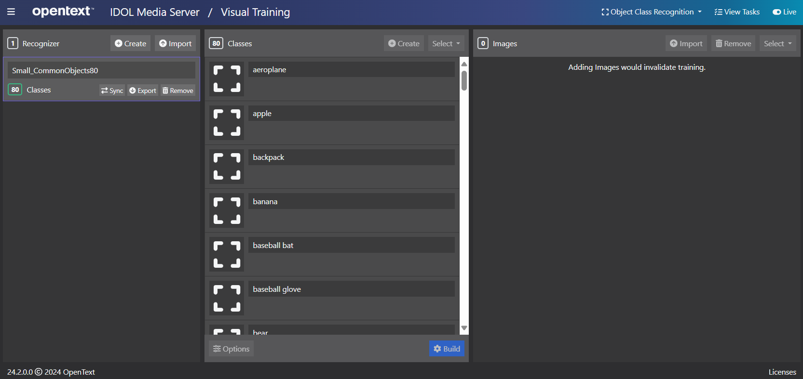
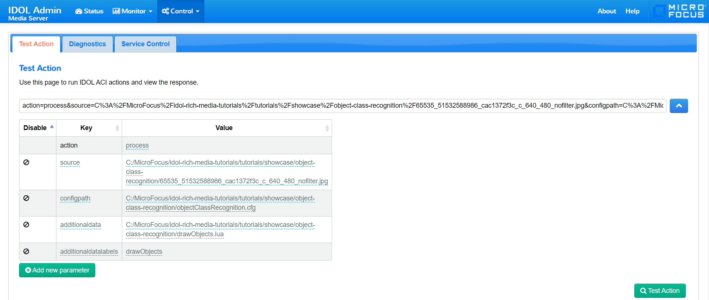
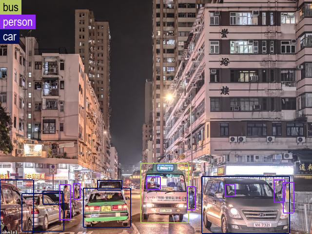

# PART I - Use an out-of-the-box recognizer

In this tutorial we will:

1. use the Media Server GUI to import pre-trained classes to enable detection of common class types,
1. build and run a process configuration to detected objects in a random image from Flickr.

This guide assumes you have already familiarized yourself with Knowledge Discovery Media Server by completing the [introductory tutorial](../../README.md#introduction).

If you want to start here, you must at least follow these [installation steps](../../setup/SETUP.md) before continuing.

---

- [Setup](#setup)
  - [Configure Knowledge Discovery Media Server](#configure-knowledge-discovery-media-server)
    - [Enabled modules](#enabled-modules)
    - [Licensed channels](#licensed-channels)
- [Training Object Class Recognizers](#training-object-class-recognizers)
  - [Import pre-defined recognizers](#import-pre-defined-recognizers)
- [Process configuration](#process-configuration)
  - [Obtaining a random test image](#obtaining-a-random-test-image)
  - [Config file](#config-file)
- [Running our analysis](#running-our-analysis)
- [Results](#results)
- [PART II - Build a custom recognizer](#part-ii---build-a-custom-recognizer)

---

## Setup

### Configure Knowledge Discovery Media Server

Knowledge Discovery Media Server must be licensed for visual analytics, as described in the [introductory tutorial](../../introduction/PART_I.md#enabling-analytics).  To reconfigure Knowledge Discovery Media Server you must edit your `mediaserver.cfg` file.

#### Enabled modules

The `Modules` section is where we list the engines that will be available to Knowledge Discovery Media Server on startup.  Ensure that this list contains the module `objectclassrecognition`:

```ini
[Modules]
Enable=...,objectclassrecognition,...
```

#### Licensed channels

The `Channels` section is where we instruct Knowledge Discovery Media Server to request license seats from Knowledge Discovery License Server.  To enable *Object Class Recognition* for this tutorial, you need to enable at least one channel of type *Visual*:

```ini
[Channels]
...
VisualChannels=1
```

> NOTE: For any changes you make in `mediaserver.cfg` to take effect you must restart Knowledge Discovery Media Server.

## Training Object Class Recognizers

OpenText provides a set of pre-defined training packs for Knowledge Discovery Media Server, including object class recognizers. Knowledge Discovery Media Server also allows you to train your own recognizers by uploading and labelling your own images.

That training can be performed through Knowledge Discovery Media Server's API, detailed in the [reference guide](https://www.microfocus.com/documentation/idol/knowledge-discovery-25.2/MediaServer_25.2_Documentation/Help/index.html#Actions/Training/_ObjectClassRecognition.htm).  For smaller projects, demos and testing, you may find it easier to use the [`gui`](http://localhost:14000/a=gui) web interface.

### Import pre-defined recognizers

Pre-trained *Object Class Recognition* packages are distributed separately from the main Knowledge Discovery Media Server package.  To obtain the training pack, return to the [Software Licensing and Downloads](https://sld.microfocus.com/mysoftware/index) portal, then:

1. Under the *Downloads* tab, select your product, product name and version from the dropdowns:

    

1. From the list of available files, select and download `MediaServerPretrainedModels_25.2.0_COMMON.zip`.

    

Extract the training pack `.zip` then, to load one of the recognizers, open the Knowledge Discovery Media Server GUI at [`/action=gui`](http://127.0.0.1:14000/a=gui#/train/objectClassRec(tool:select)) and follow these steps:

1. in the left column, click `Import`
1. navigate to your extracted training pack and select `ObjectClassRecognizer_Small_CommonObjects80.dat`

    

1. wait a few minutes for the import to complete.  You are now ready to locate objects in your media.

This recognizer contains 80 classes (from aeroplanes to zebras) and was built from the [Common Objects in Context](https://cocodataset.org) set of labelled images:


## Process configuration

### Obtaining a random test image

A fun source of random photographs is the [Lorem Flickr](https://loremflickr.com/) project.  To obtain a random photo of Hong Kong for example, try <https://loremflickr.com/640/480/hongkong>.  Here's one obtained earlier:


### Config file

An image-processing config file is included with this tutorial, called `objectClassRecognition.cfg`.

The image ingest engine is simple and should be familiar to you:

```ini
[Session]
Engine0 = Source

[Source]
Type = image
```

The analysis itself also does not require much configuration here.  We just reference the pre-loaded recognizer by name:

```ini
[ObjectClassRecognition]
Type = objectclassrecognition
Recognizer = ObjectClassRecognizer_Gen4_CommonObjects80
```

> NOTE: For full details on this and other available options for *Object Class Recognition*, please read the [reference guide](https://www.microfocus.com/documentation/idol/knowledge-discovery-25.2/MediaServer_25.2_Documentation/Help/index.html#Configuration/Analysis/ObjectClass/_ObjectClass.htm).

To show the object detection results, we are going to draw color-coded boxes around each one as overlays on the source image.  This requires two engines, a *Combine*-type Utility engine and a *Draw*-type Transform engine:

```ini
[CombineObjects]
Type = Combine
Input0 = Default_Image
Input1 = ObjectClassRecognition.Result

[DrawObjects]
Type = Draw
Input = CombineObjects.Output
LuaScript = drawObjects.lua
```

> NOTE: The `LuaScript` parameter is set to refer to a custom drawing logic file, included with this tutorial.

The final engine we need is an image encoder:

```ini
[Encoder]
Type = ImageEncoder
ImageInput = DrawObjects.Output
OutputPath = output/%source.filename.stem%/detections.png
```

## Running our analysis

Before processing, we must first copy the included `drawObjects.lua` file into Knowledge Discovery Media Server's `configurations/lua` directory.

With that copied, we're ready to go. 

Media Server looks for process configuration files in its `configurations` folder.  You have already created a sub folder there called `tutorials`.  Copy over the `objectClassRecognition.cfg` from this lesson.

Paste the following parameters into [`test-action`](http://127.0.0.1:14000/a=admin#page/console/test-action), which assume you have downloaded a local copy of these tutorial materials as described [here](../../setup/SETUP.md#obtaining-tutorial-materials):

```url
action=process&source=C:/OpenText/idol-rich-media-tutorials/tutorials/showcase/object-class-recognition/hong_kong.jpg&configName=tutorials/objectClassRecognition
```

> NOTE: Ensure that you have configured Media Server to read files from this source directory, as described in the [introduction](../../introduction/PART_I.md#enabling-file-access).

Click `Test Action` to start processing.



## Results

To review the resulting detection image, go to `output/hong_kong` and find `detections.png`:



> TIP: Take a closer look at the included `drawObjects.lua` to see how the elements of the overlays and object class key were added.  To read more about Knowledge Discovery Media Server's drawing functions, see the [reference guide](https://www.microfocus.com/documentation/idol/knowledge-discovery-25.2/MediaServer_25.2_Documentation/Help/index.html#Lua/Draw/_Drawing.htm).

## PART II - Build a custom recognizer

Start [here](./PART_II.md).
