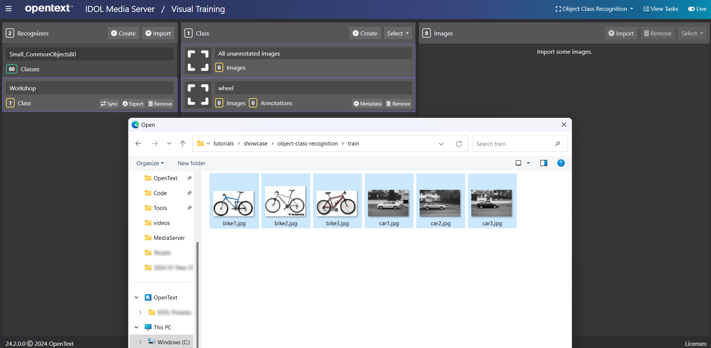
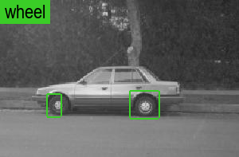

# PART II - Build a custom recognizer

The pre-trained Object Class Recognizers that ship with IDOL Media Server cover a broad range of objects; however, there may be occasions when you wish to work with additional classes of object.  IDOL Media Server enables us to build custom recognizers by uploading and annotating your own sample images.

1. use the IDOL Media Server GUI to upload and annotate sample images to train a recognizer for one new class
1. process test images to identify this new class
<!-- 1. discuss sources of new training data, e.g. OpenImages -->
<!-- 1. use "snap-shotting" to optimize your own models -->

---

- [Object class training](#object-class-training)
  - [Add your own training images](#add-your-own-training-images)
    - [Image selection best practice](#image-selection-best-practice)
  - [Annotate images for training](#annotate-images-for-training)
    - [Image annotation best practice](#image-annotation-best-practice)
  - [Build your recognizer](#build-your-recognizer)
- [Running object class recognition](#running-object-class-recognition)
- [Results](#results)
  - [GPU for processing](#gpu-for-processing)
- [Next steps](#next-steps)

---

## Object class training

IDOL Media Server can be trained to recognize classes of object, as well as specific objects, faces, vehicles and more.  We will now train a class for "wheels" using a small number of sample images in order to locate wheels in some test images.

IDOL Media Server training can be performed through its web API, detailed in the [reference guide](https://www.microfocus.com/documentation/idol/IDOL_24_2/MediaServer_24.2_Documentation/Help/index.html#Actions/Training/_TrainingActions.htm).  For smaller projects, demos and testing, you may find it easier to use the [`gui`](http://localhost:14000/a=gui) web interface.

### Add your own training images

Open the IDOL Media Server [`gui`](http://localhost:14000/a=gui#/train/objectClassRec(tool:select)) (tested in Google Chrome) then follow these steps to upload your class training images:

1. at the top right, note that the analytic *Object Class Recognition* is selected
1. in the left column, click `Create` to add a new *recognizer* (a collection of *classes*)
    - rename the recognizer to `Workshop`
1. in the center column, click `Create` to add a new *class*
    - give your class a name, *e.g.* "wheel"
    - (*optionally*) add key-value metadata
1. in the right column, click `Import` to import images
    - Navigate to the tutorial folder `C:/OpenText/idol-rich-media-tutorials/tutorials/showcase/object-class-recognition/train` and select the six images included



#### Image selection best practice

An object class recognizer is trained to locate objects of a specified class within a probe image.  This training uses machine learning and as such the resulting logic for matching can be considered a "black box".  Consider however that an essential component of locating objects is in distinguishing them from the background.  It is therefore best practice to:

1. upload sample images that include significant areas of background around your interesting objects, *i.e.* in this case, the sample images are not cropped tightly around the wheels, and
1. choose sample images that have a background that is representative of the backgrounds you will see in your probe images.

> INFO: Read the cautionary tale of the time-of-day-detecting [tank recognition AI](https://gwern.net/tank).

### Annotate images for training

Back in the IDOL Media Server GUI:

1. select (or hover over) one of the imported images and click the "Open" button
1. in the pop-up window that appears, at the top right, notice the class selector dropdown is automatically set for our single class "wheel"
1. move your mouse pointer over the image and notice that the cursor changes to a crosshair
1. click, drag and release the cursor over the image to draw a rectangle
1. tweak the rectangle to tightly surround your object of interest, either by dragging the corners of the rectangle, or editing the values for "Left", "Top", "Width" and "Height"
1. repeat this process to draw a box around each and every instance of the class in the image
1. on the navigation bar at the bottom of the pop-up window, click "Next" to move to the next sample image and repeat the annotation steps above.
1. once all images have been annotated, close the pop-up window

    

#### Image annotation best practice

Because object class recognizer training uses the regions around your annotated objects to build an understanding of the background, as discussed above, it is *essential* that you annotate each and every instance of the object class(es) in your recognizer for each and every image in your sample data.  If you do not, then features of your interesting classes may become associated with the background.

### Build your recognizer

Back in the IDOL Media Server GUI, click `Build`.

If you do not have GPU enabled for your IDOL Media Server instance, you will see an warning message at this point:


For this tutorial, the small sample size means that you can effectively train your recognizer in a reasonable period of time with or without GPU enabled.

If you do wish to train with CPU only, it is advisable to edit the default training options as follows (sacrificing some accuracy to save time):

1. Select the `generation1` recognizer type, and
1. Reduce the training iteration count to `50`.


> NOTE: With these configuration options on the author's laptop, this build took about nine minutes.

> NOTE: For details on available recognizer types and other available training options, please read the [admin guide](https://www.microfocus.com/documentation/idol/IDOL_24_2/MediaServer_24.2_Documentation/Help/Content/Operations/Analyze/ObjectClassRec_RecognizerTypes.htm).

When training your own recognizers, it is *strongly recommended* to utilize GPU acceleration.  This will allow you to train larger sample sets with many classes, as well as to utilize the most accurate "Generation 4" recognizer type.

> NOTE: For details on GPU support and setup, please refer to the [admin guide](https://www.microfocus.com/documentation/idol/IDOL_24_2/MediaServer_24.2_Documentation/Help/Content/Advanced/GPU.htm).

## Running object class recognition

Once we have trained some sample images for our class(es), we are ready to run the `ObjectClassRecognition` analysis engine.  To do this, we can define the following process engine configuration:

```ini
[ObjectClassRecognition]
Type = ObjectClassRecognition
Recognizer = Workshop
```

More options are available for the `ObjectClassRecognition` analysis engine, including setting the matching threshold and allowing multiple matches to be returned.  Please read the [reference guide](https://www.microfocus.com/documentation/idol/IDOL_24_2/MediaServer_24.2_Documentation/Help/Content/Configuration/Analysis/ObjectClass/_ObjectClass.htm) for details.

Paste the following parameters into [`test-action`](http://127.0.0.1:14000/a=admin#page/console/test-action), which assume you have downloaded a local copy of these tutorial materials as described [here](../../setup/SETUP.md#obtaining-tutorial-materials):

```url
action=process&source=C:/OpenText/idol-rich-media-tutorials/tutorials/showcase/object-class-recognition/test/car.jpg&configPath=C:/OpenText/idol-rich-media-tutorials/tutorials/showcase/object-class-recognition/objectClassRecognition.cfg&[ObjectClassRecognition]Recognizer=Workshop
```

> TIP: Select the blue arrow button to expand the process parameters and make any changes to file paths as needed on your system.

Click `Test Action` to start processing.

> NOTE: We are using the sample process configuration from PART I but using a handy feature of the ACI API to override the `Recognizer` parameter to reference our newly built model.

## Results

To review the resulting detection image, go to `output/car` and find `detections.png`:



Modify the above command to do the same for the second test image `bike.jpg`:


> NOTE: The bounding boxes are OK but do not exactly cover the detected wheels.  This is a common observation for results of a "Generation 1" recognizer.  A "Generation 4" recognizer will give significantly better bounding boxes from the same sample data.

### GPU for processing

As stated above, GPU is (practically speaking) essential for training new recognizers; however, when running a process action to match objects, the benefit of GPU is much reduced. This is particularly true for image processing. For video processing, running on a GPU-enabled IDOL Media Server *can* offer a benefit in certain situations.  See the tutorial on using Object Class Recognition for [surveillance analytics](../surveillance/README.md#optional-gpu-acceleration) for more discussion.

## Next steps

Why not try more tutorials to explore some of the other analytics available in IDOL Media Server, linked from the [showcase page](../README.md).
