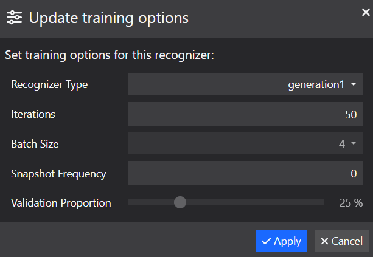

# PART II - Build a custom recognizer

> WARNING: Object Class Recognizer building is not available in 25.3.  For instructions to import a model built with 25.2, see the [documentation](https://www.microfocus.com/documentation/idol/knowledge-discovery-25.3/MediaServer_25.3_Documentation/Help/Content/Getting_Started/UpgradeDatabaseTorch.htm). The following instructions can be used with for your Media Server 25.2.

The pre-trained Object Class Recognizers that ship with Knowledge Discovery Media Server cover a broad range of objects; however, there may be occasions when you wish to work with additional classes of object.  

In this lesson, you will use Media Server to build custom recognizers:

1. use the Knowledge Discovery Media Server GUI to upload and annotate sample images
1. train a recognizer for a new class
1. process test images to identify this new class
<!-- 1. use "snapshots" to optimize your models -->
<!-- 1. discuss sources of new training data, *e.g.* OpenImages -->

---

- [Object class training](#object-class-training)
  - [Add your own training images](#add-your-own-training-images)
    - [Image selection best practice](#image-selection-best-practice)
    - [How many images do we need?](#how-many-images-do-we-need)
  - [Annotate images for training](#annotate-images-for-training)
    - [Image annotation best practice](#image-annotation-best-practice)
  - [Build your recognizer](#build-your-recognizer)
- [Running object class recognition](#running-object-class-recognition)
- [Results](#results)
  - [GPU for processing](#gpu-for-processing)
- [Accuracy optimization](#accuracy-optimization)
- [(*Optionally*) Logging model loss](#optionally-logging-model-loss)
- [Next steps](#next-steps)

---

## Object class training

Knowledge Discovery Media Server can be trained to recognize classes of object. As well as being able to detect classes from the out of the box training from [PART I](./PART_I.md), you can also define your own object types.

We will now train a class for "wheels" using a small number of sample images in order to locate wheels in some test images.

Knowledge Discovery Media Server training can be performed through its web API, detailed in the [reference guide](https://www.microfocus.com/documentation/idol/knowledge-discovery-25.2/MediaServer_25.2_Documentation/Help/index.html#Actions/Training/_TrainingActions.htm).  For smaller projects, demos and testing, you may find it easier to use the [`gui`](http://localhost:14000/a=gui) web interface.

### Add your own training images

Open the Knowledge Discovery Media Server [`gui`](http://localhost:14000/a=gui#/train/objectClassRec(tool:select)) then follow these steps to upload your class training images:

1. at the top right, note that the analytic *Object Class Recognition* is selected
1. in the left column, click `Create` to add a new *recognizer* (a collection of *classes*)
    - rename the recognizer to "Workshop"
1. in the center column, click `Create` to add a new *class*
    - give your class the name "wheel"
1. in the right column, click `Import` to import images
    - Navigate to the tutorial folder `C:/OpenText/idol-rich-media-tutorials/tutorials/showcase/object-class-recognition/train` and select all six images


#### Image selection best practice

An object class recognizer is trained to locate objects of a specified class within a given image.  This training uses machine learning and as such the resulting logic for matching can be considered a "black box".  Consider however that an essential component of locating objects is in distinguishing them from the background.  It is therefore best practice to:

1. upload sample images that include significant areas of background around your interesting objects

    > NOTE: In this example, the sample images are not cropped tightly around the wheels.

1. choose sample images that have a background that is representative of the backgrounds you will see in your probe images.

    > INFO: Read the cautionary tale of the time-of-day-detecting [tank recognition AI](https://gwern.net/tank).

#### How many images do we need?

Consider that your target object type, *e.g.* wheels, can appear with a lot of variation.  Your own brain can recognize different types of wheel because you have learned to recognize wheels on bikes, toy cars, trains, unicycles, *etc.*, and know what they look like from different angles, in different lighting conditions and when partially obscured.  To train AI, it is therefore sensible for us to look for a broad range of training images that is representative of the range we might expect to see in images we want to process.

So, how many images again?  Media Server will give you the following error if you have too few: "training an object class recognizer requires at least nine different annotations".

OK.  So, what is an annotation?  As will be discussed in more detail below, the count of "annotations" refers to count of target objects, *e.g.* wheels, across all your test images.  So, if you have one single image with nine wheels on it, that would be enough to meet the minimum requirement.

From the author's experience, it could be suggested:

- 10 annotations per class for a quick test,
- 50-100 annotations per class for a more thorough experiment, *e.g.* a proof of concept project, and
- 500+ for a deployed system.

Remember the discussion above, these additional examples must bring in new information to provide value.  It's no use adding 10 copies of the same view of an object.

> INFO: For reference, the COCO dataset, used to train the "Common Object" pre-trained models used in [PART I](./PART_I.md), were trained with an average of about ten thousand annotations per class.  See the [research paper](https://arxiv.org/abs/1405.0312) for full details, where, for interest, it was estimated that image labelling took 30 thousand hours of human effort to complete.

### Annotate images for training

Back in the Knowledge Discovery Media Server GUI:

1. select, or hover over, one of the imported images and click the "Open" button
1. in the pop-up window that appears, at the top right, notice the class selector dropdown is automatically set for our single class "wheel"
1. move your mouse pointer over the image and notice that the cursor changes to a crosshair
1. as shown in the animation below, click, drag and release the cursor over the image to draw a rectangle

    

1. you can tweak the rectangle to tightly surround your object of interest, either by dragging the corners of the rectangle, or editing the values for "Left", "Top", "Width" and "Height"
1. repeat this process to draw a box around each and every instance of the class in the image
1. on the navigation bar at the bottom of the pop-up window, click "Next" to move to the next sample image and repeat the annotation steps above.
1. once all images have been annotated, close the pop-up window

#### Image annotation best practice

Because object class recognizer training uses the regions around your annotated objects to build an understanding of the background, as discussed above, it is *essential* that you annotate each and every instance of the object class(es) in your recognizer for each and every image in your sample data.  If you do not, then features of your classes could become associated with the background.

### Build your recognizer

For this tutorial, the small sample size means that you can effectively train your recognizer in a reasonable period of time with or without GPU enabled.

If you do wish to train with CPU only, it is advisable to edit the default training options as follows (sacrificing some accuracy to save time):

1. Select the `generation1` recognizer type, and
1. Reduce the training iteration count to `50`.

    

> NOTE: For details on available recognizer types and other available training options, please read the [admin guide](https://www.microfocus.com/documentation/idol/knowledge-discovery-25.2/MediaServer_25.2_Documentation/Help/Content/Operations/Analyze/ObjectClassRec_RecognizerTypes.htm).

Once you are set up, at the bottom of the middle column, click `Build`.

> NOTE: If you do not have GPU enabled for your Knowledge Discovery Media Server instance, you will see a warning message at this point:
>
> 

Once completed, your workshop recognizer labels will turn green, to indicate that the model is finalized.

> NOTE: With these configuration options on the author's laptop using CPU, this build took about **nine minutes**. With the built in Nvidia T600 GPU, the same build took about 45 seconds.

When training your own recognizers, it is *strongly recommended* to utilize GPU acceleration.  This will allow you to train larger sample sets with many classes, as well as to utilize the most accurate "Generation 4" recognizer type.

> NOTE: For details on GPU support and setup, please refer to the [admin guide](https://www.microfocus.com/documentation/idol/knowledge-discovery-25.2/MediaServer_25.2_Documentation/Help/Content/Advanced/GPU.htm).

## Running object class recognition

Once we have trained some sample images for our class(es), we are ready to run the `ObjectClassRecognition` analysis engine.  To do this, we can define the following process engine configuration:

```ini
[ObjectClassRecognition]
Type = ObjectClassRecognition
Recognizer = Workshop
```

More options are available for the `ObjectClassRecognition` analysis engine, including setting the matching threshold and allowing multiple matches to be returned.  Please read the [reference guide](https://www.microfocus.com/documentation/idol/knowledge-discovery-25.2/MediaServer_25.2_Documentation/Help/Content/Configuration/Analysis/ObjectClass/_ObjectClass.htm) for details.

Paste the following parameters into [`test-action`](http://127.0.0.1:14000/a=admin#page/console/test-action), which assume you have downloaded a local copy of these tutorial materials as described [here](../../setup/SETUP.md#obtaining-tutorial-materials):

```url
action=process&source=C:/OpenText/idol-rich-media-tutorials/tutorials/showcase/object-class-recognition/test/car.jpg&configName=tutorials/objectClassRecognition&[ObjectClassRecognition]Recognizer=Workshop
```

> NOTE: Ensure that you have configured Media Server to read files from this source directory, as described in the [introduction](../../introduction/PART_I.md#enabling-file-access).

Click `Test Action` to start processing.

> NOTE: We are using the sample process configuration from PART I but using a handy feature of the ACI API to override the `Recognizer` parameter to reference our newly built model.

## Results

To review the resulting detection image, go to `output/car` and find `detections.png`:


Modify the above command to do the same for the second test image `bike.jpg`:


> NOTE: The bounding boxes do not *exactly* cover the detected wheels.  This is a common observation for results of a "Generation 1" recognizer.  A "Generation 4" recognizer will give significantly better bounding boxes from the same sample data.

### GPU for processing

As stated above, GPU is (practically speaking) essential for training new recognizers; however, when running a process action to match objects, the benefit of GPU is much reduced.

This is particularly true for image processing. For video processing, running on a GPU-enabled Knowledge Discovery Media Server *can* offer a benefit by enabling higher frame rate analysis.  See the tutorial on using Object Class Recognition for [surveillance analytics](../surveillance/README.md#optionally-enable-gpu-acceleration) for more discussion.

## Accuracy optimization

As a general rule, you can calculate a reasonable number of iterations by multiplying the number of object classes in the recognizer by 2000.

<!-- We can optionally configure Media Server to take "snapshots" of our new model at regular intervals during the training process.  

By setting aside some of your training images for evaluation purposes, you can then compare the accuracy (precision and recall) of your model at each snapshot.

The snapshot that represents the greatest number of iterations usually performs best. If you see a reduction in performance this indicates over-fitting. -->

<!-- ### (*Optionally*) Retrain with snapshots

Back in the GUI, on the bottom right of the list of classes, click the "Options" button to open the training options menu and make the following changes:

- increase the training iteration count to `200`,
- set the snapshot frequency to `50`, then
- click "Apply" and note that your recognizer reverts to an untrained state.

    

Click "Build" to re-run your training.

When the build is complete, note that your recognizer has entered a new "snapshotted" state and the "Snapshots" button is enabled. -->

<!-- ### Compare snapshots

> HERE

Click the "Snapshots" button to open a dedicated window.  When you first do this, you will automatically trigger a task to test the last snapshot of your build:


Once the test task is completed, you can view the calculated accuracy (recall, precision and F1) for the combined recognizer, as well as for each individual class.

Optionally, click the "Test" button on the other snapshots to run test tasks for them:


In this case, we see "perfect" accuracy for our first and last snapshots, so we have no reason to choose anything other than the last one. -->

<!-- ### Fixing a snapshot

In the current state, our model is already usable and will operate using the final build state, *i.e.* the last snapshot.


To "fix" or "publish" the model at your preferred snapshot, back to the snapshots window, hit "Select" button on your preferred snapshot.


The unwanted snapshots will be removed and your model will now be in the "trained" (green) state. -->

<!-- ### Re-using validation data

This model is not exactly the same as the first model you created, since it did not use the reserved validation data.  Having decided on your optimal snapshot (*i.e.* optimal number of training steps), you may now wish to retrain you model with a `Snapshot Frequency` of `0` to include all the available training images. -->

## (*Optionally*) Logging model loss

During longer builds, it can be reassuring to monitor the loss metric of the training model.

To do so, make the following additions to the `mediaserver.cfg`:

```diff
[Logging]
...
+ 5=CNN_LOG_STREAM

+ [CNN_LOG_STREAM]
+ LogEcho=false
+ LogFile=cnn.log
+ LogTypeCSVs=cnn
+ LogLevel=FULL
```

While the build process is running, monitor the new log file, *e.g.* on PowerShell on Windows:

```powershell
> cd logs
> Get-Content cnn.log | Select-String -Pattern "Iteration [0-9]+, loss"

19/05/2025 09:20:10 [342] 10-Full: Iteration 0, loss = 1.1928
19/05/2025 09:25:36 [342] 10-Full: Iteration 20, loss = 0.810149
19/05/2025 09:31:06 [342] 10-Full: Iteration 40, loss = 0.674582
19/05/2025 09:36:57 [342] 10-Full: Iteration 60, loss = 0.600311
19/05/2025 09:42:21 [342] 10-Full: Iteration 80, loss = 0.546299
19/05/2025 09:48:11 [342] 10-Full: Iteration 100, loss = 0.500269
19/05/2025 09:53:52 [342] 10-Full: Iteration 120, loss = 0.404473
19/05/2025 09:59:37 [342] 10-Full: Iteration 140, loss = 0.356015
19/05/2025 10:05:36 [342] 10-Full: Iteration 160, loss = 0.324005
19/05/2025 10:11:45 [342] 10-Full: Iteration 180, loss = 0.301574
19/05/2025 10:17:35 [342] 10-Full: Iteration 200, loss = 0.396326
```

> NOTE: the equivalent Linux command is:
>
> ```bash
> less -f cnn.log | grep -P "Iteration [0-9]+, loss"
> ```

You will see how the loss metric initially falls sharply but then the rate of improvement trails off.

## Next steps

Why not try more tutorials to explore some of the other analytics available in Knowledge Discovery Media Server, linked from the [showcase page](../README.md).
