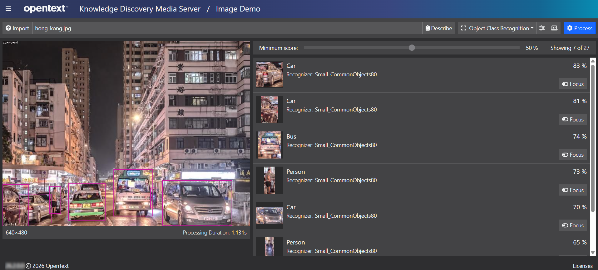

# Object Class Recognition

An introduction to Knowledge Discovery Media Server's neural network based Object Class Recognition, which can be trained to locate individual objects that belong to known, pre-defined classes in images or videos.  Common use cases include answering the questions:

- How many cars and buses are passing this CCTV camera at any given time?
- What paths do shoppers take around my store?
- Which images in my archive contain cats and not dogs?

For more details on *Object Class Recognition*, see the [admin guide](https://www.microfocus.com/documentation/idol/knowledge-discovery-26.2/MediaServer_26.2_Documentation/Help/Content/Operations/Analyze/ObjectLocalization.htm).

This guide assumes you have already familiarized yourself with Knowledge Discovery Media Server by completing the [introductory tutorial](../../README.md#introduction).

If you want to start here, you must at least follow these [installation steps](../../setup/SETUP.md) before continuing.

## Demo

Before rolling up our sleeves, let's run a quick demo using the Media Server GUI to see the results of Object Class Recognition on a sample image.

First, follow [these steps](./IMPORT_RECOGNIZER.md) to load the latest "CommonObjects80" pre-trained recognizer, then return here.

Process a test image:

- Open the Media Server GUI's [Image Demo page](http://localhost:14000/a=gui#/demo).
- Click "Import" and navigate to this tutorial folder to load the included image `hong_kong.jpg`.
- Select the pre-configured analysis option "Object Class Recognition"

  > TIP: If you added more than one recognizer, you can use the settings pop-up to select which one to apply.

- Hit the blue "Process" button.

    

## PART I - Process images for recognition

Use the pre-trained classes to test recognition of common types of object.

Start [here](./PART_I.md).

## PART II - Build a custom recognizer

Use the Knowledge Discovery Media Server GUI to annotate training images and build a custom recognizer to allow you to detect your own classes of object.

Start [here](./PART_II.md).

## Next steps

Take a look at Knowledge Discovery Media Server's sample configurations folder, which includes an example using *Object Class Recognition* to process a video file: `configurations/examples/Other/Overlay_VideoTracking.cfg`.

Try our [surveillance analytics](../surveillance/README.md) lesson, which combines *Object Class Recognition* with simple rules to trigger alerts on CCTV camera video.

Why not try more tutorials to explore some of the other analytics available in Knowledge Discovery Media Server, linked from the [showcase page](../README.md).
