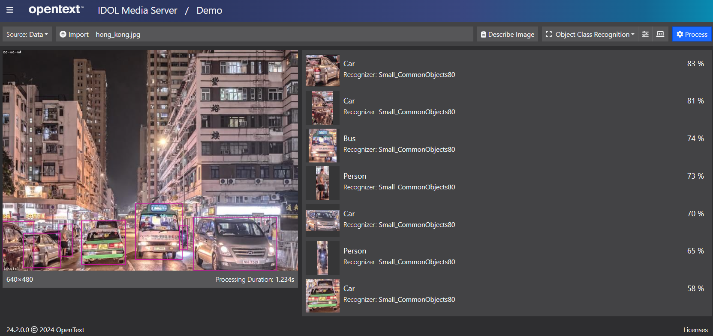

# Object Class Recognition

An introduction to IDOL Media Server's neural network based Object Class Recognition, which can be trained to locate individual objects that belong to known, pre-defined classes in images or video frames.  Common use cases include answering the questions:

- How many cars and buses are passing this CCTV camera at any given time?
- What paths do shoppers take around my store?
- Which images in my archive that contain cats and not dogs?

For more details on *Object Class Recognition*, see the [admin guide](https://www.microfocus.com/documentation/idol/IDOL_24_4/MediaServer_24.4_Documentation/Help/Content/Operations/Analyze/ObjectLocalization.htm).

## Demo

Before rolling up our sleeves, let's run a quick demo, using the Media Server GUI, to see the results of Object Class Recognition on a sample image.

First, follow [these steps](./PART_I#import-pre-defined-recognizers) to load the latest "CommonObjects80" pre-trained recognizer, then return here.

Process a test image:

- Open the Media Server GUI's [demo page](http://localhost:14000/a=gui#/demo).
- With "Source" set to "Data", click "Open" and navigate to this tutorial folder to load the included image `hong_kong.jpg`.
- Select the pre-configured analysis option "Object Class Recognition"
- Hit the blue "Process" button.

    

> TIP: If you added more than one recognizer, you can use the settings pop-up to select which one to apply.

## PART I - Use an out-of-the-box recognizer

Use the IDOL Media Server GUI to import pre-trained classes to enable recognition of common types of object.

Start [here](./PART_I.md).

## PART II - Build a custom recognizer

Use the IDOL Media Server GUI to annotate training images and build a custom recognizer to allow you to detect your own classes of object.

Start [here](./PART_II.md).

## Next steps

Take a look at IDOL Media Server's sample configurations folder, which includes an example using *Object Class Recognition* to process a video file: `configurations/examples/Other/Overlay_VideoTracking.cfg`.

Try our [surveillance analytics](../surveillance/README.md) lesson, which combines *Object Class Recognition* with simple rules to trigger alerts on CCTV camera video.

Why not try more tutorials to explore some of the other analytics available in IDOL Media Server, linked from the [showcase page](../README.md).
