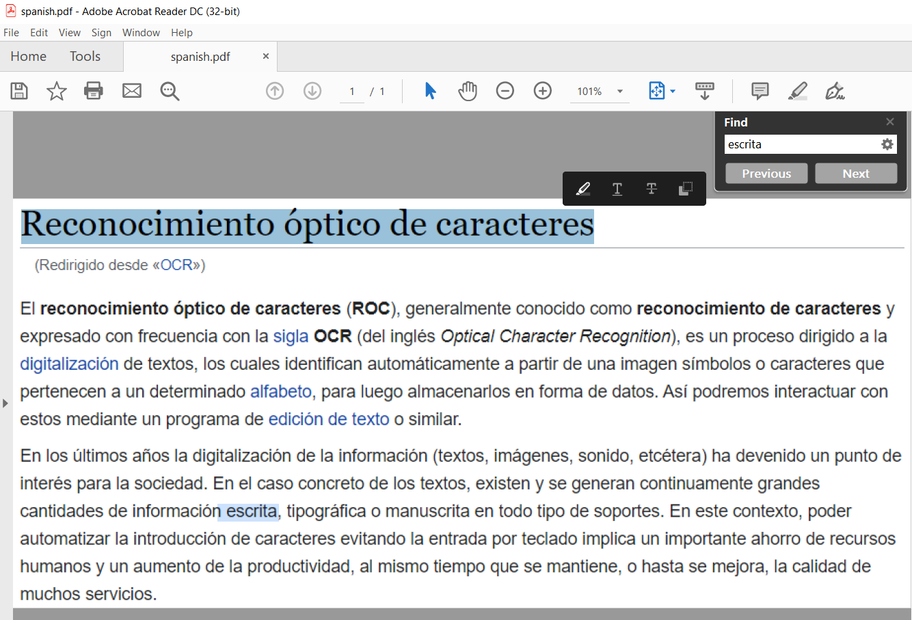

# PART I - Introduction to OCR

Knowledge Discovery Media Server can be used to perform image analytics to process scanned documents or screenshots, including optical character recognition (often called OCR), as well as logo recognition and reading multiple barcode formats.

In this tutorial we will:

1. configure and run OCR on a sample document to transcribe text
1. use the PDF encoding engine to create a convenient PDF file with selectable text overlayed on the original image
1. process a document containing multiple languages and scripts
1. learn about the parameters available to optimize OCR for your use case

This guide assumes you have already familiarized yourself with Knowledge Discovery Media Server by completing the [introductory tutorial](../../README.md#introduction).

If you want to start here, you must at least follow these [installation steps](../../setup/SETUP.md) before continuing.

---

- [Setup](#setup)
  - [Third-party software](#third-party-software)
  - [Configure OCR](#configure-ocr)
    - [Enabled modules](#enabled-modules)
    - [Licensed channels](#licensed-channels)
    - [Language support](#language-support)
- [Process configuration](#process-configuration)
- [Process an image](#process-an-image)
- [Alternative output](#alternative-output)
- [Real-world processing](#real-world-processing)
  - [Orientation](#orientation)
  - [Languages and character sets](#languages-and-character-sets)
  - [Backgrounds](#backgrounds)
  - [Fonts](#fonts)
  - [Character restrictions](#character-restrictions)
  - [Confidence](#confidence)
  - [Processing speed](#processing-speed)
- [PART II - Extracting tables and more](#part-ii---extracting-tables-and-more)

---

## Setup

### Third-party software

Download and install your favorite PDF viewer and ensure you have image viewing software installed.

### Configure OCR

Knowledge Discovery Media Server is separately licensed for visual and audio analytics, as described in the [introductory tutorial](../../introduction/PART_I.md#enabling-analytics).  To reconfigure Knowledge Discovery Media Server you must edit your `mediaserver.cfg` file.

#### Enabled modules

The `Modules` section is where we list the engines that will be available to Knowledge Discovery Media Server on startup.  Ensure that this list contains the module `ocr`:

```ini
[Modules]
Enable=...,ocr,...
```

#### Licensed channels

The `Channels` section is where we instruct Knowledge Discovery Media Server to request license seats from Knowledge Discovery License Server.  To enable OCR for this tutorial, you need to enable at least one channel of type *Visual*:

```ini
[Channels]
...
VisualChannels=1
```

> NOTE: For any changes you make in `mediaserver.cfg` to take effect you must restart Knowledge Discovery Media Server.

#### Language support

Language-specific assets for OCR are distributed with the main Knowledge Discovery Media Server package, so you are already set to process text in [over 45 languages and scripts](https://www.microfocus.com/documentation/idol/knowledge-discovery-25.3/MediaServer_25.3_Documentation/Help/Content/Appendixes/OCR_Supported_Languages.htm).

In the next step, we will set up a process configuration to recognize Spanish characters.

## Process configuration

To ingest an image file, we will include the following in our process configuration:

```ini
[Session]
Engine0 = ImageIngest

[ImageIngest]
Type = Image
```

To run OCR for a Spanish document, we will add the following settings:

```ini
[OCRAnalysis]
Type = OCR
OcrMode = document
Languages = es
```

> NOTE: The `Languages` property accepts a comma-separated list of language codes, which are specified in the [reference guide](https://www.microfocus.com/documentation/idol/knowledge-discovery-25.3/MediaServer_25.3_Documentation/Help/Content/Appendixes/OCR_Supported_Languages.htm).

To view the results in the simplest way, we will output lines of text by transforming the *Result* output track XML to plain text.  We'll add the following to our process configuration:

```ini
[TxtOutput]
Type = XML
Input = OCRAnalysis.Result
OutputPath = output/OCR/%source.filename.stem%.txt
XslTemplate = toText.xsl
```

> NOTE: For more details on the native XML output, please read the [reference guide](https://www.microfocus.com/documentation/idol/knowledge-discovery-25.3/MediaServer_25.3_Documentation/Help/Content/Operations/Analyze/OCR_output.htm).

## Process an image

We will process a screenshot of the [Spanish Wikipedia page on OCR](https://es.wikipedia.org/wiki/Reconocimiento_%C3%B3ptico_de_caracteres).

Media Server looks for process configuration files in its `configurations` folder.  You have already created a sub folder there called `tutorials`.  Copy over all the `ocr*.cfg` files from this lesson, so that we can use them.

Paste the following parameters into [`test-action`](http://127.0.0.1:14000/a=admin#page/console/test-action), which assume you have downloaded a local copy of these tutorial materials as described [here](../../setup/SETUP.md#obtaining-tutorial-materials):

```url
action=process&source=C:/OpenText/idol-rich-media-tutorials/tutorials/showcase/optical-character-recognition/docs/spanish.png&configName=tutorials/ocr1a
```

> NOTE: Ensure that you have configured Media Server to read files from this source directory, as described in the [introduction](../../introduction/PART_I.md#enabling-file-access).

Click the `Test Action` button to start processing.

To view the results, go to `output/OCR` to see the text file `spanish.txt`.

## Alternative output

A convenient way to display OCR output for humans to consume is PDF.  Knowledge Discovery Media Server's PDF encoding engine allows you overlay invisible text onto a copy of the original image, such that if you hover your mouse pointer over the text, you can select and copy it.  You can also search for words using your favorite PDF viewer's standard search functionality.

To configure PDF encoding, we add the following config section:

```ini
[PdfEncode]
Type = PDF
OCRInput = OCRAnalysis.Result
ImageInput = OCRAnalysis.ResultWithSource
OutputPath = output/OCR/%source.filename.stem%.pdf
```

Paste the following parameters into [`test-action`](http://127.0.0.1:14000/a=admin#page/console/test-action) to re-process the same file as before with this new configuration:

```url
action=process&source=C:/OpenText/idol-rich-media-tutorials/tutorials/showcase/optical-character-recognition/docs/spanish.png&configName=tutorials/ocr1b
```

Click the `Test Action` button to start processing.

To view the results, go to `output/OCR` and open the PDF file `spanish.pdf`:



This document contains both searchable and selectable text!

## Real-world processing

To get the best results from OCR, the ingested images or video must have sufficient contrast and be in focus.

The minimum height for a readable character in a high-quality image is approximately 10 pixels. In a poorer quality image, the characters must be larger.

In the configurations used above, there are some unseen assumptions, which it is important to be aware of when attempting to use OCR in the real world:

### Orientation

You may not, for example know the orientation of text in a given image.  To handle rotated files, you may set `Orientation = Any`, instead of the default value of `Upright`.  Please refer to the [reference guide](https://www.microfocus.com/documentation/idol/knowledge-discovery-25.3/MediaServer_25.3_Documentation/Help/Content/Configuration/Analysis/OCR/Orientation.htm) for details.

> NOTE: There is a small processing time penalty in doing so, but orientation checking has been optimized to be much quicker than simply trying the full OCR process four times.

### Languages and character sets

You may not know the character sets (languages) your input files, or whether they may contain text in multiple languages.

For this scenario, Knowledge Discovery Media Server allows you to specify a list of languages.  Please refer to the [reference guide](https://www.microfocus.com/documentation/idol/knowledge-discovery-25.3/MediaServer_25.3_Documentation/Help/Content/Configuration/Analysis/OCR/Languages.htm) for details.

You are free to list as many languages as Knowledge Discovery Media Server supports.  The downside of doing so is that this slows down processing.  If you know that individual documents will contain just one language, you can also set the `DetectAlphabet` parameter, which will speed up the processing of individual pages.  Please refer to the [reference guide](https://www.microfocus.com/documentation/idol/knowledge-discovery-25.3/MediaServer_25.3_Documentation/Help/Content/Configuration/Analysis/OCR/DetectAlphabet.htm) for details.

> NOTE: Language support encompasses handling of multiple character sets, *e.g.* selecting the Japanese pack enables support for native Hiragana, Katakana and Kanji, as well as for romanized (ascii) transcriptions of Japanese words.

For the included `multi-lingual.png` image, we will modify the OCR configuration to list the relevant languages, as follows:

```ini
[OCRAnalysis]
Type = OCR
OcrMode = document
Languages = en,fr,ru,th
Orientation = Any
```

> NOTE: Here we also include the `Orientation = Any` option to allow us to process a sample image that has been scanned upside down.

Paste the following parameters into [`test-action`](http://127.0.0.1:14000/a=admin#page/console/test-action) to process the new file:

```url
action=process&source=C:/OpenText/idol-rich-media-tutorials/tutorials/showcase/optical-character-recognition/docs/multi-lingual.png&configName=tutorials/ocr1c
```

Click the `Test Action` button to start processing.

To view the results, go to `output/OCR` and open the PDF file `multi-lingual.txt`.

### Backgrounds

There are various *advanced* parameters, which can be set that configure the algorithm to work better with text over various backgrounds:

- [`OcrMode`](https://www.microfocus.com/documentation/idol/knowledge-discovery-25.3/MediaServer_25.3_Documentation/Help/Content/Configuration/Analysis/OCR/OcrMode.htm): Set by default to `Scene`, to work best for an image containing sparse text and/or detailed a background, such as a photograph or TV footage. For scanned documents, it is recommended to set this parameter to `Document`, as we have done in the examples above.  There is also an `Auto` mode that can be used if you do not know in advance what type of content you are processing.
- [`HollowText`](https://www.microfocus.com/documentation/idol/knowledge-discovery-25.3/MediaServer_25.3_Documentation/Help/Content/Configuration/Analysis/OCR/HollowText.htm): Specifies whether to look for outlined text, which are often used in television subtitles.
- [`Region`](https://www.microfocus.com/documentation/idol/knowledge-discovery-25.3/MediaServer_25.3_Documentation/Help/Content/Configuration/Analysis/OCR/Region.htm): Process only regions of the image or video frame where text is expected to appear.

### Fonts

By default, OCR attempts to read text without assuming any particular font; however, if you know that your documents use a particular standard, *e.g.* [OCR-B](https://en.wikipedia.org/wiki/OCR-B) as used for machine-readable passports, you can set `FontType = ocrb`.  Please refer to the [reference guide](https://www.microfocus.com/documentation/idol/knowledge-discovery-25.3/MediaServer_25.3_Documentation/Help/Content/Configuration/Analysis/OCR/FontType.htm) for details.

### Character restrictions

By default, OCR attempts to read all characters included for the configured language(s).  If you know that your documents use a particular sub-set, you can set make use of the following options:

- [`CharacterTypes`](https://www.microfocus.com/documentation/idol/knowledge-discovery-25.3/MediaServer_25.3_Documentation/Help/Content/Configuration/Analysis/OCR/CharacterTypes.htm): A comma-separated list of `lowercase`, `uppercase`, `digit`, `punctuation`, `special` and `symbol`.
- [`DisabledCharacters`](https://www.microfocus.com/documentation/idol/knowledge-discovery-25.3/MediaServer_25.3_Documentation/Help/Content/Configuration/Analysis/OCR/DisabledCharacters.htm): Characters to exclude from the character set used for recognition, *e.g.* `£€$`.

### Confidence

Each detected word (and character) has a given confidence score.  To improve the precision of your transcription output, you can filter out lower confidence words using the `WordRejectThreshold` parameter.  Please refer to the [reference guide](https://www.microfocus.com/documentation/idol/knowledge-discovery-25.3/MediaServer_25.3_Documentation/Help/Content/Configuration/Analysis/OCR/WordRejectThreshold.htm) for details.

In addition, there are various *advanced* parameters, which can be set that may alter the confidence of your transcribed words for the better:

- [`ContextCheck`](https://www.microfocus.com/documentation/idol/knowledge-discovery-25.3/MediaServer_25.3_Documentation/Help/Content/Configuration/Analysis/OCR/ContextCheck.htm): Set by default to `True`, to compare detected possible words against a dictionary of known words.  This may increase the likelihood of correctly reading a word vs a similar but wrong reading and also boost the confidence when reading relevant words.
- [`UserDictionary`](https://www.microfocus.com/documentation/idol/knowledge-discovery-25.3/MediaServer_25.3_Documentation/Help/Content/Configuration/Analysis/OCR/UserDictionary.htm): Allows you to add a list of domain-specific words that may improve the results of the above context check.
- [`ExtraEnabledCharacters`](https://www.microfocus.com/documentation/idol/knowledge-discovery-25.3/MediaServer_25.3_Documentation/Help/Content/Configuration/Analysis/OCR/ExtraEnabledCharacters.htm): Allows you to add specific characters that should be in a word but are not normally included in your configured language(s).
- [`KeepOnly`](https://www.microfocus.com/documentation/idol/knowledge-discovery-25.3/MediaServer_25.3_Documentation/Help/Content/Configuration/Analysis/OCR/KeepOnly.htm): Keep only dictionary words or pure number and discard all others.

### Processing speed

As hinted at above, various options that allow you to deal with unknown document content, *e.g.* `Orientation=Any`, `OcrMode=Auto` and `DetectAlphabet=True`, can have a negative impact on processing speed.  In order to compensate for that and more, Knowledge Discovery Media Server also offers options to speed up processing:

- [NumParallel](https://www.microfocus.com/documentation/idol/knowledge-discovery-25.3/MediaServer_25.3_Documentation/Help/Content/Configuration/Analysis/OCR/NumParallel.htm): Enable the OCR analysis engine to use more CPU threads; allowing multiple video frames or document pages to be processed simultaneously.

  > NOTE: If the ingested image or document has only one page, setting this parameter has no effect.

- [SampleInterval](https://www.microfocus.com/documentation/idol/knowledge-discovery-25.3/MediaServer_25.3_Documentation/Help/Content/Configuration/Analysis/OCR/SampleInterval.htm): Modify this parameter to instruct the OCR analysis engine to queue more or fewer video frames for analysis.
- [MaxInputQueueLength](https://www.microfocus.com/documentation/idol/knowledge-discovery-25.3/MediaServer_25.3_Documentation/Help/Content/Configuration/Analysis/OCR/MaxInputQueueLength.htm): Set this parameter to put a limit on potential processing latency for video frames.  Since setting this parameter may result in loss of expected analysis results, consider alternative configuration changes first.

## PART II - Extracting tables and more

Start [here](./PART_II.md).
