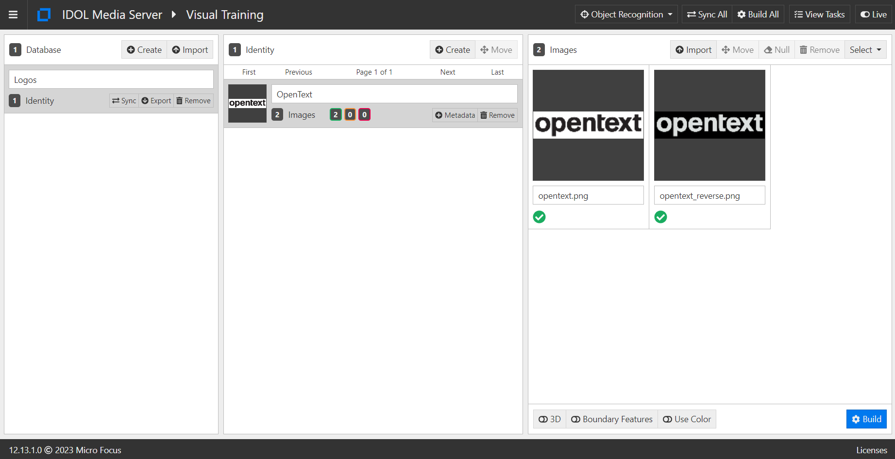
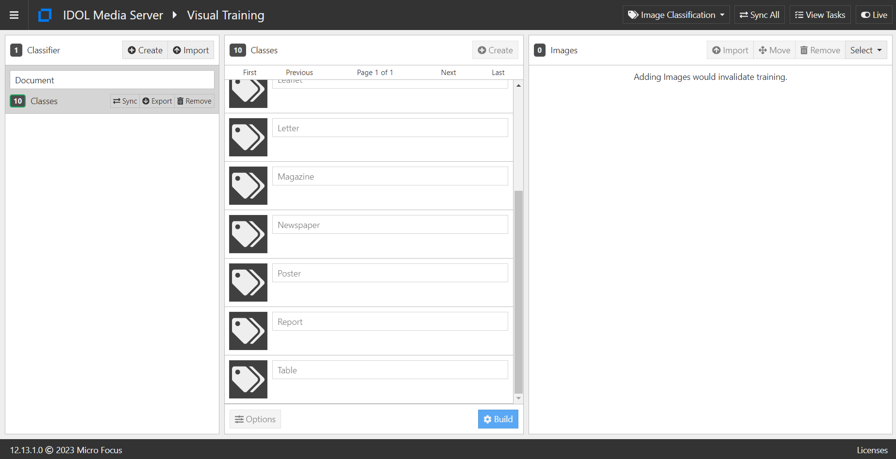

# PART II - Extracting tables and more

Scanned documents don't only contain lines of text, so Media Server's capabilities have grown to include a rich set of analytic functions to get even more out of your scanned documents.  

The OCR analysis engine itself can automatically detect tables within images and preserve the table structure in the output.  Media Server's OCR can (using KeyView) also extract any embedded text contained in the files, *e.g.* PDFs.

Optionally, additional analysis engines like *Barcode Detection*, *Object Recognition* and *Image Classification* can also be applied in the same process (and with the same license) as OCR to capture even more information, as we will see below.

In this tutorial we will:

1. run OCR on a sample PDF file to extract embedded text data
1. run OCR on a sample image to transcribe tabulated data
1. include Barcode detection
1. train and run Object Recognition for logos, and
1. import pre-built Image Classification models to label scanned documents.

This guide assumes you have already familiarized yourself with IDOL Media Server by completing the [introductory tutorial](../../README.md#introduction), as well as [Part I](./PART_I.md) of this OCR tutorial.

If you have already tried the [Image Classification](../image-classification/README.md) and [Object Recognition](../logo-recognition/README.md) tutorials, you will be very familiar with those steps below.

---

- [Setup](#setup)
  - [Enabled modules](#enabled-modules)
  - [Pre-trained models](#pre-trained-models)
    - [Licensed channels](#licensed-channels)
- [Capture embedded text](#capture-embedded-text)
  - [Process configuration](#process-configuration)
  - [Process a PDF file](#process-a-pdf-file)
- [OCR for tabulated data](#ocr-for-tabulated-data)
  - [Process configuration](#process-configuration-1)
  - [Process a document](#process-a-document)
- [(*Optional*) Barcode detection](#optional-barcode-detection)
  - [Process configuration](#process-configuration-2)
  - [Process a document](#process-a-document-1)
- [(*Optional*) Logo recognition](#optional-logo-recognition)
  - [Training](#training)
  - [Process configuration](#process-configuration-3)
  - [Process a document](#process-a-document-2)
- [(*Optional*) Image classification](#optional-image-classification)
  - [Loading models](#loading-models)
  - [Process configuration](#process-configuration-4)
  - [Process a document](#process-a-document-3)
- [PART III - Scrolling news headlines](#part-iii---scrolling-news-headlines)

---

## Setup

### Enabled modules

For this lesson, please ensure that you have the required modules enabled in Media Server. Ensure that the modules are enabled:

```ini
[Modules]
Enable=...,barcode,imageclassification,objectrecognition,ocr,...
```

### Pre-trained models

Pre-trained *Image Classification* packages are distributed separately from the main Media Server installer.  To obtain the training pack, return to the [Software Licensing and Downloads](https://sld.microfocus.com/mysoftware/index) portal, then:

1. Under the *Downloads* tab, select your product, product name and version from the dropdowns:

    

1. From the list of available files, select and download `MediaServerPretrainedModels_23.2.0_COMMON.zip`.

    

#### Licensed channels

The `Channels` section is where we instruct Media Server to request license seats from License Server.  To enable OCR for this tutorial, you need to enable at least one channel of type *Visual*:

```ini
[Channels]
...
VisualChannels=1
```

> For any changes you make in `mediaserver.cfg` to take effect you must restart Media Server.

## Capture embedded text

### Process configuration

The OCR analysis engine automatically detects embedded text in documents such as PDF files.  

```ini
[OCRAnalysis]
Type = OCR
ProcessTextElements=True
```

> NOTE: You can optionally disable this behavior to process only image data by setting `ProcessTextElements=False` (default is `True`):

### Process a PDF file

We will process a PDF file that contains text both as embedded metadata to be extracted and in image data to be detected with OCR.

Paste the following parameters into [`test-action`](http://127.0.0.1:14000/a=admin#page/console/test-action), which assume you have downloaded a local copy of these tutorial materials as described [here](../../setup/SETUP.md#obtaining-tutorial-materials):

```url
action=process&source=C:/OpenText/idol-rich-media-tutorials/tutorials/showcase/optical-character-recognition/docs/TextAndImage.pdf&configPath=C:/OpenText/idol-rich-media-tutorials/tutorials/showcase/optical-character-recognition/ocr2a.cfg
```

Click the `Test Action` button to start processing.

To view the results, go to `output/OCR` to see the text file `TextAndImage.txt`, which combines the embedded and image text into a single, correctly-ordered output.

## OCR for tabulated data

### Process configuration

The OCR analysis engine automatically detects tables in your images, so no special configuration is required for analysis.

> NOTE: You can optionally modify the output of your table data by setting `OutputTablesByColumn=True` (default is `False`). For more details, please read the [reference guide](https://www.microfocus.com/documentation/idol/IDOL_23_2/MediaServer_23.2_Documentation/Help/Content/Configuration/Analysis/OCR/OutputTablesByColumn.htm).

Handling tabulated output though does require some thought.  A common approach is to separate the table text from non-table text in order to have more targeted downstream processing.

To separate and view the tabulated results in a convenient way, we will output an HTML representation of the table by transforming the *Result* and *TableResult* output track XML with the included `toHTMLTable.xsl`:

```ini
[TableTextOutput]
Type = XML
Input0 = OCRAnalysis.Result
Input1 = OCRAnalysis.TableResult
XMLOutputPath = output/OCR/%source.filename.stem%_tables.html
XslTemplate = toHTMLTable.xsl
```

To separate out the non-table text for output, we will use an *AndNot* event stream processing engine with an included lua script, to first isolate that text before outputting it:

```ini
[NonTableText]
Type = AndNot
Input0 = OCRAnalysis.Result
Input1 = OCRAnalysis.TableResult
LuaScript = tableText.lua

[NonTableTextOutput]
Type = XML
Input = NonTableText.Output
XMLOutputPath = output/OCR/%source.filename.stem%_notTables.txt
XslTemplate = toText.xsl
```

### Process a document

We will process a PDF file that contains a screenshot image of some table data.

Paste the following parameters into [`test-action`](http://127.0.0.1:14000/a=admin#page/console/test-action), which assume you have downloaded a local copy of these tutorial materials as described [here](../../setup/SETUP.md#obtaining-tutorial-materials):

```url
action=process&source=C:/OpenText/idol-rich-media-tutorials/tutorials/showcase/optical-character-recognition/docs/TablesAndMore.pdf&configPath=C:/OpenText/idol-rich-media-tutorials/tutorials/showcase/optical-character-recognition/ocr2b.cfg
```

Click the `Test Action` button to start processing.

To view the results, go to `output/OCR` to see the two output files `TablesAndMore_tables.html` and `TablesAndMore_notTables.txt`.

## (*Optional*) Barcode detection

You may have noticed that the PDF file processed above also contains an image of a QR code.  

### Process configuration

To process this information as well, add the *Barcode Detection* analysis engine with default options:

```ini
[BarcodeAnalysis]
Type = Barcode
```

> NOTE: For details on the list of supported QR code and barcode types, please see the [reference guide](https://www.microfocus.com/documentation/idol/IDOL_23_2/MediaServer_23.2_Documentation/Help/Content/Configuration/Analysis/Barcode/BarcodeTypes.htm).

We will combine the read from the barcode with the OCR-produced text by adding a second input to the non-table text output engine:

```ini
[NonTableTextOutput]
Type = XML
Input0 = NonTableText.Output
Input1 = BarcodeAnalysis.Result
XMLOutputPath = output/OCR/%source.filename.stem%_notTables.txt
XslTemplate = toText.xsl
```

### Process a document

Paste the following parameters into [`test-action`](http://127.0.0.1:14000/a=admin#page/console/test-action), to reprocess the same PDF file with this updated configuration:

```url
action=process&source=C:/OpenText/idol-rich-media-tutorials/tutorials/showcase/optical-character-recognition/docs/TablesAndMore.pdf&configPath=C:/OpenText/idol-rich-media-tutorials/tutorials/showcase/optical-character-recognition/ocr2c.cfg
```

Click the `Test Action` button to start processing.

To view the results, go to `output/OCR` to see the updated output text file `TablesAndMore_notTables.txt` now contains a URL on the first line.

## (*Optional*) Logo recognition

You may have noticed that the PDF file processed above also contains an image of the OpenText logo.

Media Server's *Object Recognition* analysis engine is often used to identify logos in images and video.  You can learn more about Logo Recognition in the dedicated tutorial [here](../logo-recognition/README.md).

### Training

To include this capability here, we must first train Media Server to recognize the OpenText logo.  To do this, open the Media Server GUI at [`/action=gui`](http://127.0.0.1:14000/a=gui#/train/objectRec(tool:select)), the follow these steps:

1. Click the "Create" button to add a new database
1. Change the name of the database to "Logos"
1. Click the "Create" button to add a new identity
1. Change the name of the identity to "OpenText"
1. Click the "Import" button to open the file browser
1. Assuming you have downloaded a local copy of these tutorial materials, navigate to `C:/OpenText/idol-rich-media-tutorials/tutorials/showcase/optical-character-recognition/logos/` and select the files `opentext.png` and `opentext_reverse.png`

    > NOTE: It is good practice to train at least two copies on a logo with light-on-dark and dark-on-light.

1. Click the "Build" button, then wait for the training to finish

    

### Process configuration

To match this logo, add the *Object Recognition* analysis engine with default options:

```ini
[LogoAnalysis]
Type = ObjectRecognition
Database = Logos
```

We will output the detection results as XML by adding the following output engine:

```ini
[DetectionXmlOutput]
Type = XML
Input = LogoAnalysis.Result
XMLOutputPath = output/OCR/%source.filename.stem%_analysis.xml
```

### Process a document

Paste the following parameters into [`test-action`](http://127.0.0.1:14000/a=admin#page/console/test-action), to reprocess the same PDF file with this updated configuration:

```url
action=process&source=C:/OpenText/idol-rich-media-tutorials/tutorials/showcase/optical-character-recognition/docs/TablesAndMore.pdf&configPath=C:/OpenText/idol-rich-media-tutorials/tutorials/showcase/optical-character-recognition/ocr2d.cfg
```

Click the `Test Action` button to start processing.

To view the results, go to `output/OCR` to see the new output file `TablesAndMore_analysis.xml`, which contains details of the matched logo, including bounding box and confidence score.

## (*Optional*) Image classification

Media Server's *Image Classification* analysis engine ships with a number of pre-trained classifiers. You can learn more about Image Classification in the dedicated tutorial [here](../image-classification/README.md).

### Loading models

To include this capability here, we must first load the pre-trained models into Media Server.  To do this, open the Media Server GUI at [`/action=gui`](http://127.0.0.1:14000/a=gui#/train/imageClass(tool:select)), the follow these steps:

Extract the training pack `.zip` then, to load one of the classifiers, open the Media Server GUI at [`/action=gui`](http://127.0.0.1:14000/a=gui#/train/imageClass(tool:select)) and follow these steps:

1. in the left column, click `Import`
1. navigate to your extracted training pack and select `ImageClassifier_Document.dat`
   
    > NOTE: This classifier contains 10 classes (from CV to Newspaper and Report).

1. wait a few minutes for the import to complete.  You are now ready to classify media.

    

### Process configuration

To match this logo, add the *Image Classification* analysis engine with default options:

```ini
[ImageClassAnalysis]
Type = ImageClassification
Classifier = Document
```

We will output the detection results as XML by adding an additional input to the following output engine:

```ini
[DetectionXmlOutput]
Type = XML
Input0 = LogoAnalysis.Result
Input1 = ImageClassAnalysis.Result
XMLOutputPath = output/OCR/%source.filename.stem%_analysis.xml
```

### Process a document

Paste the following parameters into [`test-action`](http://127.0.0.1:14000/a=admin#page/console/test-action), to reprocess the same PDF file with this updated configuration:

```url
action=process&source=C:/OpenText/idol-rich-media-tutorials/tutorials/showcase/optical-character-recognition/docs/TablesAndMore.pdf&configPath=C:/OpenText/idol-rich-media-tutorials/tutorials/showcase/optical-character-recognition/ocr2e.cfg
```

Click the `Test Action` button to start processing.

To view the results, go to `output/OCR` to see the new *Image Classification* results in output file `TablesAndMore_analysis.xml`.

## PART III - Scrolling news headlines

<!-- Start [here](PART_III.md). -->

> COMING SOON!
