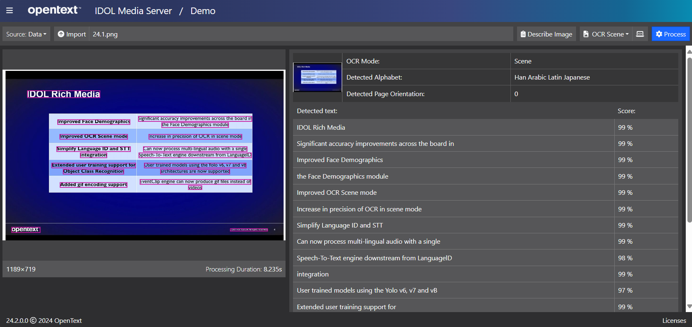

# Optical Character Recognition

An introduction to text detection and transcription with Knowledge Discovery Media Server's OCR.

## Demo

Before rolling up our sleeves, let's run a quick demo, using the Media Server GUI, to see the results of OCR on a sample image.

- Open the Media Server GUI's [demo page](http://localhost:14000/a=gui#/demo).
- With "Source" set to "Data", click "Open" and navigate to this tutorial folder to load the included image `24.1.png`.
- Select the pre-configured analysis option "OCR Scene" then hit the blue "Process" button.

    

> NOTE: This image is a screenshot from our 24.1 release event and lists the key new features of Knowledge Discovery Media Server. These improvements included the new improved "Scene" mode, which we have just used, and is great for accurately locating sparse text over busy backgrounds.

Try some of the other samples documents and images from this tutorial, in the `docs` and `logos` folders. Compare the results with "OCR Document" and "OCR Scene".

## PART I - Introduction

Use Knowledge Discovery Media Server to perform OCR on a scanned document, exploring various output options.

Start [here](./PART_I.md).

## PART II - Extracting tables and more

Scanned documents don't only contain lines of text.  Use Knowledge Discovery Media Server to detect tabulated text, read barcodes, recognize logos and classify documents.

Start [here](./PART_II.md).

## PART III - Scrolling news headlines

Follow scrolling news from on a live news broadcast stream to capture the latest headlines.

> COMING SOON!

## Next steps

Why not try more tutorials to explore some of the other analytics available in Knowledge Discovery Media Server, linked from the [showcase page](../README.md).
