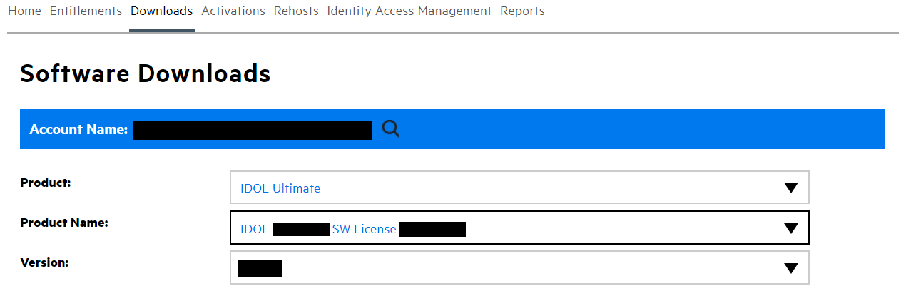
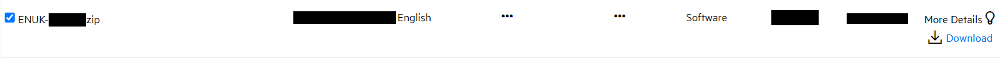

# PART I - Automatic Subtitles

IDOL Media Server can be used to perform audio analytics, including speech transcription (often called Speech-to-Text), speaker identification and language identification.  We will configure IDOL Media Server to support a simple use case of this speech transcription capability: to record video clips from on a live news broadcast stream and automatically generate subtitles for those clips.

In this tutorial we will:

1. configure a speech language pack and run speech transcription
1. record video clips from a live stream
1. use XSL transforms to re-format IDOL Media Server output to create subtitles

This guide assumes you have already familiarized yourself with IDOL Media Server by completing the [introductory tutorial](../../README.md#introduction).

---

- [Setup](#setup)
  - [Third-party software](#third-party-software)
  - [Configure speech transcription](#configure-speech-transcription)
    - [Enabled modules](#enabled-modules)
    - [Licensed channels](#licensed-channels)
    - [Language packs](#language-packs)
- [Process configuration](#process-configuration)
- [Process a news channel stream](#process-a-news-channel-stream)
- [(Optional) Converting output offline](#optional-converting-output-offline)
  - [Generate XML](#generate-xml)
  - [Convert XML with Python](#convert-xml-with-python)
- [PART II - Custom Language Model](#part-ii---custom-language-model)

---

## Setup

### Third-party software

Download and install [VLC player](http://www.videolan.org/vlc/) for video clip playback.

### Configure speech transcription

IDOL Media Server is separately licensed for visual and audio analytics, as described in the [introductory tutorial](../../introduction/PART_I.md#enabling-analytics).  To reconfigure IDOL Media Server you must edit your `mediaserver.cfg` file.

#### Enabled modules

The `Modules` section is where we list the engines that will be available to IDOL Media Server on startup.  Ensure that this list contains the module `speechtotext`:

```ini
[Modules]
Enable=...,speechtotext,...
```

#### Licensed channels

The `Channels` section is where we instruct IDOL Media Server to request license seats from IDOL License Server.  To enable speech transcription for this tutorial, you need to enable at least one channel of type *Audio*:

```ini
[Channels]
...
AudioChannels=1
```

> For any changes you make in `mediaserver.cfg` to take effect you must restart IDOL Media Server.

#### Language packs

Speech transcription language packs are distributed separately from the main IDOL Media Server installer.  To obtain a language pack, return to the [Software Licensing and Downloads](https://sld.microfocus.com/mysoftware/index) portal, then under the *Downloads* tab, select your product, product name and version from the dropdowns:



For this tutorial we will use the British English pack.  From the list of available files, select and download `ENUK-23.4.0.zip`:



Unzip the contents into IDOL Media Server's static data directory, to give you, *e.g.* `staticdata/speechtotext/ENUK`, containing files like `ver-ENUK-*`

> This language pack is targeted to high quality "broadband" audio.  An additional language pack is available for telephony.  Many other languages and dialects are supported.  Please refer to the [admin guide](https://www.microfocus.com/documentation/idol/IDOL_23_4/MediaServer_23.4_Documentation/Help/Content/Appendixes/SpeechLanguages.htm) for details.

You can manually load the ENUK language pack with the action <http://127.0.0.1:14000/action=LoadSpeechLanguageResource&LanguagePack=ENUK>.

> If you skip this manual load, IDOL Media Server will automatically load the language (if installed) when processing begins but doing this will add a delay to the processing.  

This load is an asynchronous action, which can be monitored with [/a=admin](http://127.0.0.1:14000/action=admin#page/async-queues/LOADSPEECHLANGUAGERESOURCE).

When the task is complete, review the list of loaded language pack(s) with the action <http://127.0.0.1:14000/action=ListSpeechLanguageResources>.

## Process configuration

To ingest a video stream, we will include the following in our process configuration:

```ini
[Session]
Engine0 = StreamIngest

[StreamIngest]
Type = Video
```

To run speech transcription, we will add the following settings:

```ini
[SpeechToText]
Type = SpeechToText
LanguagePack = ENUK
SpeedBias = Live
```

More options are available for the *SpeechToText* analysis engine.  Please refer to the [reference guide](https://www.microfocus.com/documentation/idol/IDOL_23_4/MediaServer_23.4_Documentation/Help/index.html#Configuration/Analysis/SpeechToText/_SpeechToText.htm) for details.

To view the results in a simple and standalone way, we will record the stream to video files and format the speech transcription output to generate subtitles for those clips.

First we need to configure video encoding:

```ini
[VideoClips]
Type = mpeg
AudioProfile = mpeg4audio
VideoProfile = mpeg4video_h264_360p
MIMEType = video/mp4
Segment = True
SegmentDuration = 30s
OutputPath = output/speechToText1/%session.token%/clip_%segment.sequence%.mp4
UseTempFolder = True
```

Next we need to generate the subtitles.  This requires two steps:

1. segmenting the text into short chunks with the *TextSegmentation* analysis engine
1. transforming the XML output into [SRT format](https://en.wikipedia.org/wiki/SubRip#SubRip_text_file_format), *e.g.*

    ```txt
    4
    00:03:09,365 --> 00:03:13,034
    It's like people only do these things because they can get paid.

    5
    00:03:12,117 --> 00:03:15,037
    And that's just really sad.
    ```

    > [Wayne's World (1992) Quotes - IMDB](https://www.imdb.com/title/tt0105793/quotes/)

To achieve all this, we need to add the following to our process configuration:

```ini
[TextSegmentation]
Type = TextSegmentation
Input = SpeechToText.Result
MaximumDuration = 5s

[SrtOutput]
Type = XML
Input = VideoClips.Proxy,TextSegmentation.Result
Mode = Bounded
EventTrack = VideoClips.Proxy
XMLOutputPath = output/speechToText1/%session.token%/clip_%segment.sequence%.srt
XslTemplate = toSRT.xsl
```

We use using the *Bounded* output mode to bundle together all the text segments with the relevant video clip.  Please read the [admin guide](https://www.microfocus.com/documentation/idol/IDOL_23_4/MediaServer_23.4_Documentation/Help/Content/Operations/Outputs/IndexingModes_BoundedEvent.htm), for details.

## Process a news channel stream

We will process the open stream from *Al Jazeera English*:

``` url
http://live-hls-web-aje.getaj.net/AJE/03.m3u8
```

Paste the following parameters into [`test-action`](http://127.0.0.1:14000/a=admin#page/console/test-action), which assume you have downloaded a local copy of these tutorial materials as described [here](../../setup/SETUP.md#obtaining-tutorial-materials):

```url
action=process&source=http://live-hls-web-aje.getaj.net/AJE/03.m3u8&configPath=C:/OpenText/idol-rich-media-tutorials/tutorials/showcase/speech-transcription/speechToText1.cfg
```

Click the `Test Action` button to start processing.  The video clip and srt are produced every 30 seconds based on the `SegmentDuration` parameter.

Review the results with [`/action=gui`](http://127.0.0.1:14000/a=gui#/monitor), then go to `output/speechToText1` to see the video clips and associated subtitle files.

Having ensured that the `.srt` file and the `.mp4` clip share the same filename in the above configuration, we can now simply open the clip in VLC player to view the time-aligned subtitles.


Stop processing by clicking the `Stop Session` button in the GUI or with the [`stop`](http://127.0.0.1:14000/a=queueInfo&queueAction=stop&queueName=process) action.

## (Optional) Converting output offline

In the above example, we used XSL transforms to convert records within IDOL Media Server for output.  You can also of course output standard XML during processing and convert it later.  

### Generate XML

First, let's generate some `.xml` output.  We will reprocess the open stream from *Al Jazeera English*:

``` url
http://live-hls-web-aje.getaj.net/AJE/03.m3u8
```

Paste the following parameters into [`test-action`](http://127.0.0.1:14000/a=admin#page/console/test-action), which assume you have downloaded a local copy of these tutorial materials as described [here](../../setup/SETUP.md#obtaining-tutorial-materials):

```url
action=process&source=http://live-hls-web-aje.getaj.net/AJE/03.m3u8&configPath=C:/OpenText/idol-rich-media-tutorials/tutorials/showcase/speech-transcription/speechToText1a.cfg
```

Click the `Test Action` button to start processing.  The video clips and `.xml` result files are produced every 30 seconds based on the `SegmentDuration` parameter.

Review the results with [`/action=gui`](http://127.0.0.1:14000/a=gui#/monitor), then go to `output/speechToText1a` to see the video clips and associated subtitle files.

Stop processing by clicking the `Stop Session` button in the GUI or with the [`stop`](http://127.0.0.1:14000/a=queueInfo&queueAction=stop&queueName=process) action.

### Convert XML with Python

> NOTE: the included script requires a [Python 3](https://www.python.org/downloads/) installation.

Next, we will use the included python script `xml2srt.py` to convert one of the output `.xml` files, ready for playback in VLC.  To do so, *e.g.* on Windows, run the following commands:

```sh
cd C:\OpenText\idol-rich-media-tutorials\tutorials\showcase\speech-transcription
python xml2srt.py "C:\OpenText\IDOLServer-23.4.0\MediaServer\output\speechToText1a\clip_1.xml"
```

This will produce a new file `clip_1.srt` in the same directory as the original `.xml` file.  As before, you can now open the video `clip_1.mp4` in VLC player to view the time-aligned subtitles.

## PART II - Custom Language Model

Start [here](PART_II.md).
