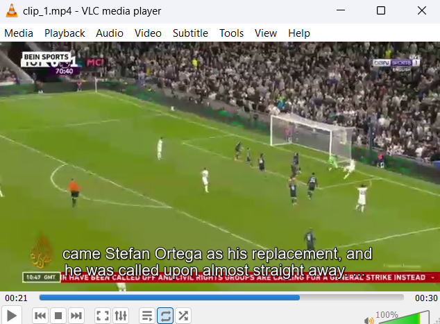

# PART I - Automatic Subtitles

As a hands-on introduction to speech transcription, we will configure Knowledge Discovery Media Server to support the following example use case: to record video clips from on a live news broadcast stream and automatically generate subtitles for those clips.

In this tutorial we will:

1. configure a speech language pack and run speech transcription
1. record video clips from a live stream
1. use XSL transforms to re-format Knowledge Discovery Media Server output to create subtitles

This guide assumes you have already familiarized yourself with Knowledge Discovery Media Server by completing the [introductory tutorial](../../README.md#introduction).

If you want to start here, you must at least follow these [installation steps](../../setup/SETUP.md) before continuing.

---

- [Setup](#setup)
  - [Third-party software](#third-party-software)
  - [Configure speech transcription](#configure-speech-transcription)
    - [Enabled modules](#enabled-modules)
    - [Licensed channels](#licensed-channels)
    - [GPU acceleration](#gpu-acceleration)
    - [Language packs](#language-packs)
- [Process configuration](#process-configuration)
- [Process a news channel stream](#process-a-news-channel-stream)
- [Working with "standard" XML output](#working-with-standard-xml-output)
  - [Generate XML](#generate-xml)
  - [(Optional) Convert XML to SRT with Python](#optional-convert-xml-to-srt-with-python)
- [PART II - Custom Language Model](#part-ii---custom-language-model)

---

## Setup

### Third-party software

Download and install [VLC player](http://www.videolan.org/vlc/) for video clip playback.

### Configure speech transcription

Knowledge Discovery Media Server is separately licensed for visual and audio analytics, as described in the [introductory tutorial](../../introduction/PART_I.md#enabling-analytics).  To reconfigure Knowledge Discovery Media Server you must edit your `mediaserver.cfg` file.

#### Enabled modules

The `Modules` section is where we list the engines that will be available to Knowledge Discovery Media Server on startup.  Ensure that this list contains the module `speechtotext`:

```ini
[Modules]
Enable=...,speechtotext,...
```

#### Licensed channels

The `Channels` section is where we instruct Knowledge Discovery Media Server to request license seats from Knowledge Discovery License Server.  To enable speech transcription for this tutorial, you need to enable at least one channel of type *Audio*:

```ini
[Channels]
...
AudioChannels=1
```

> NOTE: For any changes you make in `mediaserver.cfg` to take effect you must restart Knowledge Discovery Media Server.

#### GPU acceleration

If you are lucky enough to have access to a supported NVIDIA graphics card, you can accelerate certain analytics (including new model speech to text), as well as video ingest and encoding.  For details on support and setup, please refer to the [admin guide](https://www.microfocus.com/documentation/idol/knowledge-discovery-25.1/MediaServer_25.1_Documentation/Help/Content/Advanced/GPU.htm).

#### Language packs

Speech transcription language packs are distributed separately from the main Knowledge Discovery Media Server package.  To obtain a language pack, return to the [Software Licensing and Downloads](https://sld.microfocus.com/mysoftware/index) portal, then under the *Downloads* tab, select your product, product name and version from the dropdowns:


For this tutorial we will use the "Common" pack.  From the list of available files, select and download `MediaServerLanguagePack_25.1.0_COMMON.zip`:


Unzip the contents into Knowledge Discovery Media Server's static data directory, renaming the extracted folder to "Common", to give you, *e.g.* `staticdata/Common/`, containing one folder per supported language, such as `ENUK`, and files like `micro.dat`.

> NOTE: This combined language pack enables transcription with the new models for all supported languages.  Additional, separate language packs are available for the "legacy" models.  Please refer to the [admin guide](https://www.microfocus.com/documentation/idol/knowledge-discovery-25.1/MediaServer_25.1_Documentation/Help/Content/Appendixes/SpeechLanguages.htm) for the list of supported languages.

## Process configuration

To ingest a video stream, we will include the following in our process configuration:

```ini
[Session]
Engine0 = StreamIngest

[StreamIngest]
Type = Video
```

To run speech transcription, we will add the following settings:

```ini
[SpeechToText]
Type = SpeechToText
LanguagePack = ENUK
ModelVersion = Micro 
SpeedBias = Live
```

More options are available for the *SpeechToText* analysis engine.  Please refer to the [reference guide](https://www.microfocus.com/documentation/idol/knowledge-discovery-25.1/MediaServer_25.1_Documentation/Help/index.html#Configuration/Analysis/SpeechToText/_SpeechToText.htm) for details.

To view the results in a simple and standalone way, we will record the stream to video files and format the speech transcription output to generate subtitles for those clips.

First we need to configure video encoding:

```ini
[VideoClips]
Type = mpeg
AudioProfile = mpeg4audio
VideoProfile = mpeg4video_h264_360p
MIMEType = video/mp4
Segment = True
SegmentDuration = 30s
OutputPath = output/speechToText1/%session.token%/clip_%segment.sequence%.mp4
UseTempFolder = True
```

Next we need to generate the subtitles.  This requires two steps:

1. segmenting the text into short chunks with the *TextSegmentation* analysis engine
1. transforming the XML output into [SRT format](https://en.wikipedia.org/wiki/SubRip#SubRip_text_file_format), *e.g.*

    ```txt
    4
    00:03:09,365 --> 00:03:13,034
    It's like people only do these things because they can get paid.

    5
    00:03:12,117 --> 00:03:15,037
    And that's just really sad.
    ```

    > [Wayne's World (1992) Quotes - IMDB](https://www.imdb.com/title/tt0105793/quotes/)

To achieve all this, we need to add the following to our process configuration:

```ini
[TextSegmentation]
Type = TextSegmentation
Input = SpeechToText.Result
MaximumDuration = 5s

[SrtOutput]
Type = XML
Input = VideoClips.Proxy,TextSegmentation.Result
Mode = Bounded
EventTrack = VideoClips.Proxy
OutputPath = output/speechToText1/%session.token%/clip_%segment.sequence%.srt
XslTemplate = toSRT.xsl
```

We use using the *Bounded* output mode to bundle together all the text segments with the relevant video clip.  Please read the [admin guide](https://www.microfocus.com/documentation/idol/knowledge-discovery-25.1/MediaServer_25.1_Documentation/Help/Content/Operations/Outputs/IndexingModes_BoundedEvent.htm), for details.

## Process a news channel stream

We will process the open stream from *Al Jazeera English*:

``` url
http://live-hls-web-aje.getaj.net/AJE/03.m3u8
```

Paste the following parameters into [`test-action`](http://127.0.0.1:14000/a=admin#page/console/test-action), which assume you have downloaded a local copy of these tutorial materials as described [here](../../setup/SETUP.md#obtaining-tutorial-materials):

```url
action=process&source=http://live-hls-web-aje.getaj.net/AJE/03.m3u8&configPath=C:/OpenText/idol-rich-media-tutorials/tutorials/showcase/speech-transcription/speechToText1.cfg
```


Click the `Test Action` button to start processing.  The video clip and srt file are produced every 30 seconds based on the `SegmentDuration` parameter.

Review the results with [`/action=gui`](http://127.0.0.1:14000/a=gui#/monitor), then go to `output/speechToText1` to see the video clips and associated subtitle files.

Having ensured that the `.srt` file and the `.mp4` clip share the same filename in the above configuration, we can now simply open the clip in VLC player to view the time-aligned subtitles.



> NOTE: You will find the accuracy is typically excellent, even with the smallest `micro` model.  Also note that names of people and places are usually accurately transcribed.  The new models predict sub-word "tokens", allowing them to "guess" at spellings of words that did not appear in their training data.  This ability means that there isn't the same benefit to adding custom language models now as there was with "legacy" models.

Stop processing by clicking the `Stop Session` button in the GUI or with the [`stop`](http://127.0.0.1:14000/a=queueInfo&queueAction=stop&queueName=process) action.

## Working with "standard" XML output

In the above example, we used XSL transforms to convert records within Knowledge Discovery Media Server for output.  You can also of course output standard XML during processing and convert it as you like later.  

### Generate XML

First, let's generate some `.xml` output.  We will reprocess the same stream from *Al Jazeera English* with a modified config file `speechToText1a.cfg`.

Paste the following parameters into [`test-action`](http://127.0.0.1:14000/a=admin#page/console/test-action), which assume you have downloaded a local copy of these tutorial materials as described [here](../../setup/SETUP.md#obtaining-tutorial-materials):

```url
action=process&source=http://live-hls-web-aje.getaj.net/AJE/03.m3u8&configPath=C:/OpenText/idol-rich-media-tutorials/tutorials/showcase/speech-transcription/speechToText1a.cfg
```

Click the `Test Action` button to start processing.  The video clips and `.xml` result files are produced every 30 seconds based on the `SegmentDuration` parameter.

Review the results with [`/action=gui`](http://127.0.0.1:14000/a=gui#/monitor), then go to `output/speechToText1a` to see the video clips and associated subtitle files.

Stop processing by clicking the `Stop Session` button in the GUI or with the [`stop`](http://127.0.0.1:14000/a=queueInfo&queueAction=stop&queueName=process) action.

> NOTE: if you wish to produce both `.xml` and `.srt` at the same time, look at the commented lines at the bottom of the original `speechToText1.cfg` file.

### (Optional) Convert XML to SRT with Python

> NOTE: the included script requires a [Python 3](https://www.python.org/downloads/) installation.

Next, we will use the included python script `xml2srt.py` to convert one of the output `.xml` files, ready for playback in VLC.  To do so, *e.g.* on Windows, run the following commands:

```sh
cd C:\OpenText\idol-rich-media-tutorials\tutorials\showcase\speech-transcription
python xml2srt.py "C:\OpenText\IDOLServer-25.1.0\MediaServer\output\speechToText1a\clip_1.xml"
```

This will produce a new file `clip_1.srt` in the same directory as the original `.xml` file.  As before, you can now open the video `clip_1.mp4` in VLC player to view the time-aligned subtitles.

## PART II - Custom Language Model

Start [here](./PART_II.md).
