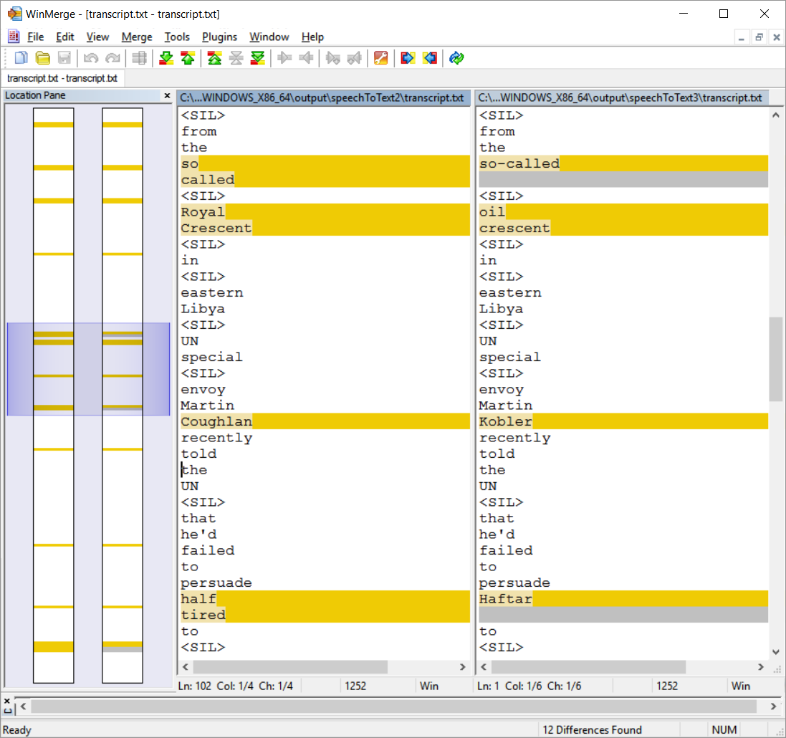

# PART II - Custom Language Models

The language models that ship with Media Server cover a broad vocabulary, reflecting the general spoken language. In some cases, you might want to process speech data that covers specialized topics, including for example financial or medical terms.  The standard language model might not cover such specialized vocabulary or sentence structures in your language.

Media Server enables us to build custom language models, which can be used to improve the quality of a transcribed speech related to a specific domain.

In this tutorial we will:

1. automatically transcribe text from a news clip discussing political affairs in Libya
1. build a custom language model from text about Libyan politicians and cities
1. configure Media Server to use this custom model
1. reprocess the same news clip and compare the transcription results

---
<!-- TOC -->

- [Setup](#setup)
  - [Third-party software](#third-party-software)
- [Process configuration](#process-configuration)
- [Process our news clip](#process-our-news-clip)
- [Build the custom language model](#build-the-custom-language-model)
- [Reprocess the news clip](#reprocess-the-news-clip)
- [PART III - Quantifying transcript accuracy](#part-iii---quantifying-transcript-accuracy)

<!-- /TOC -->
---

## Setup

### Third-party software

Download and install [WinMerge](http://winmerge.org/downloads/) or you favorite text file *diff*-ing tool, so you can easily compare the results at the end.

## Process configuration

We will use a similar configuration to Part I, modified slightly to instruct Media Server to ingest a video file rather than a stream and output a single plain text transcript for our news clip.

To ingest a video file, we will update the `Ingest` and `Analysis` sections accordingly:

1. set the `IngestRate` to `0` to process every frame and so ensure exactly reproducible results

    ```ini
    [Session]
    Engine0 = VideoIngest
    # Process every frame in the video irrespective of time taken
    IngestRate = 0
    ```

1. set `IngestDateTime` to `0` to output results in file time rather than clock time

    ```ini
    [VideoIngest]
    Type = Video
    # Use video time rather than clock time
    IngestDateTime = 0
    ```

1. modify the analysis `SpeedBias` to disable the adaptive quality level applied on live streams.  When processing files, the `SpeedBias` parameter effects the trade-off between transcription quality and processing time.

    ```ini
    [SpeechToText]
    Type = SpeechToText
    LanguagePack = ENUK
    SpeedBias = 3
    ```

    > More options are available for the *SpeechToText* analysis engine.  Please refer to the [reference guide](https://www.microfocus.com/documentation/idol/IDOL_12_13/MediaServer_12.13_Documentation/Help/index.html#Configuration/Analysis/SpeechToText/_SpeechToText.htm) for details.

1. To create a single plain text file of the transcript for the video clip, we will configure an XML-type output engine with `Mode` set to `AtEnd` and make use of the included the `toText.xsl` transform as follows:

    ```ini
    [TextOutput]
    Type = XML
    Input = SpeechToText.Result
    Mode = AtEnd
    XMLOutputPath = output/speechToText2/transcript.txt
    XslTemplate = toText.xsl
    ```

## Process our news clip

Paste the following parameters into [`test-action`](http://127.0.0.1:14000/a=admin#page/console/test-action), which assume you have downloaded a local copy of these tutorial materials as described [here](../../setup/SETUP.md#obtaining-tutorial-materials):

```url
action=process&source=C:/MicroFocus/idol-rich-media-tutorials/tutorials/showcase/speech-transcription/aljazeera.mp4&configPath=C:/MicroFocus/idol-rich-media-tutorials/tutorials/showcase/speech-transcription/speechToText2.cfg
```

Click the `Test Action` button to start processing.

Navigate to `output/speechToText2` and open the transcript file to read the results.

## Build the custom language model

The first step in creating a custom model is to source suitable text materials.  These should contain descriptive text written in normal sentences, not just a dictionary of new terms. For this tutorial we have sourced a small set of materials for you, copying the text from a news article about similar events in Libya into the file `libya.txt`, which is included with this guide.  In practice, the more data you have (and the more representative that data is) the better. Please read the [admin guide](https://www.microfocus.com/documentation/idol/IDOL_12_13/MediaServer_12.13_Documentation/Guides/html/index.html#Training/CustomLM_Introduction.htm), for further advice.

> A training text file should be encoded in UTF-8, without [BOM](https://en.wikipedia.org/wiki/Byte_order_mark#UTF-8).

We will next instruct Media Server to build our custom language model from this text:

1. paste the following parameters into [`test-action`](http://127.0.0.1:14000/a=admin#page/console/test-action):
    ```url
    action=TrainCustomSpeechLanguageModel&identifier=LibyaTerms&languagepack=ENUK&textpath=C:\MicroFocus\idol-rich-media-tutorials\tutorials\showcase\speech-transcription\libya.txt
    ```
1. click the `Test Action` button to start building
1. click the `token` link (or go to [`/action=queueinfo`](http://127.0.0.1:14000/a=queueinfo&queuename=TrainCustomSpeechLanguageModel&queueaction=getstatus)) to see the training status
1. we can review the results with [`/action=ListCustomSpeechLanguageModels`](http://127.0.0.1:14000/action=ListCustomSpeechLanguageModels):

    ```xml
    <languagemodels>
      <languagemodel>
        <identifier>LibyaTerms</identifier>
        <language>ENUK</language>
        <totalWords>3311</totalWords>
        <uniqueWords>1068</uniqueWords>
        <recommendedWeight>0.3</recommendedWeight>
      </languagemodel>
    </languagemodels>
    ```

    > When we come to use this custom model, we are recommended to apply a relative weight of 30% to the likelihood of matching these new terms *vs.* terms in the main ENUK language model.

## Reprocess the news clip

First, we will modify our Media Server process configuration to pick up this custom model, as follows:

```ini
[SpeechToText]
Type = SpeechToText
LanguagePack = ENUK
CustomLanguageModel = LibyaTerms:0.3
```

Then, paste the following parameters into [`test-action`](http://127.0.0.1:14000/a=admin#page/console/test-action), which assume you have downloaded a local copy of these tutorial materials as described [here](../../setup/SETUP.md#obtaining-tutorial-materials):

```url
action=process&source=C:/MicroFocus/idol-rich-media-tutorials/tutorials/showcase/speech-transcription/aljazeera.mp4&configPath=C:/MicroFocus/idol-rich-media-tutorials/tutorials/showcase/speech-transcription/speechToText3.cfg
```

Click the `Test Action` button to start processing.

The new text transcript will be produced after the whole video clip has been processed in the directory `output/speechToText3`.

We can now compare the results, *e.g.* with WinMerge, to see improvements in people names, place names and related vocabulary:



> Example output produced using Media Server 12.3.

## PART III - Quantifying transcript accuracy

Start [here](PART_III.md).
