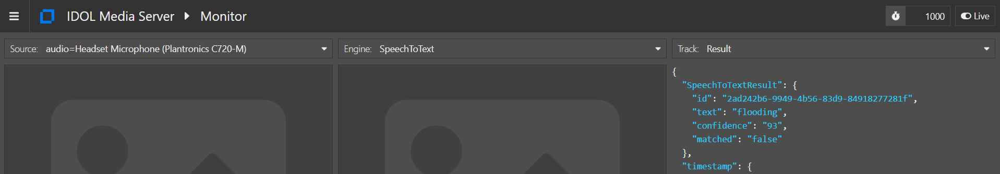

# PART III - Quantifying Transcript Accuracy

In the previous lesson, we used a custom language model (CLM) to improve the speech to text accuracy for a particular topic.  We saw the improvement in quality by comparing the before and after output of IDOL Media Server by eye.  In this lesson we will see how to quantify that accuracy level, *e.g.* to decide when you might want to create a CLM for your own use case.

In this tutorial we will use IDOL Media Server to:

1. record and transcribe your own voice as you read from an example Wikipedia page into a microphone
1. score the transcript against the original text you read from

---

- [Transcribe your own voice](#transcribe-your-own-voice)
  - [Find your audio device](#find-your-audio-device)
- [Process configuration](#process-configuration)
- [Transcribe your own monologue](#transcribe-your-own-monologue)
- [Evaluate transcript accuracy](#evaluate-transcript-accuracy)
- [Next steps](#next-steps)

---

## Transcribe your own voice

First, you will record your voice and transcribe your speech using IDOL Media Server.  

### Find your audio device

To find your microphone connection name please follow these steps:

On Windows:

Using `ffmpeg` from the command line, list the available devices:

```sh
$ ffmpeg -list_devices true -f dshow -i dummy
...
[dshow @ 000001f3d89e93c0] DirectShow video devices (some may be both video and audio devices)
[dshow @ 000001f3d89e93c0]  "USB Video Device"
[dshow @ 000001f3d89e93c0]     Alternative name "@device_pnp_\\?\usb  #vid_04f2&    pid_b5ee&>     mi_00#6&244de3b&0&0000#{65e8773d-8f56-11d0-a3b9-00a0c9223196}\global" 
[dshow @ 000001f3d89e93c0] DirectShow audio devices
[dshow @ 000001f3d89e93c0]  "Headset Microphone (Plantronics C720-M)"
[dshow @ 000001f3d89e93c0]     Alternative name "@device_cm_>         {33D9A762-90C8-11D0-BD43-00A0C911CE86}\wave_{465A54BD-F5FC-4B9A-9EC8-1C310C728109}"
[dshow @ 000001f3d89e93c0]  "Microphone (Conexant ISST Audio)"
[dshow @ 000001f3d89e93c0]     Alternative name "@device_cm_>         {33D9A762-90C8-11D0-BD43-00A0C911CE86}\wave_{7FD05CD2-493B-49AA-BFE2-C091EB64D594}"
dummy: Immediate exit requested
```

Based on this list, my connection string should be `audio=Headset Microphone (Plantronics C720-M)`.

On Ubuntu:

Install `v4l-utils`, then use the control tool to list available devices:
 
```sh
$ apt-get install v4l-utils
$ v4l2-ctl --list-devices

Headset Microphone (Plantronics C720-M) (usb-0000:00:1d.0-1.4):
        /dev/audio0
```

Based on this list, my connection string should be `audio=/dev/audio0`.

## Process configuration

To ingest our microphone output, we will include the following in our process configuration:

```ini
[Session]
Engine0 = DeviceIngest

[DeviceIngest]
Type = Video
# Uncomment this line for Windows
Format = dshow
# Uncomment this line for Ubuntu
# Format = v4l2
EnabledStreamTypes = audio
```

To run speech transcription, we will add the now familiar settings:

```ini
[SpeechToText]
Type = SpeechToText
LanguagePack = ENUK
SpeedBias = Live
```

To record your speech for later embarrassment, we will encode the stream to a single audio file at the end of the process:

```ini
[AudioClips]
Type = mpeg
AudioProfile = mpeg4audio
ImageInput = none
MIMEType = audio/aac
OutputPath = output/speechToText4/recording.aac
UseTempFolder = True
```

Finally, to output the transcript of your speech, we will use an XML output engine:

```ini
[XmlOutput]
Type = XML
Input = SpeechToText.Result
Mode = AtEnd
XSLTemplate = toText.xsl
XMLOutputPath = output/speechToText4/transcript_%segment.type%.txt
SavePreXML = true
```

> NOTE: We will use an XSL transform to output the plain text transcript, alongside the original structured XML output.

## Transcribe your own monologue

We will now read a section from the Wikipedia page on [Ancient Egyptian agriculture](https://en.wikipedia.org/wiki/Ancient_Egyptian_agriculture).  We have copied the first paragraph into the file `Ancient_Egyptian_Agriculture.txt` for easy reference.  

Open that file now and be ready to read!

> Remember to breathe! https://www.wikihow.com/Do-a-Relaxation-Exercise-for-Acting

Paste the following parameters into [`test-action`](http://127.0.0.1:14000/a=admin#page/console/test-action), which assume you have downloaded a local copy of these tutorial materials as described [here](../../setup/SETUP.md#obtaining-tutorial-materials) (remembering to update the microphone name from `Headset Microphone (Plantronics C720-M)` to match yours):

```url
action=process&source=audio%3DHeadset%20Microphone%20(Plantronics%20C720-M)&configPath=C:/OpenText/idol-rich-media-tutorials/tutorials/showcase/speech-transcription/speechToText4.cfg
```

Click the `Test Action` button to start processing.

> TIP: If you are using a headset microphone, you may hear a click in the headphones when recording begins.

In order to monitor the on-going process while you read, open the monitoring page [`/action=gui`](http://127.0.0.1:14000/a=gui#/monitor) and select the "SpeechToText".  Here you will view periodic updates from the live transcription, *e.g.* the word "flooding" was detected with 93% confidence:



Once you have finished reading, click the red `Stop Session` button in the GUI, then go to `output/speechToText4` to see the audio file and `.xml` transcript produced.

## Evaluate transcript accuracy

IDOL Media Server includes an action to evaluate a speech transcript, called [`ScoreCustomSpeechLanguageModel`](https://www.microfocus.com/documentation/idol/IDOL_23_4/MediaServer_23.4_Documentation/Help/Content/Actions/Training/ScoreCustomSpeechLanguageModel.htm).  

This action requires reprocessing the recorded audio, allowing you to do so with alternative language models to compare the performance. The action takes a process configuration snippet, defining the settings of the SpeechToText engine, *e.g.* the enclosed `scoreSpeechToText.cfg`, designed to evaluate the performance of the default `ENUK` language model:

```ini
[SpeechToText]
Type = SpeechToText
LanguagePack = ENUK
SpeedBias = 1
FilterMusic = False
```

> NOTE: Here we have set the `SpeedBias` parameter to `1` to maximize transcription accuracy.  For full details on this parameter, see the [reference guide](https://www.microfocus.com/documentation/idol/IDOL_23_4/MediaServer_23.4_Documentation/Help/Content/Configuration/Analysis/SpeechToText/SpeedBias.htm).

> NOTE: To evaluate any modifications to the language model, you will need to include the `CustomLanguageModel` or `CustomWordDatabase` parameters, as appropriate.

To run this evaluation, paste the following parameters into [`test-action`](http://127.0.0.1:14000/a=admin#page/console/test-action), making sure to update the file paths for your system. Make a note of the token returned.

```url
action=ScoreCustomSpeechLanguageModel&AudioPath=C:\OpenText\IDOLServer-23.4.0\MediaServer\output\speechToText4\recording.aac&ConfigPath=C:/OpenText/idol-rich-media-tutorials/tutorials/showcase/speech-transcription/scoreSpeechToText.cfg&TranscriptPath=C:/OpenText/idol-rich-media-tutorials/tutorials/showcase/speech-transcription/Ancient_Egyptian_Agriculture.txt
```

To view the output, paste the following `QueueInfo` action into your web browser: http://127.0.0.1:14000/Action=QueueInfo&QueueAction=GetStatus&QueueName=ScoreCustomSpeechLanguageModel.

See the score summary in the XML response.  For my own reading of the text, the "Fmeasure", or [F1 score](https://en.wikipedia.org/wiki/Precision_and_recall), was __88%__.  Full details below:

```xml
<Fmeasure>88.08</Fmeasure>
<customLanguageModel/>
<languagePack>ENUK</languagePack>
<precision>94.44</precision>
<recall>82.52</recall>
```

The recall was significantly worse than the precision for me, so I should probably learn to speak more clearly!  

How did you do?

## Next steps

Why not try more tutorials to explore some of the other analytics available in IDOL Media Server, linked from the [showcase page](../README.md).
