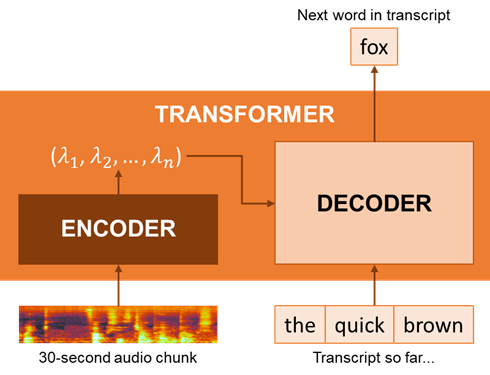

# Speech transcription

IDOL Media Server can be used to perform audio analytics, including speech transcription (often called Speech-to-Text), speaker identification and language identification.

## *NEW* Model options

IDOL's Speech-to-text can be run with multiple alternative models, which have their own strengths and weaknesses.

The "legacy" models use Convolutional Neural Networks, have the smallest hardware footprint and produce output very close to live from streaming audio.  Their accuracy level is not as high as the newer models out-of-the-box (see below) but can be significantly improved for specific use cases with custom language models (see [PART II](#part-ii---custom-language-models)).  The resulting transcript is a best attempt to map exactly what is spoken (including "ums" and "ahs").

The new STT models use Transformer-style Neural Networks, with a larger memory footprint and optional GPU acceleration.  Transformers have an Encoder that ingests the source audio, and one or more Decoders, which produce the output text transcript.

Because the audio is encoded in 30-second chunks, there is a built-in delay when processing live streams.

The resulting transcripts are typically very clear, smooth and often without the "ums", "ahs" and repeated words of the real speech.  You could think of the output as text *inspired by* what is spoken and for that reason the transcripts are often preferred by human readers over the "legacy" model's more directly transcribed output.

### Accuracy impact

The new models come in different sizes: `micro`, `small`, `medium` and `large`, with improving accuracy but increasingly large memory footprint and processing time.  As an example, for two of my own English sample videos, we see the following variation in accuracy (F1 score):

Source description | Legacy / % | Micro / % | Small / % | Medium / %
--- | :---: | :---: | :---: | :---:
Body-worn camera audio, very challenging quality | 26 | 52 | 60 | 62
TV news, good quality audio but a very strong accent | 76 | 90 | 94 | 98

### Processing requirements

The following tables show observed processing rate, CPU, RAM and GPU memory usage of the Media Server process for multiple runs over a set of sample audio files.

#### CPU-only

Model | Processing rate | CPU / core-% | RAM / GB
--- | :---: | :---: | :---:
Legacy | 0.4 +/- 0.1 | 99 +/- 7 | 1.3 +/- 0.1
Micro | 0.8 +/- 0.1 | 122 +/- 47 | 3.8 +/- 0.2
Small | 2.2 +/- 0.2 | 107 +/- 18 | 11.3 +/- 0.4
Medium | 6.3 +/- 0.1 | 105 +/- 14 | 26.5 +/- 0.8
Large | 13.1 +/- 0.9 | 104 +/- 15 | 44.7 +/- 1.6

> NOTE: Numbers are given as averages with standard deviation.  Processing rate is calculated as processing time divided by source duration.

Observe that CPU usage is similar for all models but the RAM required increases, as does the processing duration.

#### With GPU-acceleration

Model | Processing rate | CPU / core-% | RAM / GB | GPU Memory / GB
--- | :---: | :---: | :---: | :---:
Legacy | N/A | - | - | -
Micro | 0.13 +/- 0.01 | 218 +/- 114 | 3.7 +/- 0.0 | 2.7 +/- 0.2
Small | 0.18 +/- 0.02 | 150 +/- 85 | 7.0 +/- 0.2 | 7.6 +/- 0.8
Medium | 0.32 +/- 0.02 | 114 +/- 47 | 15.0 +/- 0.4 | 17.1 +/- 1.6
Large | 0.43 +/- 0.07 | 124 +/- 46 | 27.7 +/- 1.0 | 28.7 +/- 3.9

> NOTE: Numbers are given as averages with standard deviation.  Processing rate is calculated as processing time divided by source duration.

With GPU acceleration enabled, processing duration is dramatically increased: all new models run faster or as fast as the "legacy" model does on CPU.  Also observe that CPU usage is more variable, that the RAM required is somewhat reduced, and is a similar quantity to the required GPU memory.  Given the huge footprint of the `large` model it is unlikely that it will be economical to use in production.

## PART I - Automatic Subtitles

An introduction to speech transcription with IDOL Media Server.

Use IDOL Media Server with it's new models to perform Speech-to-Text transcription on a live news broadcast stream to record video clips and generate subtitles for those clips.

Start [here](./PART_I.md).

## PART II - Custom Language Models

Use IDOL Media Server with it's legacy models and build a custom language model to improve speech transcription of a video discussing political affairs in Libya.

Start [here](./PART_II.md).

## PART III - Quantifying Transcript Accuracy

Use IDOL Media Server to transcribe your speech as you read from a script.  Score your transcript to measure the accuracy of Speech-to-Text.

Start [here](./PART_III.md).

## Next steps

Why not try more tutorials to explore some of the other analytics available in IDOL Media Server, linked from the [showcase page](../README.md).
