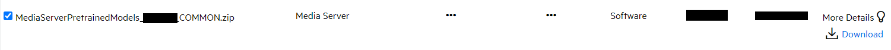
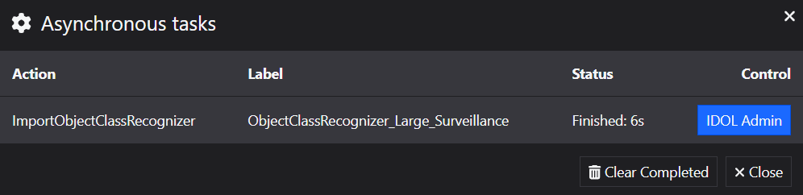
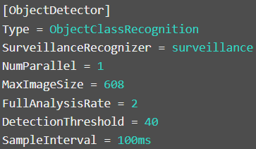

# Surveillance analysis

Media Server includes a general purpose *Object Class Recognition* analysis engine, which can be trained to detect and track objects of almost any class.  The most common classes used for CCTV surveillance include people, cars, buses and bicycles and IDOL provides out-of-the-box training for these classes. Media Server also allows you to train your own. 

Alert rules can be built to analyze the location and movement of these detected objects to trigger alerts for multiple security use cases, such as:

- People counting
- Loitering
- Restricted area access
- Wrong way driving
- Illegal turning
- *and many more*.

In this tutorial we will:

1. use the Media Server GUI to import pre-trained models to enable recognition of common surveillance objects,
1. run a process action to create a video with overlayed tracking information for people and vehicles, and
1. watch a demo video showing how to use tripwires to alert of vehicles based on their direction of travel.

This guide assumes you have already familiarized yourself with IDOL Media Server by completing the [introductory tutorial](../../README.md#introduction).

---

- [Setup](#setup)
  - [Import object class recognizer](#import-object-class-recognizer)
    - [Enabled modules](#enabled-modules)
    - [Licensed channels](#licensed-channels)
    - [Pre-trained models](#pre-trained-models)
- [Process configuration](#process-configuration)
- [Run a process configuration](#run-a-process-configuration)
- [Build configurations in the GUI](#build-configurations-in-the-gui)
  - [(*Optional*) GPU acceleration](#optional-gpu-acceleration)
- [Next steps](#next-steps)

---

## Setup

### Import object class recognizer

Media Server must be licensed for visual analytics, as described in the [introductory tutorial](../../introduction/PART_I.md#enabling-analytics).  To reconfigure Media Server you must edit your `mediaserver.cfg` file.

#### Enabled modules

The `Modules` section is where we list the engines that will be available to Media Server on startup.  Ensure that this list contains the module `objectclassrecognition`:

```ini
[Modules]
Enable=...,objectclassrecognition,...
```

#### Licensed channels

*Reminder*: The `Channels` section is where we instruct Media Server to request license seats from License Server.  Media Server has four license *flavours*:

1. Audio
1. Surveillance
1. Visual
1. Video Management

To enable *Object Class Recognition* for this tutorial, you need to enable at least one channel of either *Surveillance* or *Visual*:

```ini
[Channels]
...
VisualChannels=1
```

> NOTE: A *Surveillance* type license only allows you to load the out-of-the-box "Surveillance" objects training pack.  For other training packs - and to build your own models - you will require a *Visual* type license.

> NOTE: For any changes you make in `mediaserver.cfg` to take effect you must restart Media Server.

#### Pre-trained models

Pre-trained *Object Class Recognition* recognizers are distributed separately from the main Media Server installer.  To obtain the training pack, return to the [Software Licensing and Downloads](https://sld.microfocus.com/mysoftware/index) portal, then:

1. Under the *Downloads* tab, select your product, product name and version from the dropdowns:

    

1. From the list of available files, select and download `MediaServerPretrainedModels_23.2.0_COMMON.zip`.

    

Extract the training pack `.zip` then, to load the surveillance recognizer, open the Media Server GUI at [`/action=gui`](http://127.0.0.1:14000/a=gui#/train/objectClassRec(tool:select)) and follow these steps:

1. in the left column, click `Import`
1. navigate to your extracted training pack and select `ObjectClassRecognizer_Gen2_Surveillance.dat`

    

1. a notification will pop-up to tell you the model is uploading, then processing:

    

1. (__*Important!*__) once imported, rename the recognizer to "surveillance":

    

> NOTE: You have imported six classes: "bicycle", "bus", "car", "motorcycle", "person" and "truck".  Each one contains metadata fields defining the expected real-world object dimensions.  These scales turn all detected objects into "standard candles", enabling the camera perspective to be estimated.  Read about conversion to real-world coordinates [here](https://www.microfocus.com/documentation/idol/IDOL_23_2/MediaServer_23.2_Documentation/Help/Content/Advanced/Perspective.htm).

## Process configuration

Media Server configurations for Surveillance combine the base *Object Class Recognition* engine, which finds and tracks the objects, with one or more *Alert* and *Utility* engines to define scenario-based rules.  These engines include:

- [Path Alert](https://www.microfocus.com/documentation/idol/IDOL_23_2/MediaServer_23.2_Documentation/Help/index.html#Configuration/Analysis/AlertPath/_AlertPath.htm): Generates an alert when an object follows a specified path through the scene.
- [Region Alert](https://www.microfocus.com/documentation/idol/IDOL_23_2/MediaServer_23.2_Documentation/Help/index.html#Configuration/Analysis/AlertRegion/_AlertRegion.htm): Generates an alert when an object is present within a specified region for a specified amount of time.
- [Stationary Alert](https://www.microfocus.com/documentation/idol/IDOL_23_2/MediaServer_23.2_Documentation/Help/index.html#Configuration/Analysis/AlertStationary/_AlertStationary.htm): Generates an alert when an object is stationary for a specified amount of time.
- [Tripwire Alert](https://www.microfocus.com/documentation/idol/IDOL_23_2/MediaServer_23.2_Documentation/Help/index.html#Configuration/Analysis/AlertTripwire/_AlertTripWires.htm): Generates an alert when an object crosses a tripwire.
- [Traffic Lights](https://www.microfocus.com/documentation/idol/IDOL_23_2/MediaServer_23.2_Documentation/Help/index.html#Configuration/Analysis/TrafficLight/_TrafficLight.htm): Determines the state of traffic lights, so that you can detect vehicles failing to stop for a red light.
- [Scene Filter](https://www.microfocus.com/documentation/idol/IDOL_23_2/MediaServer_23.2_Documentation/Help/index.html#Configuration/Utilities/SceneFilter/_SceneFilter.htm): Filters out source video frames, and therefore stops analysis, when a PTZ-capable CCTV camera has been moved away from a trained scene by the operator.
- [Lua Filter](https://www.microfocus.com/documentation/idol/IDOL_23_2/MediaServer_23.2_Documentation/Help/index.html#Configuration/ESP/Filter/_Filter.htm): Filters out records based on your custom logic defined using the Lua scripting language.  See [tips on working with Lua](../../appendix/Lua_tips.md) for more information.
  > The detector schedule option in the Surveillance configuration builder is implemented as a Lua filter:
  > 
- [Perspective](https://www.microfocus.com/documentation/idol/IDOL_23_2/MediaServer_23.2_Documentation/Help/index.html#Configuration/Utilities/Perspective/_Perspective.htm): Combines sizes and movement of people, buses, cars, *etc.* to estimate the perspective from which the camera views the scene. This allows Media Server to convert a position in a video frame into real-world 3D coordinates.
- [Count](https://www.microfocus.com/documentation/idol/IDOL_23_2/MediaServer_23.2_Documentation/Help/index.html#Configuration/Utilities/Count/_Count.htm): Counts the number of objects that are present within the scene or a specified region of the scene.
- [Heatmap](https://www.microfocus.com/documentation/idol/IDOL_23_2/MediaServer_23.2_Documentation/Help/index.html#Configuration/Utilities/Heatmap/_Heatmap.htm): Creates an image that shows the paths of objects through the scene and identifies areas with the most activity. As objects move through the same part of the scene, their paths overlap and the heatmap turns from blue, to green, and then to red.

Configuration files combining these engines can quickly become complicated to write by hand; therefore, the Media Server GUI has been enhanced to add a *Surveillance Configuration* page, which allows you to set up most CCTV surveillance use cases with just a few clicks.

<details><summary>More on Alert engines.</summary>

Alert engines introduce additional track types over and above those discussed in the [introductory tutorial](../../introduction/PART_I.md#track-types).  Their behavior varies slightly based on the Alert type.  For a *Region* type alert, these are:

Name | Description
--- | ---
Data | Contains one record for each object that remains within the region for longer than MinimumTime, for each video frame.
Result | Contains one record for each object that remains within the region for longer than MinimumTime. If an object moves in and out of the region several times, Media Server can produce several results with the same ID.
ResultWithSource | The same as the Result track, but each record also includes the *best* source frame.
Start | The same as the Data track, except it contains only the first record of each event.
End | The same as the Data track, except it contains only the last record of each event.
Alert | The same as the Result track, except that records are created as soon as the object meets the minimum time requirement, rather than when the object exits the region.
AlertWithSource | The same as the Alert track, but each record also includes the source frame.

</details>

## Run a process configuration

You will use an example configuration to generate a video clip with overlays for each tracked person and vehicle in the test video `pets2009.mp4`.  

> From the [PETS 2009 benchmark data set](http://cs.binghamton.edu/~mrldata/pets2009).

You can look at the the included config file `Overlay_VideoTracking.cfg` in detail to get a sense of the process.

Paste the following parameters into [`test-action`](http://localhost:14000/a=admin#page/console/test-action), which assume you have downloaded a local copy of these tutorial materials as described [here](../../setup/SETUP.md#obtaining-tutorial-materials):

```url
action=process&source=C:/OpenText/idol-rich-media-tutorials/tutorials/showcase/surveillance/pets2009.mp4&configPath=C:/OpenText/idol-rich-media-tutorials/tutorials/showcase/surveillance/Overlay_VideoTracking.cfg
```

On that page, click `Test Action` to start processing.

To review the resulting video clip, go to your `output/surveillance` folder.

This frame from the output video shows the overlayed people and vehicles:


## Build configurations in the GUI

Please watch this demo video from IDOL's YouTube playlist to see the easy setup process for tracking vehicles in the road scene:

[](https://www.youtube.com/watch?v=XjKjIxlKy9I&list=PLlUdEXI83_Xoq5Fe2iUnY8fjV9PuX61FA)

Now have a go yourself - it's easy!

### (*Optional*) GPU acceleration

When building your configuration, you can configure your Detector in either CPU or GPU mode:


When you select GPU mode, the configuration wizard modifies the underlying *Object Class Recognition* analysis engine to process more video frames (*i.e.* a higher [FullAnalysisRate](https://www.microfocus.com/documentation/idol/IDOL_23_2/MediaServer_23.2_Documentation/Help/Content/Configuration/Analysis/ObjectClass/FullAnalysisRate.htm)) at a higher resolution:

CPU mode | GPU mode
--- | ---
 | 

> NOTE: For details on GPU support and setup, please refer to the [admin guide](https://www.microfocus.com/documentation/idol/IDOL_23_2/MediaServer_23.2_Documentation/Help/Content/Getting_Started/Install_GPU.htm).

Using GPU mode can be useful when tracking smaller objects or objects that more quickly across the field of view.

## Next steps

Why not try more tutorials to explore some of the other analytics available in Media Server, linked from the [main page](../../README.md).
