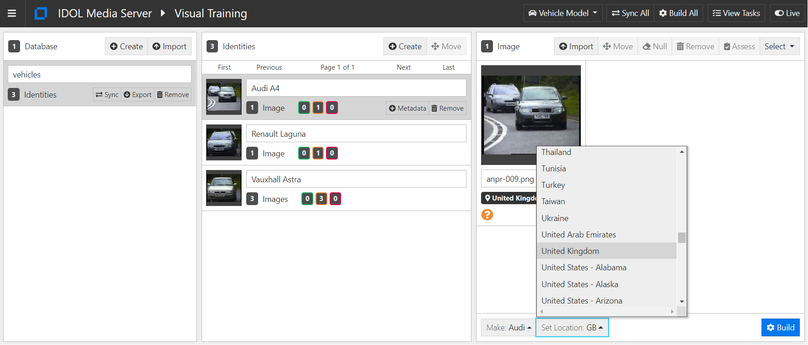
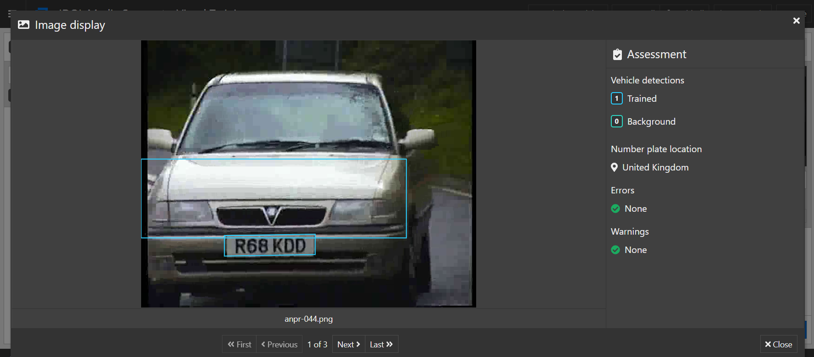
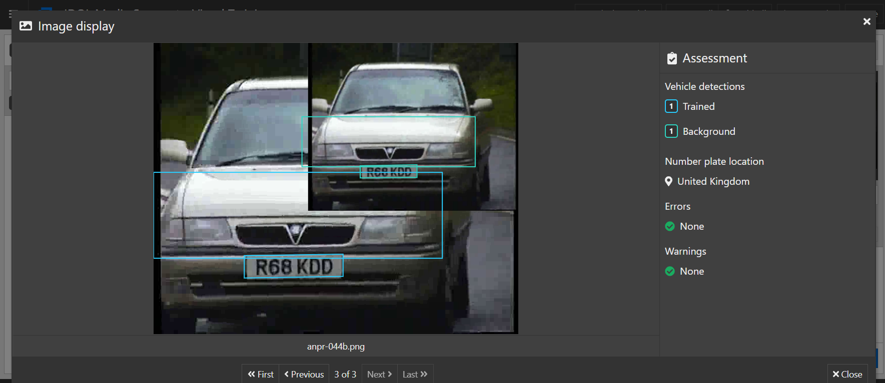
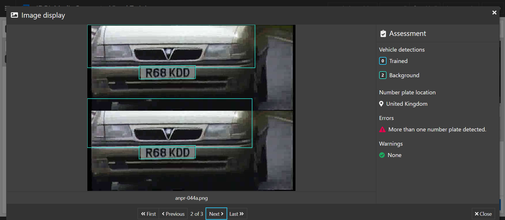
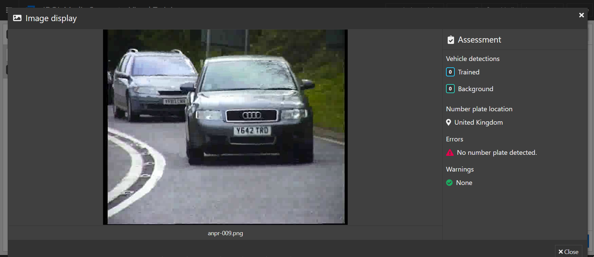
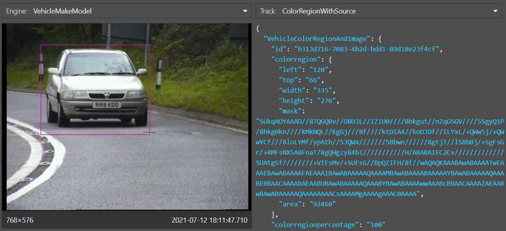
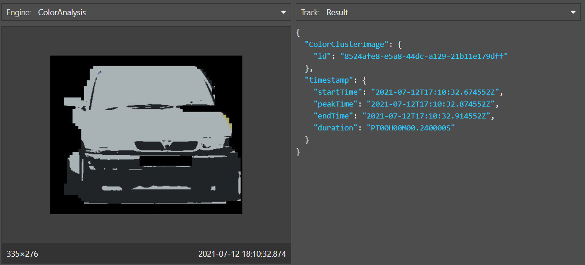

# Vehicle analysis

IDOL Media Server includes a *NumberPlate* analysis engine, which can be configured to read number (license) plates from over 100 countries and states around the world.  With analysis chaining, the vehicle make, model and color can also be determined.

In this tutorial we will:

1. use the *NumberPlate* analysis engine to read Saudi number plates in a video from a moving vehicle
1. identify vehicle make and model
1. identify vehicle color
1. (*Optionally*) Train new vehicle models

This guide assumes you have already familiarized yourself with IDOL Media Server by completing the [introductory tutorial](../../README.md#introduction).

---

- [Setup](#setup)
  - [Configure vehicle analysis](#configure-vehicle-analysis)
    - [Enabled modules](#enabled-modules)
    - [Licensed channels](#licensed-channels)
- [Process configuration](#process-configuration)
- [Making changes](#making-changes)
- [Training vehicle analysis (*Optional*)](#training-vehicle-analysis-optional)
  - [Vehicle makes](#vehicle-makes)
  - [Training vehicle models](#training-vehicle-models)
  - [Assessing images for training](#assessing-images-for-training)
- [Processing video](#processing-video)
- [Next steps](#next-steps)

---

## Setup

### Configure vehicle analysis

IDOL Media Server must be licensed for visual analytics, as described in the [introductory tutorial](../../introduction/PART_I.md#enabling-analytics).  To reconfigure IDOL Media Server you must edit your `mediaserver.cfg` file.

#### Enabled modules

The `Modules` section is where we list the engines that will be available to IDOL Media Server on startup.  Ensure that this list contains the modules `numberplate` and `vehiclemodel`:

```ini
[Modules]
Enable=...,numberplate,...,vehiclemodel
```

#### Licensed channels

*Reminder*: The `Channels` section is where we instruct IDOL Media Server to request license seats from IDOL License Server.  IDOL Media Server has four license *flavours*:

1. Audio
1. Surveillance
1. Visual
1. Video Management

To enable object recognition for this tutorial, you need to enable at least one channel of either *Surveillance* or *Visual*:

```ini
[Channels]
...
VisualChannels=1
```

> NOTE: For any changes you make in `mediaserver.cfg` to take effect you must restart IDOL Media Server.

## Process configuration

IDOL Media Server ships with a number of sample configurations, including some for number plate and vehicle analysis.  We will use the example `configurations/examples/VehicleModel/WithColor.cfg`, which configures the required analysis engines, as well as engines to output XML alerts and to encode images of the detected number plates.

This file already includes the minimal configuration for number plate recognition, which requires only that you set a location, *i.e.* `GB` for the United Kingdom.

```ini
[Anpr]
Type = numberplate
Location = GB
```

> You can also set multiple locations with or without weightings to indicate the relative likelihood of seeing a plate form that location:
> 
> ```ini
> Location=FR,BE,DE
> ```
> 
> or
> 
> ```ini
> LocationWithPriorities=FR:1.0,BE:0.1,DE:0.01
> ```

This minimal configuration quietly uses the following default options, which can be read about in detail in the [reference guide](https://www.microfocus.com/documentation/idol/IDOL_23_4/MediaServer_23.4_Documentation/Help/index.html#Configuration/Analysis/ANPR/_NumberPlate.htm) and are shown here grouped by their functions.

```ini
# Detection of plates
Boldness = 17
ExpectedRotation = 0.0 # degrees (clockwise from horizontal)
MaxCharHeight = 96 # pixels
MaxPlatesPerFrame = 3
MinCharHeight = 12 # pixels
Sensitivity = 10

# Processing
MaxInputQueueLength = # time duration (not set = no limit)
NumParallel = 1
SampleInterval = 1ms

# Integration
MinRead = 2

# Filtering
MinValidScore = 92
OutputAlternativeResults = False
OutputUnformattedResults = False
RejectReadsWithInvalidGaps = True
```

In addition to these parameters it is also possible to set a region of interest in which the analysis will work.  This can be a rectangle, specified by `Region` or a polygon, specified by `FreeFormRegion`.

Once a number plate has been detected, we can usually safely assume a vehicle has also been found.  With IDOL Media Server's analysis chaining, we can use this location to feed additional analytic engines:

- The *VehicleRecognition* analysis engine, which:
  - recognizes one of the pre-trained vehicle makes, *i.e.* "Tesla"
  - (*optionally*) can be trained to match against specific vehicle models, *i.e.* "Model S"
  - outputs a bounding box for the vehicle on which the plate is detected for further analysis.

  ```ini
  [VehicleMakeModel]
  Type = vehiclemodel
  Input = Anpr.DataWithSource
  Database = vehicles
  ```

- The *ColorCluster* analysis engine can be used here (similarly to how we used it analyze clothing in the [introductory tutorial](../../introduction/PART_II.md#run-face-and-clothing-analysis)) to:
  - identify the main colors of the detected vehicle
  - to match the main detected colors to a dictionary of predefined colors

  ```ini
  [ColorAnalysis]
  Type = colorcluster
  Input = VehicleMakeModel.ColorRegionWithSource
  Region = input
  ColorDictionary = weightedcarcolors.dat
  ```

## Making changes

Let's create our own copy to work on `configurations/examples/VehicleModel/WithColor2.cfg` and make the following changes:

1. Reduce the input data rate for vehicle analysis by changing its input from the *data* to the *result* track of the number plate engine:

  ```diff
    [VehicleMakeModel]
    Type = vehiclemodel
  - Input = Anpr.DataWithSource
  + Input = Anpr.ResultWithSource
  ```

1. Attach some additional tracks to a dummy engine so that they will be *in use* and therefore available for live monitoring:

  ```diff
    [Session]
    ...
    Engine8 = AnprFrameOutput
  + Engine9 = Keep

    ...

  + [Keep]
  + Type = Combine
  + Input0 = VehicleMakeModel.DataWithSource
  + Input1 = VehicleMakeModel.ResultWithSource
  + Input2 = VehicleMakeModel.VehicleMakeImage
  + Input3 = Anpr.Start
  + Input4 = Anpr.DataWithSource
  + Input5 = Anpr.End
  + Input6 = ColorAnalysis.ClusteredImage
  ```

1. Finally, since we are ingesting a video file, we should remember to set the `IngestRate` parameter so that we process every frame in a reproducible way:

  ```diff
    [Session]
    ...
    Engine9 = Keep
  + IngestRate = 0
  ```

## Training vehicle analysis (*Optional*)

### Vehicle makes

Vehicle make identification is pre-trained.  To view the current list of supported vehicle makes, run [`action=listVehicleMakes`](http://127.0.0.1:14000/a=listVehicleMakes).

### Training vehicle models

Open the training web app at [`/action=gui`](http://127.0.0.1:14000/a=gui#/train/vehicleModel(tool:select)) then follow these steps to train your identity:

1. in the left column, click `Create` to add a new *database* (a collection of identities)
    - rename the database as `vehicles`
1. in the center column, click `Create` to add a new *identity* for each vehicle image in the `vehicles` directory of this guide
    - give your identity a name
    - (*optionally*) add arbitrary key-value metadata
1. on the right, click `Import` to import images
    - on your file system, navigate to the `vehicles` directory from this tutorial to select the vehicle image provided
    - select the appropriate vehicle make from the drop-up list below your image thumbnail(s).  If your make is not listed, select *Unknown*
    - select the appropriate ANPR location for each image.
      > NOTE: ANPR is used to locate a number plate and, from that, the vehicle in your training image
1. on the top-right menu bar, click `Build All` to train all vehicle models



> TIP: Cameras that are positioned on a gantry over the traffic are best suited for recognition because they capture images where the vehicles approach head-on.  For further recommendations about image quality, and for instructions to collect your own vehicle model training images, read the [admin guide](https://www.microfocus.com/documentation/idol/IDOL_23_4/MediaServer_23.4_Documentation/Help/Content/Training/VehicleModel_Introduction.htm).

### Assessing images for training

When selecting images of faces for training, we should follow the above guidance given in the [admin guide](https://www.microfocus.com/documentation/idol/IDOL_23_4/MediaServer_23.4_Documentation/Help/Content/Training/VehicleModel_Introduction.htm).

> TIP: Cameras that are positioned on a gantry over the traffic are best suited for recognition because they capture images where the vehicles approach head-on.

You can also instruct IDOL Media Server to assess training images without actually training them to warn you of any potential errors.  

> NOTE: Ensure that you have first set the location for the number plate in a given image before running assessment.

In the `gui`, click the "Open original image" button to see details of a given assessment:



If more than one number plate is detected, and one plate is larger than the other(s), the larger plate will be used to locate and train a vehicle model:



If more than one number plate is detected, and they are (all) of similar size, none will be used for vehicle model trained:



If no number plates are detected a vehicle model cannot be trained:



## Processing video

Paste the following parameters into [`test-action`](http://127.0.0.1:14000/a=admin#page/console/test-action), which assume you have downloaded a local copy of these tutorial materials as described [here](../../setup/SETUP.md#obtaining-tutorial-materials):

```url
action=process&source=C:/OpenText/idol-rich-media-tutorials/tutorials/showcase/vehicle-analysis/vehicles.mp4&configName=examples/VehicleModel/WithColor2
```

Click `Test Action` to start processing, then review the running process with [`/action=gui`](http://127.0.0.1:14000/a=gui#monitor).

Note the bounding box detected for the vehicle carrying the plate:





Wait for the video to finish processing, or stop early with [`stop`](http://127.0.0.1:14000/a=queueInfo&queueAction=stop&queueName=process), then go to your IDOL Media Server's `output` folder to see the saved image files and XML.  These will be written in a sub-directory named after the uuid of the session, so look for the newest folder.

## Next steps

Why not try more tutorials to explore some of the other analytics available in IDOL Media Server, linked from the [showcase page](../README.md).
